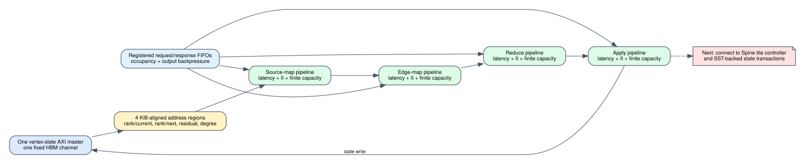

# Shared algorithm timing primitives

Date: 2026-07-25
Branch: `codex/fine-grained-cycle-sim`
Baseline commit: `c1bb345`

## Scope

This milestone adds two reusable mechanisms needed before timed PageRank and
the normalized Spine versus GraSU+ReGraph comparison:

1. an explicit address layout for every algorithm state array; and
2. independent finite source-map, edge-map, reduce, and apply pipelines.



These are execution-driven primitives. A pipeline accepts a request only when
its initiation interval and in-flight capacity permit it. A completed operation
remains resident when its registered response FIFO is full, which propagates
backpressure and can eventually fill the pipeline. Source-map, edge-map,
reduce, and apply are independent and can overlap.

## State-channel decision

PageRank does not receive free extra HBM channels. Current rank, next rank,
residual, and degree are 4 KiB-aligned address regions behind the existing
vertex-state AXI master and therefore contend on the same configured HBM
pseudo-channel. The layout remains configurable through graph size and
alignment.

For a 1,025-vertex fixture, each payload array contains 4,100 bytes:

| algorithm | primary read | primary write | auxiliary | degree | allocated bytes |
| --- | ---: | ---: | ---: | ---: | ---: |
| weighted SSSP | 0 | 0 | none | none | 8,192 |
| full PageRank | 0 | 8,192 | none | 16,384 | 24,576 |
| residual PageRank | 0 | 0 | 8,192 | 16,384 | 24,576 |

The table contains byte offsets within one AXI address space, not independent
channels. Full PageRank's separate write region is the ping-pong rank buffer.

## Pipeline evidence

A concurrent four-stage fixture uses a source-map latency of 3 cycles, II 2,
capacity 2, and a depth-1 output FIFO whose consumer is deliberately delayed.
It completes in 15 clock cycles and records:

```text
source accepted/completed: 3 / 3
source II stalls:           1
source capacity stalls:     1
source output stalls:       6
source max in flight:       2
edge/reduce/apply:           1 accepted and completed each
```

All response transaction IDs preserve order. Full PageRank source
contributions, dangling values, float32 sum, and apply results match the C++
policy contract.

The latency values in this fixture test mechanics only. They are not an HLS
characterization and must not be used as a PageRank performance claim. The
eventual architecture profile will identify operation latency/II as measured
from synthesis or explicitly projected.

Machine-readable evidence is
`docs/evidence/algorithm_timing_primitives_20260725.json`.

## Reproduction

```bash
cd /home/chuxiao/spine-cycle-sim
cmake --build build/cycle-core -j2
./build/cycle-core/cpp/spine_cycle_core_tests algorithm_state_layout
./build/cycle-core/cpp/spine_cycle_core_tests algorithm_pipeline
./build/cycle-core/cpp/spine_cycle_core_tests
python3 -m unittest discover -s tests
make -C cpp/sst -B -j2
git diff --check
```

## Remaining boundary

1. The Spine tile controller does not yet issue requests to these operation
   FIFOs; timed PageRank end-to-end remains open.
2. The address layout is defined but PageRank degree/rank/residual AXI traffic
   has not yet been generated against Mock or SST-HBM.
3. Pipeline latency and II need HLS microkernel synthesis evidence before they
   become hardware-characterized profile values.
4. Dangling reduction, all-vertex Full PageRank apply, residual activation,
   ping-pong swap, and convergence control remain to be integrated.
