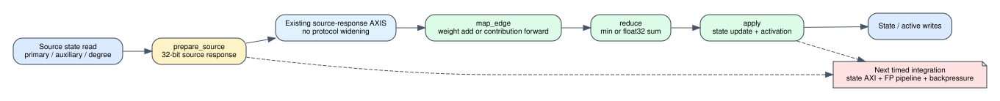

# C++ hardware algorithm policy contract

Date: 2026-07-25
Branch: `codex/fine-grained-cycle-sim`
Baseline commit: `019c664`
HLS reference: `afb8199a2ca8d3fd208b985324bf4d8719e2b839`

## Scope

This milestone defines the hardware-shaped C++ contract for weighted SSSP,
full PageRank, and thresholded residual PageRank. It fixes state storage,
source-map, edge-map, reduce, apply, activation, and dynamic-update semantics
before those algorithms are connected to the timed Spine pipeline.

It is functional and structural evidence only. The PageRank policies do not
yet issue degree, rank, or residual AXI requests and do not yet consume timed
floating-point pipeline stages. Consequently, this milestone makes no
PageRank latency, throughput, energy, or area claim.



## Protocol decision

The existing 32-bit source-response AXIS protocol is retained:

- weighted SSSP returns the source distance; Reader adds the 16-bit weight;
- full PageRank returns `damping * rank / out_degree` as one float32 word;
- residual PageRank consumes the signed source residual, updates source rank,
  and returns `damping * residual / out_degree` as one float32 word.

Reader therefore forwards PageRank contributions without widening the
source-response or edge stream. Degree reads, auxiliary state reads/writes,
dangling reduction, and floating-point pipeline latency remain explicit work
for timed integration; they are not hidden in this interface decision.

## State and operation ledger

| algorithm | primary arrays | auxiliary arrays | degree arrays | reduce | update mode |
| --- | ---: | ---: | ---: | --- | --- |
| weighted SSSP | 1 | 0 | 0 | uint32 minimum | incremental insert/decrease; fallback delete/increase |
| full PageRank | 2 (ping-pong) | 0 | 1 | float32 sum | warm start |
| residual PageRank | 1 | 1 | 1 | signed float32 sum | signed residual |

`AlgorithmOperationProfile` records the required integer and floating-point
operations and their target initiation intervals. Every policy is currently
marked `timing_characterized=false`; a later milestone may set that flag only
after the operation pipeline participates in scheduler cycles and
backpressure.

## Validation

The focused C++ tests cover invalid configurations, storage and operation
profiles, update-mode selection, SSSP saturation/min semantics, PageRank
dangling/source contribution, and signed residual activation.

```text
focused C++ policy tests: 5 passed
full C++ tests:           62 passed
full Python tests:       153 passed
git diff --check:         clean
```

Machine-readable evidence is
`docs/evidence/cpp_algorithm_policy_contract_20260725.json`.

## Reproduction

```bash
cd /home/chuxiao/spine-cycle-sim
cmake --build build/cycle-core -j2
./build/cycle-core/cpp/spine_cycle_core_tests algorithm_policy
./build/cycle-core/cpp/spine_cycle_core_tests
python3 -m unittest discover -s tests
git diff --check
```

## Remaining boundary

1. Inject weighted SSSP through this policy with zero functional and cycle
   regression against the existing hard-coded Reader/Compute path.
2. Add timed degree and auxiliary/ping-pong state HBM interfaces for PageRank.
3. Model float32 source-map/reduce/apply pipeline latency and backpressure.
4. Add global dangling accumulation and iteration convergence control.
5. Run both PageRank modes through the same dynamic correctness gate as the
   Python oracle before making performance claims.
