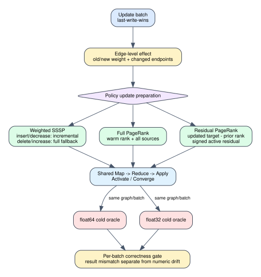

# Dynamic algorithm contract

Date: 2026-07-25
Branch: `codex/fine-grained-cycle-sim`
Baseline commit: `7fb1ce9`

## Scope

This milestone extends the shared functional `Update -> Map -> Reduce -> Apply
-> Activate/Converge` layer from static graph runs to persistent dynamic
batches. It is the correctness contract that the timed Spine and
GraSU+ReGraph models must execute. It is not cycle-timing evidence by itself.



Each effective edge update now records `(src, dst, old_weight, new_weight)` in
addition to aggregate counts. Missing deletes and unchanged writes remain
no-ops and do not appear as effective changes. This edge-level record prevents
the update policy from inferring repair behavior from counts alone.

## Update policies

### Weighted SSSP

- Insert and weight decrease preserve prior distances and activate every
  changed source. Normal frontier propagation then discovers improvements.
- Delete and weight increase select `full_recompute_fallback`. This is
  conservative but exact; no unsupported incremental invalidation is hidden.
- Both uint64 mathematical infinity and uint32 architecture infinity are
  normalized during correctness comparison.

### Full PageRank

- Every effective batch starts from the prior rank vector.
- All vertices participate in each warm-started iteration.
- Damping, dangling redistribution, L1 convergence, and float32 operation
  quantization are unchanged from the static policy.

### Thresholded residual PageRank

For the updated graph, the policy evaluates one PageRank application on the
prior rank vector and initializes:

    signed_residual[v] = updated_target[v] - prior_rank[v]

This produces both positive and negative residuals when transition
probabilities move. A vertex is active when
`abs(signed_residual[v]) > epsilon / N`; subsequent signed pushes use the same
Map/Reduce/Apply path as cold residual PageRank.

## Dual-oracle gate

For every batch and numeric mode, the dynamic result is compared with a fresh
cold execution on the updated graph. These checks are independent:

- float64 dynamic versus float64 cold mathematical oracle;
- float32 dynamic versus float32 cold architecture-numeric oracle; and
- float64 versus float32 drift, reported but not required to be bit-identical
  for PageRank.

| algorithm | batches | modes | per-mode cold oracle |
| --- | ---: | --- | --- |
| weighted SSSP | 3 | incremental, delete fallback, increase fallback | all exact |
| full PageRank | 2 | warm start | all within tolerance |
| residual PageRank | 2 | signed residual | all within tolerance |

Weighted SSSP has zero float64/float32 difference in all three batches. Full
PageRank's maximum observed numeric difference is `2.43e-8`. Residual
PageRank's maximum is `1.06e-7`. In the second residual batch, float64 maps 444
edges and float32 maps 447 because three threshold-near frontier decisions
differ. Both converge to their same-mode cold oracle, so the work difference is
real architecture-numeric behavior that the timed model must preserve.

Machine-readable evidence is
`docs/evidence/dynamic_algorithm_acceptance_20260725.json`.

## Reproduction

```bash
cd /home/chuxiao/spine-cycle-sim
python3 -m unittest tests.test_algorithms -v
python3 scripts/run_dynamic_algorithm_acceptance.py \
  --out docs/evidence/dynamic_algorithm_acceptance_20260725.json
python3 -m unittest discover -s tests
git diff --check
```

## Remaining boundary

1. These policies currently execute in the Python functional engine. PageRank
   map/reduce/apply operations do not yet drive the C++ FIFO, URAM, AXI, or SST
   timing path.
2. The current HLS implementation is weighted SSSP-specific. PageRank requires
   explicit float32 datapaths and additional/ping-pong state storage whose
   latency, area, and energy must be declared.
3. SSSP delete/increase fallback selection is now correct, but automatic
   on-device invocation and its full timed cost are not connected.
4. Large file-backed dynamic workloads and the 20-synthetic/3-real acceptance
   matrix remain later experiment milestones.

The next implementation step is a C++ hardware-shaped policy contract followed
by timed Spine reader Map and compute Reduce/Apply integration.
