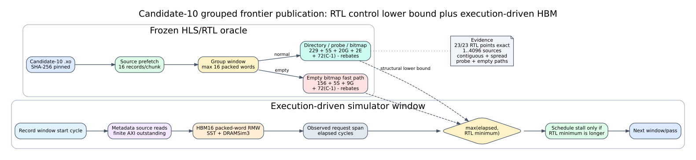

# Candidate-10 Grouped Publication RTL Schedule

## Scope

This milestone closes the source-dependent control gap in the frozen
Candidate-10 grouped frontier publication pass. It does not add a fitted delay
to every edge. The simulator still executes metadata and persistent HBM
requests through finite AXI ports and SST/DRAMSim3; the extracted RTL schedule
acts only as a lower bound for each publication window.

Authoritative hardware inputs:

- HLS source SHA-256:
  `d98fb04cb59c3b00b894ba4d615d7dd1a6250f46fe1d998a951bb0a0843c7dbc`
- read-maintenance XO SHA-256:
  `629e185724467cc14eec4ae14018ff0a89a94aa518ef77499ca6cc2363b28be5`
- routed 150 MHz xclbin SHA-256:
  `551ed1e89755a8b97725efa4003e28007eabd66abb73f480c6ee087a627b9666`

## Hardware Behavior

The production HLS processes source records in windows containing at most 16
distinct packed words. A window can contain more than 16 sources. Sources are
prefetched in chunks of 16, packed-word state is read, new bits are enumerated,
and the updated words are written. Directory words group four sources; dirty
bitmap words group 128 sources. An empty-frontier proof lets the bitmap pass
skip persistent reads and bit enumeration, but it still executes source and
group control.

With `S` sources, `G` packed-word groups, `E` newly enumerated bits, and
`C=ceil(S/16)` prefetch chunks, the frozen RTL has these exact ideal-AXI spans:

```text
normal = 229 + 5*S + 20*G + 2*E + 72*(C-1)
empty  = 156 + 5*S +  9*G       + 72*(C-1)
```

Subtract four cycles for a full 16-group window and three cycles for each
continuation window. The equations are structural results from the packaged
RTL, not an OLS fit.

## Simulator Composition

For each window the simulator records its start cycle, issues the existing
payload-backed metadata and HBM16 requests, and observes their completion span.
It then waits only for:

```text
max(0, rtl_minimum_cycles - execution_driven_elapsed_cycles)
```

Therefore AXI/HBM contention is not skipped and the RTL cost is not double
counted. New counters report windows, groups, prefetch chunks, enumerated bits,
summed RTL minimum cycles, and actual schedule-stall cycles.



## RTL Oracle Evidence

The harness extracts only the grouped-pass RTL and dependencies from the pinned
XO. Its AXI responder permits unlimited outstanding requests so the result is a
control lower bound rather than a memory model. The SST model supplies memory
timing separately.

All 23 cases pass with zero cycle delta. Coverage includes 1, 4, 16, 17, 32,
48, 64, 128, and 4096 contiguous sources; spread directory and bitmap groups;
bitmap probe; empty-bitmap fast path; and multi-window execution.

Evidence:

- `docs/evidence/candidate10_grouped_pass_rtl_oracle_20260726/manifest.json`
- `docs/evidence/candidate10_grouped_pass_rtl_oracle_20260726/grouped_pass_oracle.csv`
- raw XSim logs under the same directory

Reproduce:

```bash
cd /home/chuxiao/spine-cycle-sim
python3 scripts/collect_candidate10_grouped_pass_rtl_oracle.py \
  --out-dir docs/evidence/candidate10_grouped_pass_rtl_oracle_20260726
```

## Hardware Matrix Result

The raw simulator remains below hardware; this milestone deliberately does not
hide the remaining gap with the diagnostic residual layer.

| Case | Before | After | HW cycles | Raw error after |
|---|---:|---:|---:|---:|
| 4096 sources / 4096 edges | 600,062 | 703,812 | 827,778 | -14.98% |
| 4097 sources / 4112 edges | 600,636 | 704,705 | 815,092 | -13.54% |
| 16 spread sources | 8,369 | 9,252 | 46,090 | -79.93% |
| 1 source / 8193 edges | 251,123 | 251,487 | 480,377 | -47.65% |
| 4096 sources / 65,536 edges | about 2.46M after list scheduling | 2,563,644 | 3,855,495 | -33.51% |

The 4096-source cases gain about 103K cycles, matching their actual schedule
stall. The one-source 8193-edge case gains only 364 cycles. This localizes its
remaining 229K-cycle gap to L0 writer/AXI and fixed control behavior rather than
frontier publication.

The bounded diagnostic residual now records calibration feature maxima. It
clamps out-of-domain features, exports raw extrapolation only for audit, and
explicitly labels the per-extra-edge coefficient as unresolved writer/AXI
composite behavior. It is not part of execution-driven simulator time.

## Reproduction

```bash
cd /home/chuxiao/spine-cycle-sim

cmake --build build/cycle-core -j2
build/cycle-core/cpp/spine_cycle_core_tests spine_candidate10
make -C cpp/sst -j2

python3 scripts/run_candidate10_maintenance_matrix.py \
  --out-dir results/candidate10_grouped_schedule_full_20260726 \
  --roles calibration,holdout --no-build

python3 scripts/analyze_candidate10_maintenance.py \
  --matrix results/candidate10_grouped_schedule_full_20260726/matrix.csv \
  --out-dir results/candidate10_grouped_schedule_full_20260726/analysis

python3 scripts/run_candidate10_maintenance_matrix.py \
  --out-dir results/candidate10_grouped_schedule_stress_65536_20260726 \
  --roles stress --cases stress_task_capacity_65536 \
  --no-build --max-cycles 10000000
```

## Next Gap

The next mechanism to close is the family-local L0 writer: packed row/mask/page
writes, AXI burst formation, outstanding transactions, and writer pipeline
stalling. Tiny zero/one-edge cases also require a separate audit of fixed kernel
and measurement-window overhead. Neither gap requires recompiling the existing
Spine Candidate10 hardware baseline.
