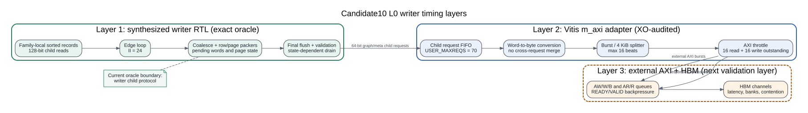

# Candidate10 L0 writer RTL schedule oracle

Date: 2026-07-26
Branch: `codex/fine-grained-cycle-sim`

## Purpose

This evidence separates three timing layers that must not be calibrated as one
opaque residual:

1. the synthesized `partitioned_write_l0_family` control/dataflow schedule;
2. the Vitis HLS child-to-AXI adapter;
3. external AXI/HBM latency, contention, and backpressure.

The first layer now has a deterministic RTL oracle. The second layer has been
source-audited from the same frozen XO. The third layer is deliberately not
claimed by this oracle and remains a simulator/hardware holdout task.



## Frozen artifact

The oracle executes generated RTL from:

```text
/data/feiyang/spine-dynamic-graph-builds/
  pipeline_dirty_frontier_publication_1e61fc0_20260725/production/
  hls_v5_candidate_10/spine_partconv_rdmaint_kernel.hw.xo
```

XO SHA256:

```text
629e185724467cc14eec4ae14018ff0a89a94aa518ef77499ca6cc2363b28be5
```

The source and generated-RTL member names and hashes are recorded in
`docs/evidence/candidate10_l0_writer_rtl_oracle_20260726/manifest.json`.
The collector refuses to run if the XO or audited HLS sources do not match.

## What the oracle drives

`candidate10_l0_writer_tb.sv` instantiates the complete synthesized
`partitioned_write_l0_family` module, not a hand-written writer model. It drives
the writer's three child interfaces:

| child port | width | operation |
| --- | ---: | --- |
| sorted input | 128 bit | one read request/response per input record |
| graph | 64 bit | edge, row, row-mask, page-base, and page-bitmap writes |
| metadata | 64 bit | page-epoch read and page-epoch/page-list writes |

The child protocol uses addresses in port words and lengths in actual beats.
The kernel-level adapter later converts these to byte addresses and AXI
`AxLEN`. The testbench returns one child B response per accepted child AW
request. Periodic `READY` stalls are optional and deterministic.

The current HLS is family-local: the upstream range/bucket stage supplies only
one family's records. The writer trusts that contract. The two deliberately
mixed-family cases therefore expect overflow and validation failure; they are
negative protocol tests, not valid workloads.

## Matrix and result

All 56 cases pass payload-count, request-count, overflow, schedule, and
validation
expectations. The matrix covers:

- the empty invocation;
- 1 through 1024 records with one source;
- unique sources in one page at 2/3/4/5 and 15/16/17 boundaries;
- one new page per source at the same boundaries;
- duplicate coalescing and two/three/four/five records per source;
- two records per source across page transitions;
- family-local contract violations;
- same-source and page-heavy deterministic backpressure.

The synthesized edge loop has an exact steady-state slope of 24 cycles per
input once the one-record special case is excluded:

```text
writer_cycles = 24 * input_records + control_residual
```

The residual is state-dependent. A structural predictor derived from the RTL
matches all 52 valid, unstalled cases with exactly zero cycle error:

```text
N = input records
G = groups belonging to the final source
R = output rows
P = output pages

N == 0: cycles = 0
N == 1: cycles = 799
N >= 2: cycles = 24*N + residual

residual starts at 701
if G == 1:
    residual += 71
    if R > 1 and R mod 4 == 1: residual += 69
    if P > 1:
        residual += 144
        if P is odd: residual += 69
else if R is even and P mod 4 != 0:
    residual += 69
```

Representative observations are:

| case | cycles | `24*N` | residual |
| --- | ---: | ---: | ---: |
| same source, N=2 | 749 | 48 | 701 |
| same source, N=16 | 1,085 | 384 | 701 |
| same source, N=1024 | 25,277 | 24,576 | 701 |
| dense sources, N=4 | 868 | 96 | 772 |
| dense sources, N=5 | 961 | 120 | 841 |
| dense sources, N=16 | 1,156 | 384 | 772 |
| dense sources, N=17 | 1,249 | 408 | 841 |
| one page/source, N=3 | 1,057 | 72 | 985 |
| one page/source, N=4 | 1,012 | 96 | 916 |
| one page/source, N=16 | 1,300 | 384 | 916 |
| one page/source, N=17 | 1,462 | 408 | 1,054 |

The jumps are real RTL behavior. A final source with multiple groups allows
row/page side effects to overlap later `II=24` iterations. A final source with
only one group exposes the late row/page/final flush drain. The one-record case
is also special: 799 total cycles and a 775-cycle residual.

This disproves a single-intercept correction. The simulator now evaluates the
same structural state per active family invocation and enforces the resulting
RTL control lower bound. It does not fit a hardware-wide residual or charge
this latency per edge.

## Internal request evidence

For one valid edge, the writer issues 9 graph child beats:

```text
edge 1 + row 1 + row-mask 1 + page-base 2 + page-bitmap 4 = 9 beats
```

It also issues two metadata writes for page epoch and page list. The CSV stores
child request counts and byte equivalents separately. These are child-port
bytes, not a claim about external HBM transactions.

## Adapter audit

The same XO's `gmem_p0` graph adapter is instantiated as:

| parameter | Candidate10 value |
| --- | ---: |
| child/external data width | 64 bit |
| `USER_MAXREQS` | 70 |
| maximum read/write burst | 16 beats |
| read/write outstanding | 16 |

Its request preprocessor computes:

```text
byte_length = (child_beats << log2(bytes_per_beat)) - 1
byte_address = target_base + (child_word_address << log2(bytes_per_beat))
```

Each child request enters the request FIFO independently. The burst converter
then splits that request at 16 beats and 4 KiB boundaries. There is no
cross-request coalescer in this adapter. Consequently, adjacent one-edge child
writes remain distinct parent AXI requests; the simulator must not invent a
large write burst by merging them.

The architecture profile's `max_outstanding_per_port=32` describes backend HBM
capacity. It is not the Candidate10 HLS adapter limit, which is 16. These two
limits must remain independently configurable.

## Backpressure sensitivity

The deterministic stalls are not an HBM calibration, but they prove where
pressure can propagate:

| case | ideal | stalled | delta | slowdown |
| --- | ---: | ---: | ---: | ---: |
| same source, N=16, stall 2/5 cycles | 1,085 | 1,116 | +31 | 1.029x |
| one page/source, N=16, stall 4/8 cycles | 1,300 | 1,569 | +269 | 1.207x |

The page-heavy writer is more sensitive because each transition emits more
graph and metadata requests. A model with only aggregate bytes cannot reproduce
this difference.

## Simulator implementation

The simulator has payload-backed addresses, packing, request FIFOs, burst
splitting, 4 KiB boundaries, outstanding limits, responses, and finite
backpressure. Candidate10 L0 writing now additionally:

1. tracks input records, emitted rows/pages, and final-source group count;
2. computes the RTL-derived control lower bound per active family invocation;
3. completes at `max(control deadline, dependent memory completion)`;
4. reports schedule invocations, minimum cycles, control padding, and memory
   overrun separately;
5. keeps the HLS adapter outstanding limit separate from backend HBM capacity.

The RTL residual is not added to existing memory latency. Queue stalls still
feed back through real request/response dependencies, while the writer control
deadline advances concurrently. This avoids double-counting protocol waits.

## Execution-driven A/B

The same exact Amazon slice was run with only the structural writer schedule
toggled:

| mode | total cycles | maintenance cycles | backend requests | DRAM reads | DRAM writes | ACT |
| --- | ---: | ---: | ---: | ---: | ---: | ---: |
| schedule off | 3,687 | 3,686 | 731 | 431 | 300 | 47 |
| schedule on | 4,170 | 4,169 | 731 | 431 | 300 | 40 |

The enabled run reports one invocation, a 941-cycle RTL lower bound, 503
control-padding cycles, and zero memory-overrun cycles. Request count and bytes
are identical. Total latency increases by 483 rather than 503 cycles because
the changed issue timing also changes HBM row-buffer interleaving. That is the
intended execution-driven behavior: control and memory are causally coupled,
not two independent spreadsheet terms.

## Hardware holdout

All 11 Candidate10 maintenance hardware cases remain functionally passing. The
new schedule increases simulated cycles by 0 to 9,309 depending on the number
and final state of active writer invocations. It is largely hidden by memory
completion for the 4,096/4,112-edge cases, but material for small workloads
with many active families.

Raw, uncalibrated full-maintenance error is still substantial:

| role | median absolute error |
| --- | ---: |
| calibration | 59.54% |
| holdout | 71.14% |

This is useful negative evidence. The writer edge-loop slope and final flush
are no longer the main unexplained term, but the correction does not justify a
cycle-exact end-to-end claim. Tiny/sparse cases still expose outer family-range
and kernel-wrapper control cost; larger cases still expose adapter and external
memory timing.

## Reproduction

```bash
cd /home/chuxiao/spine-cycle-sim

python3 -m unittest tests.test_candidate10_l0_writer_rtl_oracle

python3 scripts/collect_candidate10_l0_writer_rtl_oracle.py \
  --out-dir docs/evidence/candidate10_l0_writer_rtl_oracle_20260726

python3 scripts/run_sst_spine_vertical.py \
  --scenario candidate10_maintenance \
  --profile configs/architectures/spine_candidate10_one_pass_1e61fc0.json \
  --validation-mode generic \
  --workload tests/data/amazon_top1_exact.slice \
  --no-build \
  --out-dir results/candidate10_l0_writer_rtl_schedule_on_final_20260726

python3 scripts/run_sst_spine_vertical.py \
  --scenario candidate10_maintenance \
  --profile configs/architectures/spine_candidate10_one_pass_1e61fc0.json \
  --validation-mode generic \
  --workload tests/data/amazon_top1_exact.slice \
  --no-build \
  --no-candidate-l0-writer-rtl-schedule \
  --out-dir results/candidate10_l0_writer_rtl_schedule_off_final_20260726

python3 scripts/run_candidate10_maintenance_matrix.py \
  --out-dir results/candidate10_l0_writer_rtl_schedule_hw_matrix_20260726 \
  --no-build

python3 scripts/collect_candidate10_l0_writer_schedule_alignment.py \
  --out docs/evidence/candidate10_l0_writer_schedule_alignment_20260726.json
```

For one traceable case:

```bash
BUILD_DIR=/data/tmp/chuxiao/candidate10_l0_writer_trace \
  scripts/run_candidate10_l0_writer_rtl_oracle.sh \
  INPUTS=17 EDGES=17 ROWS=17 PATTERN=1 SOURCE_STRIDE=256 TRACE=1
```

Vivado/XSim 2024.1 is taken from
`/data/yxx/tools/xilinx/Vivado/2024.1/bin` by default.

## Remaining claims boundary

This milestone supports exact statements about the frozen writer RTL's
unstalled structural control schedule, child requests under the testbench
response policy, and the simulator's causal composition of that schedule with
its current memory backend. It does not yet support claims about cycle-exact
Vitis adapter arbitration, U55C HBM latency distributions, inter-port
contention, or calibrated end-to-end hardware accuracy.

The next evidence layers are deliberately ordered:

1. oracle and model the outer family-range/kernel-wrapper schedule;
2. replay exact child requests through the generated Vitis `m_axi` adapter and
   validate burst splitting, 4 KiB boundaries, adapter outstanding limits, and
   response backpressure;
3. calibrate only the remaining external AXI/HBM service and contention terms
   against U55C microbenchmarks.
