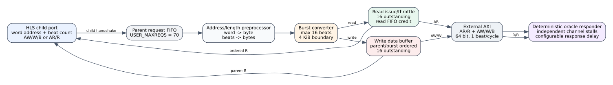

# Candidate10 child-to-m_axi adapter RTL oracle

Date: 2026-07-26
Branch: `codex/fine-grained-cycle-sim`

## Purpose

This evidence isolates the generated Vitis HLS adapter between a kernel child
memory port and external AXI. It answers transaction and flow-control questions
that the L0-writer RTL oracle deliberately leaves outside its claim:

- how child word addresses become external byte addresses;
- how child beat counts become AXI `AxLEN` and bursts;
- where 16-beat and 4 KiB splits occur;
- whether adjacent child requests are coalesced;
- where the 16-outstanding limit applies;
- how read/write and FIFO backpressure alter issue timing.



## Frozen artifact

The testbench instantiates this generated module directly from the frozen XO:

```text
spine_partconv_rdmaint_kernel_gmem_p0_m_axi
```

XO SHA256:

```text
629e185724467cc14eec4ae14018ff0a89a94aa518ef77499ca6cc2363b28be5
```

The exact RTL member and its hash are recorded in
`docs/evidence/candidate10_m_axi_adapter_rtl_oracle_20260726/manifest.json`.

The instantiated parameters match the Candidate10 kernel top:

| parameter | value |
| --- | ---: |
| child/external data width | 64 bit |
| address width | 64 bit |
| maximum read burst | 16 beats |
| maximum write burst | 16 beats |
| read outstanding | 16 |
| write outstanding | 16 |
| `USER_MAXREQS` | 70 |
| `CONSERVATIVE` | 1 |

## Matrix

All 29 cases pass. The matrix includes read and write versions of:

- aligned lengths `1/15/16/17/31/32/33` beats;
- 4 KiB crossings at word offsets 510 and 511;
- adjacent multi-beat and one-beat child requests;
- 17 delayed independent requests to reach the outstanding limit;
- independent `AR`, `AW`, `W`, child `R`, and child `B` stalls;
- read-FIFO saturation with 768 returned beats and a slow child consumer.

Each case validates the complete ordered external address/length trace, payload
beat counts, child completion counts, protocol fields, outstanding occupancy,
and expected pressure counters.

## Exact transaction rules

For a 64-bit port, the generated adapter implements:

```text
external_byte_address = child_word_address * 8
external_beats         = external_AxLEN + 1
burst_beats            = min(remaining, 16, beats_to_next_4KiB_boundary)
```

For example, child word 511 with 17 beats becomes:

| burst | byte address | beats | external `AxLEN` |
| ---: | ---: | ---: | ---: |
| 0 | 4,088 | 1 | 0 |
| 1 | 4,096 | 16 | 15 |

Two adjacent child requests of eight beats remain two eight-beat external
bursts at byte addresses 0 and 64. They are not coalesced into one 16-beat
burst. The simulator must preserve parent-request boundaries.

## Read and write schedules differ

With the deterministic one-cycle responder, selected cases produce:

| operation | child beats | first external address | first external data | child completion | total cycles |
| --- | ---: | ---: | ---: | ---: | ---: |
| read | 1 | 7 | 8 | 11 | 12 |
| read | 16 | 7 | 8 | 26 | 27 |
| read | 17 | 7 | 8 | 27 | 28 |
| write | 1 | 11 | 12 | 16 | 17 |
| write | 16 | 26 | 27 | 46 | 47 |
| write | 17 | 26 | 27 | 48 | 49 |

Cycles are relative to the first accepted child request. Reads can issue the
split `AR` bursts in consecutive cycles. Writes first buffer child `W` data,
then issue `AW/W`; a single split parent had only one external write burst
outstanding in every ideal case. This contradicts a shared read/write
round-robin burst model.

Independent one-beat requests can still overlap. With 17 requests and a
100-cycle response delay, both read and write paths reach exactly 16 external
outstanding transactions; request 17 waits for a completion. The adapter limit
is therefore 16, independent of the backend HBM capacity.

## Backpressure behavior

The small read-pressure case has 51 child-response stall cycles and six
external address stall cycles. It does not deassert external `RREADY`: its 66
beats fit in the adapter's internal buffering.

The saturation case sends 768 read beats while the child accepts one beat every
16 cycles. The adapter reaches 16 outstanding bursts, then spaces later `AR`
issues by as much as 256 cycles. External response-stall count remains zero
because the throttle prevents unsafe requests before their responses arrive.
This distinction matters: pressure appears as address-issue throttling, not
necessarily as an already-issued `R` beat being rejected.

The write-pressure case independently exercises `AW`, `W`, and child `B`
pressure. It records 4 address stalls, 54 external data stalls, 20 child-data
stalls, and 2 child-response stalls while preserving the exact six-burst trace.

## Simulator implications

The shared memory core already performs correct 16-beat/4 KiB splitting, but
the Candidate10 profile and scheduling still require these changes:

1. use Candidate10 request capacities (`USER_MAXREQS=70`, write-only result 67)
   separately from the 16 external outstanding limit and backend HBM capacity;
2. preserve parent request boundaries and expose their identities in traces;
3. model read address issue and write buffering/address issue as different
   state machines;
4. limit each 64-bit port to one external response beat per cycle;
5. make read reorder/FIFO capacity throttle future address issue before unsafe
   responses are requested;
6. report child-queue, address, data, response, and backend stalls separately.

The oracle does not provide an HBM service-time distribution. External
inter-port arbitration and HBM bank/row contention remain backend concerns.

## Reproduction

```bash
cd /home/chuxiao/spine-cycle-sim

python3 -m unittest tests.test_candidate10_m_axi_adapter_rtl_oracle

python3 scripts/collect_candidate10_m_axi_adapter_rtl_oracle.py \
  --out-dir docs/evidence/candidate10_m_axi_adapter_rtl_oracle_20260726
```

One directly traceable boundary case:

```bash
scripts/run_candidate10_m_axi_adapter_rtl_oracle.sh \
  OP=0 REQUESTS=1 START_WORD=511 BEATS=17 STRIDE_WORDS=64 \
  RESPONSE_DELAY=1
```

Vivado/XSim 2024.1 is taken from
`/data/yxx/tools/xilinx/Vivado/2024.1/bin` by default. The collector retries one
time if XSim produces a nonzero process exit and preserves the failed attempt
log; RTL pass/fail still requires a clean successful attempt.

## Claim boundary

This milestone supports exact claims about the frozen `gmem_p0` adapter's
transaction shapes, deterministic channel schedule, outstanding limit, and
backpressure behavior under the oracle responder. Other Candidate10 adapters
may inherit these rules only after their generated parameter/module hashes are
shown equivalent. It does not yet support U55C interconnect or HBM contention
claims.
