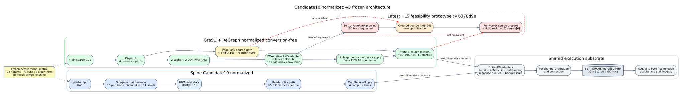

# Candidate10 normalized-v3 architecture freeze

## Decision

The 73-case formal matrix is bound to one immutable architecture contract:

- Candidate10-derived Spine from `spine_candidate10_normalized_v1`;
- conversion-free GraSU plus PMA-native ReGraph from the three
  `grasu_regraph_candidate10_normalized_hls_*_v3` profiles; and
- one shared U55C, FIFO/AXI, and execution-driven SST/DRAMSim3 substrate.

The machine-readable source of truth is
`configs/contracts/candidate10_normalized_architecture_freeze_v3.json`.
Its generator hashes all four profiles and the 23-fixture, 73-run manifest.
Formal results may add evidence but may not mutate lanes, FIFO depths, AXI
windows, HBM mappings, clocks, capacities, algorithm work, or measured
windows. A changed architecture requires an explicitly named projected
profile and cannot replace the baseline after results are visible.



## Shared platform

Both systems use a 150 MHz normalized kernel clock, 450 MHz HBM clock, 32
512-bit U55C pseudo-channels, 1,024-byte maximum bursts, the same
execution-driven SST/DRAMSim3 backend, and a 23-pseudo-channel resource
budget. Outstanding limits remain architecture-specific and resource-visible:
32 per Spine port and 16 per GraSU/ReGraph port.

Spine preserves 16 partitions, 32 families, 11 levels, four compute lanes,
16 graph HBM channels, 65,536-vertex tiles, and the 4,096-active-source tiny
threshold. GraSU/ReGraph preserves four bin-search CUs, one dispatch, two
cache and two DDR processors, an eight-lane conversion-free adapter, one
little-gather/merger/apply path, finite inter-CU streams, and the algorithm
specific state and convergence rules.

## Algorithm contract

| Algorithm | Map | Reduce | State and termination |
| --- | --- | --- | --- |
| Weighted SSSP | saturating distance + weight | unsigned minimum | uint32 distance; frozen minimum fixed supersteps |
| Full PageRank | float32 damping * rank / degree | float32 sum | float32 rank; exactly three iterations |
| Thresholded residual PageRank | float32 damping * residual / degree | signed float32 sum | rank + residual; threshold or 256 iterations |

Every formal row must pass the architecture-state oracle and an independent
mathematical oracle. A mismatch is a failed row, not a timing sample.

## Latest HLS prototype crosswalk

The feasibility prototype is pinned to
`grasu-regraph-integration@7b922ee24c488b8864f0951dc06275d9d0d54b1c`.
It now contains complete conversion-free Full and residual PageRank build
topologies with 16 CUs. It is valuable synthesis/PPA evidence, but it is not
silently called matching normalized-v3 HLS:

| Mechanism | Frozen normalized v3 | Latest HLS prototype | Disposition |
| --- | --- | --- | --- |
| PMA handoff | finite eight-lane AXIS | finite eight-lane AXIS | structurally equivalent |
| Bin-search AXI | edge input master + shared row/binary metadata master per CU | same two-master topology, checked from compiled XO | structurally equivalent |
| Degree completion | four depth-16 FIFOs + 4,096 reorder entries | one ordered depth-64 AXIS from dispatch | model separately; optimization |
| PageRank state | apply/degree on HBM[30] | rank HBM[4], residual HBM[5], degree HBM[6] | native-prototype mode required |
| Source preparation | per-source cache refill, degree read, source-map | separate full-vertex pass to HBM[1]/HBM[3] | native-prototype mode required |
| Residual state | packed 64-bit rank/residual | separate 32-bit arrays | keep PPA evidence separate |
| Host control | frozen iteration/convergence contract | per-kernel launches not yet E2E validated | validate launch/order/drain |

These differences can change memory traffic or contention, so PageRank remains
blocked from a `matching-HLS normalized` label. They do not prevent structural
exploration under the frozen normalized contract.

## Reproduction

```bash
cd /home/chuxiao/spine-cycle-sim
python3 scripts/prepare_candidate10_normalized_freeze_v3.py
python3 -m unittest \
  tests.test_candidate10_normalized_freeze_v3 \
  tests.test_hls_derived_normalized_v3
```

Regenerate only before the formal matrix starts:

```bash
python3 scripts/prepare_candidate10_normalized_freeze_v3.py --write
```

The generator refusing a stale artifact is intentional. It prevents a profile
or workload change from being hidden behind the same experiment name.
