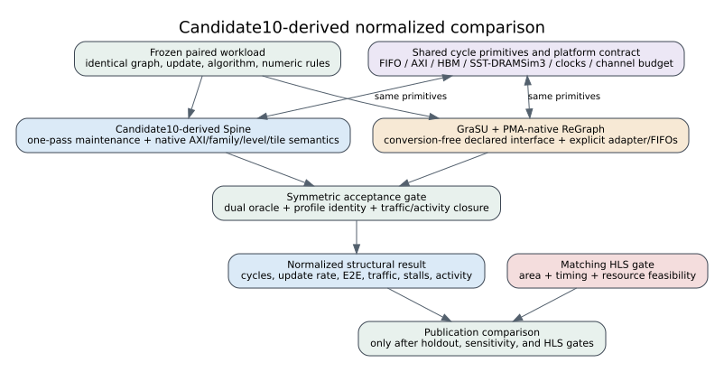

# Candidate10-derived normalized comparison contract

## Decision

Native hardware alignment is a validation anchor, not the headline comparison.
The primary performance view is a symmetric normalized comparison between:

- Candidate10-derived Spine, preserving the compiled one-pass maintenance,
  AXI, family, level, partition, tile, and host-round semantics; and
- conversion-free GraSU update plus PMA-native ReGraph compute, with every
  adapter, FIFO, request, and handoff that the declared interface requires.

The normalized result is structural execution-driven simulation. It is not a
native FPGA measurement. Matching HLS synthesis remains mandatory before an
iso-resource publication claim because only the Spine side currently has a
routed implementation of the normalized microarchitecture.



## Why the previous matrix is not the new performance baseline

The 2026-07-25 matrix used `spine_latest_afb8199`. That profile omitted
`maintenance_architecture` and `axi_profile`, so the runner selected its legacy
fallbacks, `shared_engine_serial` and `hls_split_9c08763`. The 146 passing
system rows remain evidence for workload generation, dual-oracle correctness,
SST/DRAMSim3 orchestration, sparse HBM binding, timeout handling, and result
pairing. They are not evidence for latest-Candidate10 Spine performance.

The new default is `spine_candidate10_normalized_v1`, whose native parent is
`spine_candidate10_one_pass_1e61fc0`. The parent file SHA-256 and protected
Candidate10 parameters are checked before any child process starts.

## Claim layers

| Layer | Purpose | Allowed claim |
|---|---|---|
| Native | Validate reusable mechanisms against HLS, RTL, hw_emu, and FPGA | Feasibility, correctness, component timing, and trends only |
| Normalized | Compare equal algorithms under one platform and resource contract | Primary structural performance, traffic, and activity result |
| Projected | Change lanes, queues, scans, levels, channels, or overlap | Explicit what-if and ablation only |
| Matching HLS | Implement the exact normalized/projected topology | Area/timing feasibility and promotion evidence |

No native resource result is relabeled as normalized. No projected speedup is
reported as measured. Native host conversion is measured separately; zero
conversion is permitted only for a declared PMA-native interface whose adapter
and handoff are present in the model and matching HLS.

## Fail-closed profile contract

`validate_normalized_profile_contract()` enforces:

1. Spine profile ID and role are explicitly Candidate10-derived normalized.
2. Its native parent ID and SHA-256 match the committed hardware-validated
   Candidate10 profile.
3. Protected maintenance, AXI, memory-layout, family, level, partition, tile,
   publication, and L0-writer parameters equal the native parent.
4. All three GraSU/ReGraph algorithm profiles are normalized, conversion-free,
   PMA-native, and reference the same Spine resource profile.
5. Both systems use 150 MHz normalized compute, 450 MHz HBM, the same 32-channel
   512-bit memory geometry, burst/outstanding limits, and 23-pseudo-channel
   budget.
6. Every returned row matches the invoked profile path, profile ID, profile
   SHA-256, and, for Spine, actual maintenance and AXI implementation IDs.

The v2 workload manifest separately freezes 20 disjoint synthetic fixtures,
three compact real-dataset slices, 73 run cases, all input hashes, algorithm
parameters, profile hashes, and calibration/holdout/validation roles.

## First execution-driven smoke

Command:

```bash
cd /home/chuxiao/spine-cycle-sim
python3 scripts/run_shared_comparison_matrix.py \
  --run-id syn_weighted_diamond_v8__weighted_sssp \
  --run-id syn_weighted_diamond_v8__full_pagerank \
  --run-id syn_weighted_diamond_v8__residual_pagerank \
  --out-dir docs/evidence/candidate10_normalized_profile_smoke_20260726 \
  --jobs 3 \
  --no-build
```

All six rows passed both correctness oracles, profile identity checks, physical
HBM binding checks, and the backend request ledger:

| Algorithm | Spine cycles / requests | GraSU/ReGraph cycles / requests | Spine ratio |
|---|---:|---:|---:|
| Weighted SSSP | 58,618 / 3,982 | 233,633 / 101,466 | 3.9857x |
| Full PageRank | 32,069 / 2,207 | 133,053 / 50,757 | 4.1490x |
| Thresholded residual PageRank | 689,247 / 41,332 | 2,727,567 / 2,671,385 | 3.9573x |

These ratios are three algorithms on one tiny graph, not performance
conclusions. They prove that the new profile lineage reaches the executed
components: Spine reported `candidate10_one_pass` and
`candidate10_gmem_1e61fc0`, while the three GraSU/ReGraph rows reported the
three immutable Candidate10-v2 profile identities. The manifest labels the
evidence as a filtered structural subset and `complete_matrix` is false.

## Publication gate

A result can enter the primary comparison only when:

- both architecture and mathematical oracles pass;
- update, differential detection, handoff, compute, and E2E windows are
  separately closed and no required conversion is hidden;
- request/byte/burst/stall/activity ledgers close;
- calibration, holdout, and real validation roles are kept disjoint;
- parameter sensitivity does not reverse the stated conclusion; and
- matching GraSU/ReGraph HLS establishes that the normalized resource envelope
  is feasible. Until then, results remain structural simulation evidence.

## Reproduction

```bash
cd /home/chuxiao/spine-cycle-sim
python3 scripts/prepare_shared_comparison_workloads.py --verify-only
python3 -m unittest \
  tests.test_architecture_profiles \
  tests.test_shared_comparison_workloads \
  tests.test_shared_comparison_runner
```

The historical matrix is preserved in
`configs/experiments/shared_comparison_workloads_20260725.json`. The new default
is `configs/experiments/shared_comparison_candidate10_v2_20260726.json`.
