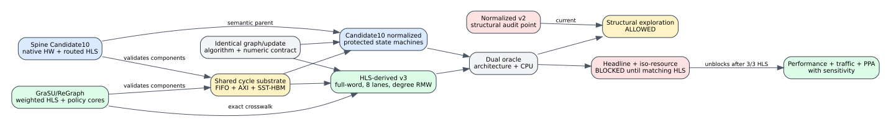

# Candidate10 Normalized Scientific Comparison Gate

## Decision

Native alignment is a validation anchor, not the final comparison target.  It
checks that the simulator's state machines, request generation, FIFO/AXI/HBM
interactions, and hardware costs correspond to implementable designs.  It does
not justify scaling a native cycle count into a normalized result, and it does
not make an asymmetric GraSU/ReGraph model publication ready.

The primary comparison will use two explicit normalized architectures on the
same platform.  Each architecture must inherit its own implementable datapath;
only listed platform parameters may be normalized.  The final evidence chain is:



1. native or component HLS validates each architecture's mechanisms;
2. one shared execution-driven FIFO/AXI/HBM substrate evaluates both systems;
3. matching HLS supplies resources and timing for the compared datapaths; and
4. sensitivity analysis shows whether reasonable timing uncertainty changes the
   ordering.

## Current Gate

| System/algorithm | Functional evidence | Closest implementation | Exact normalized HLS | Allowed use |
|---|---|---|---|---|
| Spine Candidate10 | Native HW and routed xclbin | Candidate10 parent | Parent semantics preserved | Structural comparison and feasibility anchor |
| GraSU/ReGraph weighted SSSP | Whole-system `sw_emu` oracle pass | 15-CU routed HW design | No | Structural comparison only |
| GraSU/ReGraph Full PageRank | Simulator dual oracle and isolated policy tests | Unsynthesized whole-system proposal | No | Correctness/structure only |
| GraSU/ReGraph residual PageRank | Simulator dual oracle and isolated policy tests | Unsynthesized whole-system proposal | No | Correctness/structure only |

The weighted routed build uses 98,060 LUT, 12,772 LUTRAM, 112,582 registers,
233 BRAM, and 64 URAM.  Its 200 MHz kernel clock has `+0.218 ns` WNS, but the
whole design has `-0.187 ns` WNS on HBM-clock paths.  A route-aggressive relink
is prepared but has not run.  This is useful feasibility evidence, not a timing-
closed normalized implementation.

The current normalized-v2 GraSU/ReGraph profiles are not the same architecture
as that HLS design:

| Field | normalized v2 | closest HLS | Consequence |
|---|---:|---:|---|
| ReGraph lanes | 4 | 8 | Different compute throughput and area |
| AXI outstanding/port | 32 | 16 | Different memory-level parallelism and buffering |
| PMA edge ABI | simplified weighted word | full-word compare | Different weight-update semantics |
| PageRank degree update | omitted from timing | explicit RMW required | Dynamic update work is undercounted in v2 |
| Kernel clock | 150 MHz | 200 MHz requested | Intentional platform normalization, not itself a blocker |

Therefore v2 speedups may expose structural trends and simulator bugs, but they
must not be the headline speedup, iso-resource result, or measured-FPGA result.

## Machine-Enforced Claims

`configs/contracts/candidate10_normalized_hls_feasibility_v1.json` binds every
profile and the HLS evidence summary by SHA-256.  The shared runner now accepts
`--claim-scope` and fails before launching SST when evidence does not support the
requested scope.

Currently permitted:

- `correctness`: only with per-run architecture and mathematical oracles;
- `structural_exploratory`: execution-driven timing, traffic, stalls, and
  sensitivity, explicitly labeled non-headline.

Currently blocked:

- `headline_normalized_performance`;
- `iso_resource_performance`; and
- `fpga_measured_performance` for every normalized result.

## HLS-Derived V3 Baseline

Do not mutate v2 and do not simplify the working HLS merely to match it.  Create
an immutable v3 baseline from the implementation that already has correctness
and routing evidence:

- full-word PMA comparison and delete-old/insert-new weight changes;
- eight-lane PMA adapter and Map/Reduce datapath;
- 16 outstanding requests per HLS initiator unless a synthesized 32-entry
  variant is produced;
- timed insert/delete degree maintenance for both PageRank variants;
- explicit dangling reduction, state layout, iteration/convergence control, and
  nonzero queues between GraSU and ReGraph; and
- 150 MHz normalized comparison clock and the same 23-pseudo-channel budget as
  Spine.  The native 200 MHz build remains separately reported.

This is an architecture-fidelity correction, not a projected optimization.  A
later projected profile may change lanes, queues, channels, or update semantics,
but every such change must name its hardware cost and appear only in ablation or
design-space results.

## Scientific Comparison Protocol

1. Feed both systems byte-identical graph/update artifacts and identical
   algorithm/numeric/convergence contracts.
2. Require both architecture-state and independent CPU algorithm oracles for
   every reported run.
3. Use the same clock, HBM device model, channel budget, request granularity,
   and energy parameter source.  Preserve each architecture's real channel
   mapping and contention.
4. Include all necessary work.  The conversion-free GraSU/ReGraph integration
   has no host conversion array, but its adapter, queues, barriers, degree RMW,
   and host rounds are timed.
5. Report performance together with LUT/BRAM/URAM/DSP and memory traffic.  Equal
   device/HBM is the primary platform-matched comparison; exact iso-resource
   projections are separate because the two architectures trade BRAM and URAM
   differently.
6. Keep calibration workloads disjoint from holdout datasets.  Report medians,
   tails, and per-workload outcomes rather than only an aggregate speedup.
7. Sweep uncertain FIFO, AXI, HBM, and policy latencies.  A headline conclusion
   is robust only if plausible parameter ranges do not reverse it.

## Next Gates

1. Run the prepared weighted route-aggressive relink and archive the timing
   disposition.
2. Compile all three isolated policy cores for incremental resource/timing
   evidence.
3. Freeze the HLS-derived v3 simulator profiles and rerun the three-algorithm
   smoke set.  Any v2-to-v3 cycle change is reported as a fidelity correction.
4. Integrate Full and residual PageRank into complete HLS data paths and pass
   whole-system correctness tests.
5. Synthesize the exact v3 variants, update the machine gate to matching, then
   execute the disjoint synthetic and real holdout matrix for headline results.

Until gates 3-5 pass, the correct statement is: the platform can compare
execution-driven structures and validate correctness, but it has not yet
established the final Spine-versus-GraSU/ReGraph performance claim.

## Prepared Long Builds

Do not run these two jobs concurrently, and do not start either while another
large Vivado link is using the same host.  First retry timing closure for the
existing weighted whole system:

```bash
cd /home/chuxiao/grasu-regraph-integration

/data/tmp/chuxiao/grasu_regraph_weighted_sssp_native_hw_relink_route_aggressive_a927186_20260726/link_command.sh \
  > /data/tmp/chuxiao/grasu_regraph_weighted_sssp_native_hw_relink_route_aggressive_a927186_20260726/link.stdout.log \
  2>&1

/data/tmp/chuxiao/grasu_regraph_weighted_sssp_native_hw_relink_route_aggressive_a927186_20260726/collect_result.sh
```

Then synthesize the three isolated eight-lane algorithm policy cores:

```bash
cd /home/chuxiao/grasu-regraph-integration

/data/tmp/chuxiao/regraph_algorithm_policy_hw_20260726/compile_commands.sh \
  > /data/tmp/chuxiao/regraph_algorithm_policy_hw_20260726/compile.stdout.log \
  2>&1
```

The policy XOs are incremental arithmetic resource/timing evidence only.  They
do not unblock Full or residual PageRank until their complete data paths are
integrated and synthesized.
