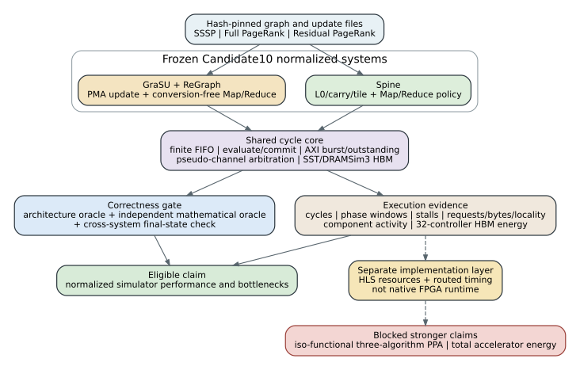

# Candidate10 publication acceptance ledger

## Claim scope

This ledger separates simulator performance, correctness, implementation
feasibility, and energy evidence. Candidate10 is a normalized,
conversion-free, execution-driven comparison at 150 MHz. It is not native FPGA
runtime and is not an iso-resource comparison.



## Acceptance status

| Gate | Status | Evidence |
| --- | --- | --- |
| Frozen architecture contract | PASS | `configs/contracts/candidate10_normalized_architecture_freeze_v3.json` |
| Three algorithms | PASS | weighted SSSP, Full PageRank, thresholded residual PageRank |
| Formal correctness | PASS | 146/146 system runs and 73/73 pairs; zero dual-oracle mismatch |
| Real small batches | PASS | 54/54 system runs and 27/27 pairs; insert/delete/weight-change |
| Dense and capacity sweep | PASS | 8 timing pairs and 4 capacity endpoints |
| HBM sensitivity | PASS | 120 system runs, zero strict ranking inversion |
| Matched HBM energy | PASS | 12 system runs, six pairs, all 32 controllers |
| Spine routed feasibility | PASS | U55C routed xclbin, 150 MHz timing closed |
| GraSU+ReGraph three-algorithm routed feasibility | IN PROGRESS | weighted and Full PageRank routed; residual build running |
| 50K-edge real-slice runtime | IN PROGRESS | Candidate10 v3 rerun running after fallback repair |
| Matched total accelerator energy | BLOCKED | asymmetric on-chip coverage; logic/clock/interconnect omitted |
| Three-algorithm iso-functional Spine PPA | BLOCKED | current Spine xclbin is the SSSP compute baseline |

## Frozen simulator results

The 73-pair formal matrix gives a 1.184x Spine speedup geometric mean and a
1.187x median. Spine wins 39 pairs and GraSU+ReGraph wins 34. This does not
support a universal Spine-win claim. The compact-real subset favors
GraSU+ReGraph: Spine speedup is 0.709x geometric mean and Spine wins one of nine
pairs.

The 27-pair real small-batch matrix also favors GraSU+ReGraph end to end:
Spine speedup is 0.726x geometric mean. Compute-only weighted SSSP favors Spine
by 2.258x, but GraSU+ReGraph's pure update path is about 505x faster in this
eight-user-mutation matrix. These are separate windows and must not be mixed.

Dense Full PageRank favors GraSU+ReGraph by 4.33--5.01x. The capacity sweep
reproduces the frozen profile limits: Spine accepts 16,384 final edges at its
L1 boundary while GraSU+ReGraph rejects the corresponding 8,192-update case;
at 24,576 final edges both profiles reject. No timing ratio is reported for a
rejected endpoint.

## Memory and energy

Across the formal matrix, GraSU+ReGraph issues 4.197x as many backend requests
as Spine on geometric average. Request count is not an energy proxy: burst
width, row locality, active time, and refresh/background energy all matter.

For the matched Full and residual PageRank energy subset, the
GraSU/Spine 32-controller HBM total-energy ratio is 0.809x geometric mean,
while its command-dynamic ratio is 1.930x. GraSU+ReGraph performs more DRAM
command work but often finishes sooner, reducing accumulated background and
refresh energy. The ratio ranges across workloads and is not universal.

Only this HBM ratio is matched. CACTI-P selected-array results use projected
32 nm ASIC SRAMs and do not cover equivalent arrays on both systems. No total
accelerator, FPGA board, or ASIC energy winner is eligible.

## PPA boundary

The routed Spine Candidate10 SSSP baseline uses 127,910 LUT, 149,746 registers,
99 BRAM, 99 URAM, and 22 DSP, with +0.003 ns WNS at 150 MHz.

The conversion-free GraSU+ReGraph weighted SSSP system uses 96,559 LUT,
107,380 registers, 233 BRAM, 64 URAM, and no DSP. It misses 150 MHz by 0.013 ns
(approximately 149.7 MHz). Full PageRank uses 178,374 LUT, 177,836 registers,
278 BRAM, 64 URAM, and 304 DSP; it misses 150 MHz by 0.130 ns (approximately
147.1 MHz). Routed feasibility is established, but neither result is labeled
150 MHz timing closure.

The GraSU+ReGraph PageRank resources include algorithm-specific source prepare
and apply hardware. The Spine resources do not include an equivalent
whole-system PageRank implementation. Cross-system resource ratios are
therefore descriptive, not iso-functional PPA comparisons.

## Reproduction and integrity

Verify the frozen evidence bundles independently:

```bash
for bundle in \
  candidate10_hls_v3_formal_matrix_20260727 \
  candidate10_hls_v3_real_small_batches_20260727 \
  candidate10_hls_v3_dense_full_pagerank_20260727 \
  candidate10_hls_v3_matched_pagerank_energy_20260727 \
  candidate10_alignment_inputs_20260727; do
  (cd "docs/evidence/${bundle}" && sha256sum -c SHA256SUMS)
done
```

The large-runtime manifest now pins `candidate10_hls_v3`; invoking its runner
with the legacy default fails before launching a child process.
Rejected compiler-only and SST thread-scaling runtime experiments are recorded
in `docs/runtime_rejected_paths_20260727.md`.

## Remaining publication work

1. Freeze the residual PageRank routed artifact, resources, timing, and source
   identity after the active Vitis run completes.
2. Accept or reject the 50K-edge runtime gate only after both systems finish,
   all correctness checks pass, and the host wall time is recorded.
3. Implement and synthesize Spine Full/residual PageRank whole systems before
   making an iso-functional three-algorithm PPA claim.
4. Add symmetric on-chip activity and characterized storage plus logic,
   interconnect, and clock energy before making a total-energy claim.
