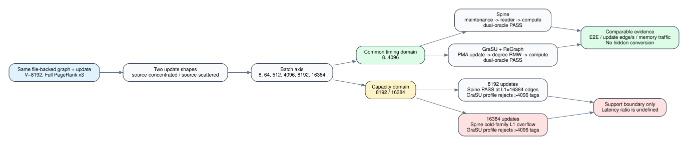

# Full PageRank Dense-Batch Sweep

## Purpose

This milestone measures how update-batch size and source concentration affect
the execution-driven Spine and GraSU+ReGraph models. It is a synthetic stress
test, not a replacement for the three-real-dataset acceptance matrix.



## Fixed contract

- 8,192 vertices and an 8,192-edge directed ring as the initial graph.
- Three Full PageRank iterations at damping 0.85.
- Insert-only batches of 8, 64, 512, 4,096, 8,192, and 16,384 records.
- Two shapes: updates concentrated on few sources and updates scattered across
  all sources.
- The graph and update files, including SHA-256 hashes, are identical across
  architectures.
- Every successful timing row must pass float32 architecture, float64
  mathematical, and cross-system rank-vector checks.

The input contract is
`configs/experiments/hls_full_pagerank_dense_batch_sweep_20260726.json`.
Generated slices are under `tests/data/hls_full_pagerank_dense_batches/`.

## Capacity domains

The workload deliberately keeps destination IDs below 2^20. Spine therefore
places all cold edges in one family. L0 can hold 131,072 edges, but after an
update to an occupied L0 the carry target is L1, whose per-family capacity is
16,384 edges in both the simulator and current HLS formula.

The proposed GraSU PageRank profile has 4,096 degree-completion reorder
entries. The full degree-maintenance HLS CU does not yet exist, so this is a
profile limit rather than a synthesized whole-system claim.

| Batch | Final edges | Spine | GraSU+ReGraph | Valid claim |
|---:|---:|---|---|---|
| 8..4,096 | 8,200..12,288 | PASS | PASS | paired timing and traffic |
| 8,192 | 16,384 | PASS | profile capacity reject | support boundary only |
| 16,384 | 24,576 | L1 family overflow | profile capacity reject | support boundary only |

No speedup is reported where either architecture cannot enter the common
successful timing window.

## Reproduction

Generate and verify all file-backed inputs:

```bash
python3 scripts/prepare_hls_full_pagerank_dense_batches.py
python3 scripts/prepare_hls_full_pagerank_dense_batches.py --verify-only
```

Run all eight comparable pairs (capacity endpoints are excluded by contract):

```bash
python3 scripts/run_hls_pagerank_real_comparison.py \
  --input-manifest configs/experiments/hls_full_pagerank_dense_batch_sweep_20260726.json \
  --out-dir results/dense_full_pagerank_matrix_20260726 \
  --jobs 4 --timeout-seconds 300 --max-cycles 200000000 --no-build
```

Run all four capacity endpoints:

```bash
python3 scripts/run_spine_dense_capacity_cliff.py \
  --out-dir results/dense_full_pagerank_capacity_20260726 \
  --timeout-seconds 300 --max-cycles 200000000 --no-build
```

The capacity runner accepts a nonzero Spine child only when the exact expected
target-level overflow is present. GraSU batches above 4,096 are checked against
the pinned profile and are not launched as doomed SST jobs.

## Complete timing evidence

All eight comparable pairs and all 16 system executions passed their
architecture oracle, float64 mathematical oracle, and cross-system rank-vector
checks. The maximum cross-system rank difference was zero in every pair.

| Update shape | Batch | Spine E2E (ms) | GraSU E2E (ms) | GraSU speedup | Spine update (ms) | GraSU update (ms) |
|---|---:|---:|---:|---:|---:|---:|
| concentrated | 8 | 24.891 | 6.020 | 4.13x | 1.474 | 0.001 |
| concentrated | 64 | 24.908 | 6.025 | 4.13x | 1.490 | 0.005 |
| concentrated | 512 | 25.104 | 6.090 | 4.12x | 1.620 | 0.066 |
| concentrated | 4,096 | 26.235 | 6.719 | 3.91x | 2.639 | 0.684 |
| scattered | 8 | 24.893 | 6.020 | 4.13x | 1.476 | 0.001 |
| scattered | 64 | 24.924 | 6.024 | 4.14x | 1.506 | 0.007 |
| scattered | 512 | 25.216 | 6.069 | 4.15x | 1.726 | 0.052 |
| scattered | 4,096 | 27.090 | 6.429 | 4.21x | 3.477 | 0.411 |

The compute phase remains nearly fixed because the final graph grows by at
most 50%: Spine compute is 23.416--23.613 ms and GraSU+ReGraph compute is
6.018--6.035 ms. The update distribution has opposite effects at 4,096
records. Scattered sources increase Spine update requests from 113,823 to
130,203, while concentrated sources increase GraSU update requests from 24,576
to 57,361. These request counts explain the timing direction in the model; they
do not by themselves prove the same magnitude on FPGA.

The eight-pair matrix used four concurrent child jobs and completed in 152.0
host seconds. Individual Spine jobs took 50.1--55.0 seconds; GraSU+ReGraph jobs
took 11.3--14.6 seconds. This is simulator throughput evidence, not modeled
accelerator latency.

## Capacity evidence

All four capacity outcomes matched the declared contract:

- At 8,192 updates, Spine completed at the exact 16,384-edge L1 boundary for
  both shapes, in 27.583 ms concentrated and 29.262 ms scattered.
- At 16,384 updates, Spine reported the exact target-level-1 family overflow
  after 670,600 concentrated or 984,161 scattered cycles. Reader and compute
  did not start, so this is a fail-fast capacity result.
- GraSU+ReGraph rejected both batch sizes against the pinned 4,096-entry
  proposed PageRank profile. This is a static profile boundary, not a native
  synthesized-hardware failure.
- No latency ratio is produced for any capacity row.

The capacity matrix completed in 139.4 host seconds. Its successful runs also
passed all PageRank correctness gates.

## Claim boundary

These are execution-driven simulator results using the shared AXI/FIFO/HBM
primitives. GraSU Full PageRank remains an HLS-equivalent proposed profile, not
a compiled whole-system xclbin. Results do not claim cycle-for-cycle hardware
calibration or total-chip energy. The dense sweep covers the requested batch
stress axis; real-dataset E2E, full PPA, and large-graph runtime remain separate
acceptance items.
