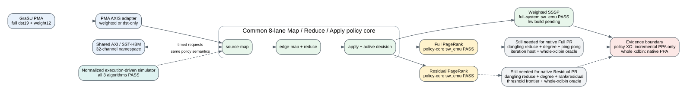

# HLS Algorithm Policy Evidence

The simulator and HLS evidence now share one explicit algorithm boundary:
source-map, edge-map/reduce, and apply. Weighted SSSP, Full PageRank, and
thresholded residual PageRank have byte-level float32/integer policy semantics
and an eight-lane HLS implementation at integration commit `7b922ee`.

## What Passed

- All three policy variants pass C++ functional tests against their expected
  state transitions.
- All three compile to Vitis 2024.1 `sw_emu` XOs at a requested 200 MHz clock.
- The PMA adapter passes legacy unit-weight, weighted full-word, and PageRank
  destination-only output tests.
- The normalized execution-driven simulator already runs all three algorithms
  with dual-oracle correctness checks.

The conversion-free whole-system PageRank source graph is now integrated and
its component correctness tests pass.  Hardware builds use the shared 150 MHz
comparison clock.  Compiled-XO metadata is checked before link: every compact
GraSU bin-search CU exposes two AXI masters, with row-offset and binary probes
sharing one metadata master.  The expected HMSS master totals are 27 for Full
PageRank and 29 for residual PageRank.

## What This Does Not Yet Prove

PageRank is not yet a validated native accelerator result.  The whole xclbins
must finish link/place/route, their host iteration and convergence sequencing
must run, and their final state must pass both architecture and independent
mathematical oracles.  Until those gates pass, PageRank performance remains
`normalized/proposed`, not `native`.

Weighted SSSP is farther along: the conversion-free complete xclbin passed
`sw_emu`, and its `hw` build is prepared under
`/data/tmp/chuxiao/grasu_regraph_weighted_sssp_normalized_v3_hw_20260726`.
Full and residual PageRank builds are tracked under the roots pinned in the
machine-readable contract.

## Evidence Contract

The machine-readable status is
`configs/contracts/hls_algorithm_policy_evidence_v1.json`. Its tests verify
source hashes, the integration commit, all three algorithm entries, and
fail-closed native labels. Policy-core synthesis reports may be used only for
incremental arithmetic resource/latency comparison. Whole-system FPGA PPA
requires a linked and routed xclbin.
