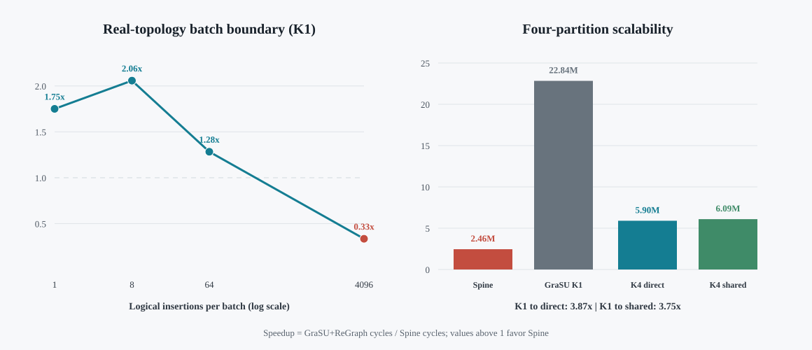

# Dynamic Connected Components: K1 Screening and K4 Scalability

## Contract

The simulator computes weakly connected components over reciprocal edge
records.  Each component label is its minimum vertex ID.  Insertions use
incremental repair; deletion repair is outside the current claim.  Every
reported row passes both the architecture-precision oracle and an independent
CPU connected-components oracle.  Final labels, active-edge work, memory
requests, and queue drain must match before timing is admitted.

## Real-topology K1 boundary

The screening graph is a reciprocal, sink-free projection of a real Flickr
topology slice with 2,552 vertices and 8,192 edge records.  Spine and
GraSU+ReGraph K1 receive byte-identical graph and insertion streams.

| Logical insertions | Spine cycles | GraSU+ReGraph cycles | Spine speedup |
|---:|---:|---:|---:|
| 1 | 262,422 | 459,369 | 1.750x |
| 8 | 534,476 | 1,099,913 | 2.058x |
| 64 | 608,763 | 781,025 | 1.283x |
| 4,096 | 1,608,878 | 538,677 | 0.335x |

Spine wins the three sparse/small batches.  The dense batch is an explicit
negative boundary: broad activation and update work make GraSU+ReGraph faster.
The result therefore supports a conditional sparse-update claim, not a
universal CC speedup claim.

## Four-partition scalability

The scalability fixture has 262,144 vertices and four balanced destination
partitions.  It is a synthetic four-way replication of the real Flickr slice,
with one reciprocal insertion per partition.  It is used only to isolate
partition parallelism.

| Variant | Frontends | Downstreams | Cycles | Requests | Read bytes | Write bytes |
|---|---:|---:|---:|---:|---:|---:|
| Spine | 1 native | 1 native | 2,455,396 | 1,073,671 | 2,199,912 | 2,196,416 |
| GraSU+ReGraph K1 | 1 | 1 | 22,837,741 | 2,247,184 | 20,086,464 | 6,291,968 |
| GraSU+ReGraph direct K4 | 4 | 4 | 5,900,033 | 2,247,184 | 20,086,464 | 6,291,968 |
| GraSU+ReGraph shared K4 | 4 | 1 | 6,094,290 | 2,247,184 | 20,086,464 | 6,291,968 |

Direct and shared K4 are `3.871x` and `3.747x` faster than K1.  Shared K4 is
only `3.29%` slower than direct K4 while activating one downstream at a time.
All three GraSU+ReGraph variants issue exactly the same requests and bytes, so
the measured gain comes from partition overlap rather than reduced work.
Spine remains `2.48x` faster than shared K4 on this sparse fixture.



## Reproduction

```bash
cd /home/chuxiao/spine-cycle-sim-publication
make -C cpp/sst -j2

python3 scripts/run_connected_components_matrix.py \
  --out-dir evidence/cc_k1_publication_v1 \
  --run-id cc_real_soc_flickr_insert_u1 \
  --run-id cc_real_soc_flickr_insert_u8 \
  --run-id cc_real_soc_flickr_insert_u64 \
  --run-id cc_real_soc_flickr_insert_u4096 \
  --compute-pipelines 1 --downstream-sharing direct \
  --max-concurrent 4 --no-build

python3 scripts/run_connected_components_matrix.py \
  --out-dir evidence/cc_scalability_p4_k1_v3 \
  --run-id cc_real_soc_flickr_replicated_p4_insert_u4 \
  --compute-pipelines 1 --downstream-sharing direct \
  --max-concurrent 2 --no-build

python3 scripts/run_connected_components_matrix.py \
  --out-dir evidence/cc_scalability_p4_direct_k4_v2 \
  --run-id cc_real_soc_flickr_replicated_p4_insert_u4 \
  --architecture grasu --compute-pipelines 4 \
  --downstream-sharing direct --max-concurrent 1 --no-build

python3 scripts/run_connected_components_matrix.py \
  --out-dir evidence/cc_scalability_p4_shared_k4_v1 \
  --run-id cc_real_soc_flickr_replicated_p4_insert_u4 \
  --architecture grasu --compute-pipelines 4 \
  --downstream-sharing shared --max-concurrent 1 --no-build

python3 scripts/analyze_connected_components_publication.py \
  --out-dir evidence/connected_components_publication_analysis_v1
python3 scripts/render_connected_components_figure.py
```

The analyzer fails closed on correctness, workload/update/plugin provenance,
K1/direct-K4/shared-K4 topology, positive cycles, and GraSU+ReGraph request and
byte conservation.  Compact committed evidence is in
`docs/evidence/connected_components_publication_v1/`; raw SST/DRAMSim3 output
remains under `evidence/`.

## Limitations and follow-up

- The real-topology K1 screening graph has only 8,192 edge records.
- The four-partition fixture is synthetic and has only 8,192 initial edge
  records; it is not a large real-graph result.
- The derived-real AskUbuntu 540,000-record gate and 903,774-record full
  reciprocal projection are now complete; see
  `large_real_three_algorithm_20260728.md`.
- A large-real direct/shared-K4 rerun remains a separate scalability follow-up.
- Shared-K4 resource feasibility still requires HLS synthesis evidence.
