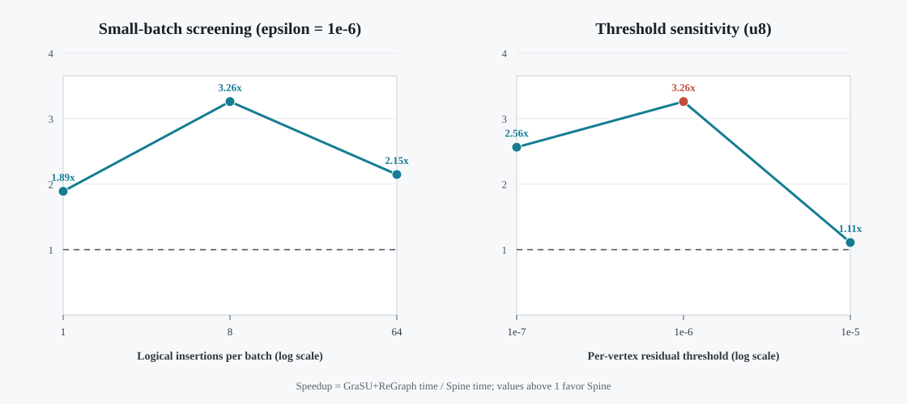

# Delta.hls Per-Vertex Residual PageRank: K=1 Screening

## Scope and frozen semantics

This experiment evaluates the Delta.hls-style warm-start residual PageRank
path in Spine and the conversion-free GraSU+ReGraph normalized baseline.  It
uses the following shared algorithm contract:

- damping factor: `0.85`;
- activation: a vertex is active when `abs(residual[v]) > epsilon`;
- primary threshold: `epsilon = 1e-6`;
- stopping condition: no active vertex remains and `Linf(residual) <= epsilon`;
- old-graph state: float32 PageRank warm-started to the same per-vertex
  threshold;
- graph contract: reciprocal, weighted, and sink-free before and after the
  update.

This is **not** the GAP Benchmark Suite's global `L1 < 1e-4` convergence rule,
and no `epsilon / |V|` conversion is used.  The neighboring thresholds
`1e-7` and `1e-5` are reported as sensitivity points rather than alternative
definitions of the primary result.

## Correctness gates

Every performance row is admitted only when all of the following hold:

1. Spine and GraSU+ReGraph match their independent float32 architecture
   oracles for rank, residual, and frontier sequence.
2. Both outputs satisfy an independent float64 full-PageRank oracle.  The
   conservative error bound is `(old_rank_L1_defect + final_residual_L1) /
   (1 - damping)` with a 1.1 guard factor.
3. The two architectures have matching frontier sequences and differ by at
   most `1e-5` in rank and residual state.
4. Reader, compute, AXI/HBM request, byte, and response ledgers close.  In
   particular, cumulative active edges equal the independent oracle on both
   systems.
5. Workload, profile, capability catalog, and SST plugin hashes match the
   frozen inputs recorded in `summary.json`.

All rows below passed these gates.  For the primary u1/u8/u64 matrix, the
largest cross-system rank difference is `1e-8`; cumulative active-edge counts
match exactly.

## Primary K=1 result

The frozen real-topology input has 2,552 vertices and 8,192 reciprocal edge
records.  Insert batches are nested synthetic mutations on that topology.

| Logical insertions | Iterations | Active edges | Spine cycles | GraSU+ReGraph cycles | Spine speedup | GraSU/Spine HBM byte ratio |
|---:|---:|---:|---:|---:|---:|---:|
| 1 | 4 | 1,411 | 448,163 | 847,205 | 1.89x | 28.42x |
| 8 | 12 | 9,162 | 759,284 | 2,475,379 | 3.26x | 36.82x |
| 64 | 26 | 49,148 | 2,482,106 | 5,329,115 | 2.15x | 23.06x |

The principal mechanism is not fewer algorithmic edges: both systems execute
the same active-edge count and frontier sequence.  Spine avoids the repeated
PMA partition/source-state/gather traffic incurred by GraSU+ReGraph, so its
accepted HBM bytes are 23.1x--36.8x lower in these cases.  The resulting
speedup is 1.89x--3.26x at K=1.

## Threshold sensitivity on u8

| Per-vertex threshold | Iterations | Active edges | Spine cycles | GraSU+ReGraph cycles | Spine speedup | GraSU/Spine HBM byte ratio |
|---:|---:|---:|---:|---:|---:|---:|
| `1e-7` | 30 | 49,256 | 2,394,567 | 6,138,986 | 2.56x | 26.42x |
| `1e-6` | 12 | 9,162 | 759,284 | 2,475,379 | 3.26x | 36.82x |
| `1e-5` | 2 | 978 | 396,858 | 440,239 | 1.11x | 18.02x |

The Spine advantage remains positive at all three thresholds.  It peaks at
`1e-6` for this update because the frontier is large enough to expose
GraSU+ReGraph's repeated partition traffic, while Spine still benefits from
differential traversal.  At `1e-5`, both systems finish in two iterations and
fixed update/launch work dominates, reducing the gap.



## Reproduction

```bash
cd /home/chuxiao/spine-cycle-sim-publication
make -C cpp/sst -j2

python3 scripts/run_delta_hls_residual_matrix.py \
  --out-dir evidence/deltahls_residual_k1_screening_v2 \
  --role screening --epsilon 1e-6 --jobs 2 --no-build

python3 scripts/run_delta_hls_residual_matrix.py \
  --out-dir evidence/deltahls_residual_threshold_sensitivity_u8_v1 \
  --run-id deltahls_soc_flickr_insert_u8 \
  --epsilon 1e-7 --epsilon 1e-6 --epsilon 1e-5 \
  --jobs 2 --no-build

python3 scripts/render_delta_hls_residual_figure.py
python3 -m unittest discover -s tests
```

Compact committed evidence is under
`docs/evidence/deltahls_residual_k1_screening_v2/` and
`docs/evidence/deltahls_residual_threshold_sensitivity_u8_v1/`.  Raw SST and
DRAMSim3 output remains under `evidence/` and is intentionally not committed.

## Limitations and follow-up

- The graph is a deterministic reciprocal closure of a compact real Flickr
  slice, not the full dataset; updates are synthetic.
- Direct/shared K4 partition-scaling evidence is reported in
  `deltahls_residual_p4_scalability_20260728.md`.
- The derived-real AskUbuntu 540,000-record gate and 903,774-record full
  reciprocal projection are reported in
  `large_real_three_algorithm_20260728.md`; a large-real K4 rerun remains a
  separate follow-up.
- The cycle model is execution-driven and uses SST/DRAMSim3, but it is not
  calibrated cycle-for-cycle to FPGA hardware.
- The result supports a per-vertex Delta.hls residual claim only.  It must not
  be cited as a GAP global-L1 PageRank result.
