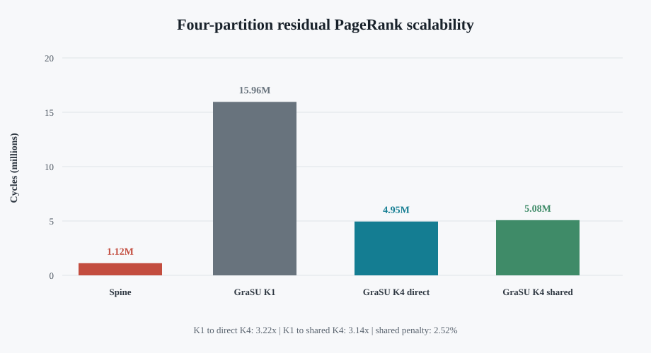

# Delta.hls Residual PageRank: Four-Partition Scalability

## Workload and purpose

This experiment isolates GraSU+ReGraph partition parallelism after the K=1
real-topology screening.  The frozen synthetic graph contains 262,144 vertices
and 262,144 reciprocal edge records: each of four 65,536-vertex destination
partitions contains an equal-size matching.  Every vertex has one outgoing
edge, so the old and updated graphs are strictly sink-free.  One reciprocal
insertion is applied in each partition (`u4`, eight physical records).

This fixture is deliberately synthetic and balanced.  It answers whether the
same GraSU+ReGraph work scales from one to four partition workers; it is not
used as evidence about real-graph topology behavior.

All variants use damping `0.85`, per-vertex residual threshold `1e-6`, the
same SST/DRAMSim3 plugin, and the same graph/update hashes.  Rank, residual,
frontier, active-edge, request, byte, and completion ledgers all pass.

## Result

| System | Frontends | Downstreams | Max parallel partitions | Max parallel downstreams | Cycles | HBM requests | HBM bytes |
|---|---:|---:|---:|---:|---:|---:|---:|
| Spine | 1 native path | 1 native path | 1 | 1 | 1,117,303 | 525,704 | 2,109,040 |
| GraSU+ReGraph K1 | 1 | 1 | 1 | 1 | 15,955,029 | 1,773,366 | 39,044,736 |
| GraSU+ReGraph direct K4 | 4 | 4 | 4 | 4 | 4,950,600 | 1,773,366 | 39,044,736 |
| GraSU+ReGraph shared K4 | 4 | 1 | 4 | 1 | 5,075,197 | 1,773,366 | 39,044,736 |

Direct K4 is `3.223x` faster than K1.  Shared K4 is `3.144x` faster than K1
and only `2.52%` slower than direct K4.  Since all three GraSU+ReGraph variants
issue exactly the same request count and byte count, the speedup comes from
partition overlap rather than reduced work.

The small direct/shared gap indicates that this sparse residual workload is
dominated by PMA/source/gather frontend work.  Serializing the partition-level
merger/apply/HBM-wrapper downstream has little effect because only 24 active
edges reach it.  The shared design therefore captures most K4 performance
while representing fewer downstream blocks.  Resource feasibility for that
shared topology still requires HLS synthesis evidence.

Spine is `14.28x` faster than GraSU+ReGraph K1, `4.43x` faster than direct K4,
and `4.54x` faster than shared K4 on this fixture.  This result supports a
sparse-update scalability claim; it does not replace the compact real Flickr
screening in `deltahls_residual_k1_screening_20260728.md`.



## Reproduction

```bash
cd /home/chuxiao/spine-cycle-sim-publication
python3 scripts/generate_deltahls_scalability_workload.py
make -C cpp/sst -j2

python3 scripts/run_delta_hls_residual_matrix.py \
  --manifest configs/experiments/deltahls_sinkfree_scalability_p4_v1.json \
  --out-dir evidence/deltahls_residual_p4_spine_v1 \
  --architecture spine --epsilon 1e-6 --jobs 1 --no-build

python3 scripts/run_delta_hls_residual_matrix.py \
  --manifest configs/experiments/deltahls_sinkfree_scalability_p4_v1.json \
  --grasu-profile configs/architectures/grasu_regraph_candidate10_k1_multipart_residual_v4.json \
  --capability-catalog configs/contracts/grasu_regraph_k1_multipart_capabilities_v4.json \
  --out-dir evidence/deltahls_residual_p4_k1_v1 \
  --architecture grasu_regraph --downstream-sharing direct \
  --epsilon 1e-6 --jobs 1 --no-build

python3 scripts/run_delta_hls_residual_matrix.py \
  --manifest configs/experiments/deltahls_sinkfree_scalability_p4_v1.json \
  --grasu-profile configs/architectures/grasu_regraph_candidate10_k4_multipart_residual_v4.json \
  --capability-catalog configs/contracts/grasu_regraph_k1_multipart_capabilities_v4.json \
  --out-dir evidence/deltahls_residual_p4_direct_k4_v1 \
  --architecture grasu_regraph --downstream-sharing direct \
  --epsilon 1e-6 --jobs 1 --no-build

python3 scripts/run_delta_hls_residual_matrix.py \
  --manifest configs/experiments/deltahls_sinkfree_scalability_p4_v1.json \
  --grasu-profile configs/architectures/grasu_regraph_candidate10_k4_multipart_residual_v4.json \
  --capability-catalog configs/contracts/grasu_regraph_k1_multipart_capabilities_v4.json \
  --out-dir evidence/deltahls_residual_p4_shared_k4_v1 \
  --architecture grasu_regraph --downstream-sharing shared \
  --epsilon 1e-6 --jobs 1 --no-build

python3 scripts/analyze_delta_hls_residual_scalability.py \
  --out-dir evidence/deltahls_residual_p4_scalability_analysis_v1
python3 scripts/render_delta_hls_residual_figure.py
```

The compact committed evidence is in
`docs/evidence/deltahls_residual_p4_scalability_v1/`.  Raw SST/DRAMSim3 output
remains under `evidence/` and is intentionally not committed.

## Limitations

- The balanced matching graph is synthetic and converges in one residual
  iteration after the update.
- Direct K4 represents four complete downstream paths.  Shared K4 enforces one
  partition-granular downstream token in the simulator; synthesis is still
  needed to support its resource/area claim.
- Timing is execution-driven simulator evidence, not cycle-for-cycle FPGA
  calibration.
