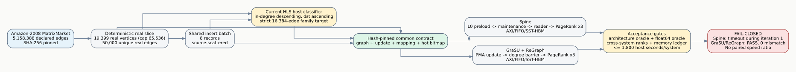

# Full PageRank Large Real-Slice Runtime

## Purpose

This fail-closed stress gate tests whether the execution-driven simulator can
complete a materially larger real-edge workload within the requested
tens-of-minutes host-runtime budget while preserving the same correctness and
memory-ledger checks used by the paired small-batch experiments.



## Input contract

- Source: `amazon-2008.mtx`, raw SHA-256
  `a828ef78ef9af3c58f5fb9a0329b24128177087b4245b036a234df1e7181f254`.
- Deterministic compact-ID slice with 19,399 mapped real vertices and 50,000
  unique real directed edges, within the 65,536-vertex normalized cap.
- One source-scattered batch with eight insertions; final graph has 50,008
  edges.
- Three Full PageRank iterations at damping 0.85.
- The graph, update, and local-ID mapping are committed and hash-pinned.

This is a **large real slice**, not the complete Amazon-2008 dataset. It stays
within the current normalized GraSU/ReGraph single-partition vertex limit and
does not claim multi-partition or full-dataset scalability. Two 100,000-edge
attempts exceeded the 1,800-second host-runtime budget: the first padded the
domain to 65,536 vertices and scanned 27,580 artificial edgeless vertices; the
second used only its 37,956 mapped vertices but still did not finish the first
PageRank iteration. Those attempts are runtime-stress evidence, not completed
performance pairs, and no cross-system speed ratio is reported for them.

## Spine layout gate

The hot bitmap is generated with the current HLS host rule: sort destinations
by descending in-degree and ascending destination ID, then move destinations
to their hash-selected hot shards until every cold family fits its configured
target. The target here is the strict 16,384-edge L1 family capacity because a
timed update follows an occupied L0.

- Hot vertices: 2,149.
- Cold edges after the update: 16,382.
- Hot edges after the update: 33,626.
- Largest hot shard: 2,466 edges.
- Every cold family and hot shard is at or below 16,384 edges.

## Reproduction

Generate from the raw dataset, or verify only the committed artifacts:

```bash
python3 scripts/prepare_hls_full_pagerank_large_real.py
python3 scripts/prepare_hls_full_pagerank_large_real.py --verify-only
```

Run the two systems sequentially so host-runtime measurements do not compete
for a CPU core:

```bash
python3 scripts/run_hls_pagerank_real_comparison.py \
  --input-manifest \
    configs/experiments/hls_full_pagerank_real_large_runtime_20260726.json \
  --out-dir results/full_pagerank_real_large_runtime_20260726 \
  --jobs 1 --timeout-seconds 1800 --max-cycles 500000000 --no-build
```

This command is expected to return nonzero at the current revision because the
Spine child reaches the declared timeout. The child writes a partial
`result.json` on termination; partial ranks are diagnostic only and are not a
correctness result.

## Measured result

The 50,000-edge run also failed the host-runtime gate. Spine reached the
1,800-second limit after completing maintenance but before finishing the first
PageRank iteration. GraSU/ReGraph completed the same graph and update in
25.171 host seconds with zero oracle mismatches. Since Spine did not complete,
there is no valid paired accelerator-cycle or speedup result.

| system | host status | completed work | modeled cycles | backend requests | correctness |
| --- | --- | --- | ---: | ---: | --- |
| Spine | TIMEOUT at 1,800 s | maintenance; 34,425/50,008 edges of iteration 1 | 46,246,619 partial | 3,653,834 partial | not evaluated; partial ranks are expected to mismatch |
| GraSU + ReGraph | PASS in 25.171 s | update plus all 3 iterations | 2,656,384 | 227,376 | 0 mismatches |

The earlier 100,000-edge mapped-domain attempt likewise timed out in Spine
before completing iteration 1, while GraSU/ReGraph passed in 44.969 seconds.
The machine-readable stress records are
`docs/evidence/full_pagerank_large_runtime_50k_fail_20260726.json` and
`docs/evidence/full_pagerank_large_runtime_100k_fail_20260726.json`.

The result is an acceptance failure for simulator throughput, not evidence that
the modeled Spine hardware would take 1,800 seconds. The next runtime work must
reduce scheduler/request-processing cost without coalescing away AXI ordering,
FIFO backpressure, HBM contention, or DRAM row behavior.

## Claim boundary

Cycles are execution-driven profile estimates, not cycle-for-cycle FPGA
calibration. Both systems use the same SST memHierarchy/DRAMSim3 HBM primitives,
but the GraSU+ReGraph PageRank compute path remains an HLS-equivalent proposed
profile. Host runtime measures simulator throughput and must not be reported as
accelerator latency.
