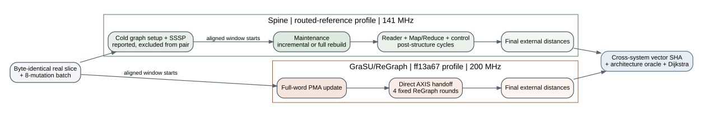

# Weighted SSSP Real Compact HLS-Profile Comparison

Date: 2026-07-26

## Scope

This is the first fail-closed dynamic weighted-SSSP comparison between the
Spine routed-reference profile and the executable `ff13a67` weighted
GraSU/ReGraph profile. It covers three compact real-edge slices and three
eight-mutation scenarios per dataset. Every pair consumes byte-identical graph
and update files and compares the complete external distance vector.



This is profile-clock-adjusted execution-driven evidence. It is not a
cycle-calibrated hardware result, and the compact slices are not full datasets.

## Timing Contract

Spine first constructs and solves the cold graph because its dynamic simulator
maintains persistent level and vertex state. The parent reports that cold cost
separately and compares only `update_cycles`, which begins immediately before
dynamic maintenance. GraSU/ReGraph starts its aligned window at PMA update and
includes the direct handoff plus four fixed ReGraph rounds.

The pair converts cycles independently: Spine uses the routed-reference 141 MHz
data clock; GraSU/ReGraph uses the profile's requested 200 MHz kernel clock.
Comparing raw cycles or adding Spine cold setup to only one side would be
invalid.

## Correctness

All 18 child runs passed their architecture and mathematical oracles. All nine
Spine/GraSU pairs produced byte-equivalent normalized distance vectors after
mapping each architecture's infinity sentinel to one common value. The parent
stores the vector SHA in `system_rows.csv` and rejects any cross-system
mismatch before writing a PASS manifest.

## End-To-End Result

`spine_speedup_over_grasu` is `GraSU time / Spine time`; values above one favor
Spine.

| Dataset | Insert | Delete | Weight change |
| --- | ---: | ---: | ---: |
| Amazon-2008 compact | 3.712x | 1.260x | 1.244x |
| web-Google compact | 2.453x | 0.807x | 0.805x |
| soc-Flickr compact | 2.274x | 0.752x | 0.695x |

Across all nine pairs, Spine wins five and GraSU/ReGraph wins four. Spine's
overall geometric-mean E2E speedup is 1.306x, with a 1.244x median. That
aggregate hides the useful result:

| Scenario | Spine E2E speedup geomean | Interpretation |
| --- | ---: | --- |
| insert | 2.746x | Spine incrementally relaxes only affected work; GraSU/ReGraph still pays four fixed destination sweeps |
| delete | 0.914x | Spine full rebuild becomes expensive on the larger compact slices |
| weight change | 0.886x | Explicit delete+insert also forces Spine full rebuild |

The result is therefore not "Spine always wins." Its advantage is strongest
when a small monotonic update stays incremental. GraSU/ReGraph overtakes it on
larger deletion and replacement cases because PMA update remains tiny while
Spine rescans and rebuilds its levels.

## Update And Memory

GraSU's PMA update stage is 514x faster geometrically for insert batches,
1,517x for deletion, and 896x for weight replacement. This does not translate
directly into E2E speedup because its fixed ReGraph compute is roughly 1.02 to
1.59 ms on these physical partition shapes.

Aligned backend requests explain the crossover. For insertions,
GraSU/ReGraph issues 9.36x more requests geometrically because Spine's active
set remains sparse. For deletion and weight replacement, the ratio is near
1.0x overall: Amazon still favors Spine's request count, while web-Google and
Flickr full rebuilds make Spine issue more requests.

The shared accepted-request ledger now also reports requested bytes and
address locality. Across all nine rows, GraSU/ReGraph uses 2.101x as many
requests and 10.687x as many requested bytes by geometric mean. Aggregated
non-first-request byte locality is 92.29% contiguous / 7.16% discontinuous for
Spine and 99.08% contiguous / 0.90% discontinuous for GraSU/ReGraph. GraSU is
therefore more sequential, but its wide PMA/state sweeps move substantially
more requested data. Weighted Spine currently exposes cold versus aligned-E2E
traffic; it does not yet split the aligned window into maintenance and compute
traffic.

The GraSU/ReGraph rows also expose about 32K AXIS push stalls on each real
slice, so finite stream pressure is represented. This matrix does not report a
DRAM energy ratio: Spine's current DRAMSim3 counters span cold plus update,
whereas its aligned request counter is phase-snapshotted. A phase-aligned
read/write/ACT/PRE/energy snapshot is required before that comparison is valid.

## Runtime And Reproduction

Two concurrent jobs completed all 18 child simulations in 44.46 host
seconds. This satisfies only the compact-matrix runtime gate, not the
publication-scale graph gate.

```bash
cd /home/chuxiao/spine-cycle-sim
python3 scripts/prepare_hls_weighted_real_batches.py --verify-only
python3 scripts/run_hls_weighted_real_comparison.py \
  --no-build \
  --jobs 2 \
  --out-dir results/hls_weighted_sssp_memory_locality_release_20260726
```

The tracked summary is
`docs/evidence/hls_weighted_real_compact_comparison_20260726.json`. It pins the
matrix manifest, system rows, pair rows, profiles, input corpus, and execution
fingerprint. Raw child directories remain ignored by Git.

## Remaining Boundary

This closes HLS-profile weighted-SSSP correctness and dynamic E2E comparison
for compact real slices. It does not close full-dataset E2E, physical DRAM
burst/row locality, phase-aligned DRAM energy, weighted-Spine's internal phase
split, total area/power/timing, dense batch sweeps, or scalability.
