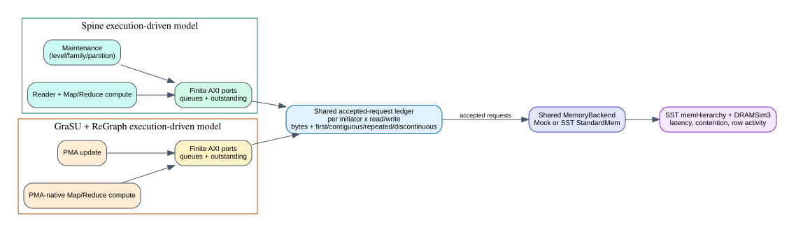

# Shared Real-Compact Memory Traffic And Locality

Date: 2026-07-26

## Scope

This milestone gives Spine and GraSU/ReGraph one common memory-accounting
contract for weighted SSSP, Full PageRank, and thresholded residual PageRank.
It covers the same three compact real-edge datasets and three eight-mutation
scenarios used by the E2E matrices: 54 system rows and 27 architecture pairs.
Every input matrix must be complete and correctness-clean before the analyzer
accepts it.



## Exact metric

The common `MemoryBackend` records a request only when the backend accepts it.
Classification is independent for each `(initiator_id, read_or_write)` stream:

- `first`: the first accepted request after an explicit phase boundary;
- `contiguous`: same logical channel and current byte address equals the prior
  address plus the prior request size;
- `repeated`: same logical channel and exact same byte address;
- `discontinuous`: every other address transition.

Reads and writes are never chained to each other, and interleaved initiators do
not disturb one another. Counts and requested bytes are recorded separately.
`requests * 64 B` is retained only as a nominal upper bound; it is not reported
as actual traffic when a request is 4, 8, or another width.

This metric is a logical request-trace locality proxy. It is not a DRAM row-hit
classifier and does not include controller burst amplification.

## Phase contract

Full and residual PageRank expose update and compute snapshots for both
architectures. GraSU/ReGraph weighted SSSP also exposes PMA update and ReGraph
compute separately. Spine weighted SSSP currently exposes cold execution and
the aligned dynamic E2E window; the latter still combines maintenance,
multi-round compute, and acknowledgement traffic. The analyzer marks that row
`aligned_total_only` instead of inventing a phase split.

All total, read/write, category, and available phase sums are fail-closed in
both the child validators and the common analyzer.

## Results

Ratios are geometric means across nine paired real-compact batches. Locality
percentages aggregate bytes across all nine rows and exclude each stream's
`first` bytes from the denominator.

| Algorithm | Spine E2E wins | Spine speedup | GraSU/Spine requests | GraSU/Spine requested bytes | Spine contiguous / discontinuous | GraSU contiguous / discontinuous |
| --- | ---: | ---: | ---: | ---: | ---: | ---: |
| weighted SSSP | 5/9 | 1.306x | 2.101x | 10.687x | 92.29% / 7.16% | 99.08% / 0.90% |
| Full PageRank | 0/9 | 0.780x | 1.307x | 10.595x | 73.01% / 26.12% | 99.05% / 0.91% |
| thresholded residual PageRank | 3/9 | 0.896x | 2.279x | 23.393x | 55.98% / 43.21% | 96.99% / 3.01% |

The central result is that sequentiality and volume are different axes.
GraSU/ReGraph's fixed PMA/partition sweeps are highly contiguous, but they move
far more requested bytes. Spine moves less data by following sparse active
work, but its accesses become increasingly discontinuous for Full and residual
PageRank. A performance explanation must therefore combine volume, locality,
parallelism, queue stalls, and DRAM behavior; no one column is a winner metric.

## Reproduction

```bash
cd /home/chuxiao/spine-cycle-sim
make -C cpp/sst -j2
python3 scripts/run_hls_weighted_real_comparison.py \
  --out-dir results/hls_weighted_sssp_memory_locality_release_20260726 \
  --jobs 2 --timeout-seconds 300 --max-cycles 100000000 --no-build
python3 scripts/run_hls_pagerank_real_comparison.py \
  --out-dir results/hls_full_pagerank_memory_locality_final_20260726 \
  --jobs 2 --timeout-seconds 300 --max-cycles 100000000 --no-build
python3 scripts/run_hls_residual_pagerank_real_comparison.py \
  --out-dir results/hls_residual_pagerank_memory_locality_final_20260726 \
  --jobs 2 --timeout-seconds 300 --max-cycles 100000000 --no-build
python3 scripts/analyze_real_memory_traffic.py \
  --weighted-dir results/hls_weighted_sssp_memory_locality_release_20260726 \
  --full-pagerank-dir results/hls_full_pagerank_memory_locality_final_20260726 \
  --residual-pagerank-dir results/hls_residual_pagerank_memory_locality_final_20260726 \
  --out-dir results/real_memory_traffic_locality_final_20260726
```

## Remaining gate

The next memory-fidelity step is to report physical DRAM burst amplification
and row-buffer behavior alongside accepted-request locality, and to add the
missing weighted-Spine maintenance/compute boundary. Publication acceptance
also still requires matched component energy/PPA, dense-batch sweeps, and
full-dataset runtime evidence.
