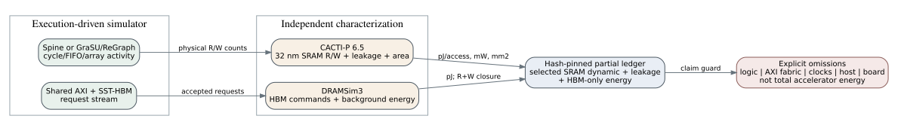

# DRAMSim3 and CACTI-P selected-array energy evidence

Date: 2026-07-25
Branch: `codex/fine-grained-cycle-sim`

## Result and claim boundary

This milestone connects execution-driven simulator activity to two independent
energy sources:

1. DRAMSim3 reports HBM command-stream energy for every one of the 32 physical
   pseudo-channels; and
2. CACTI-P 6.5 characterizes selected 32 nm ASIC SRAM arrays, whose per-access
   energy and leakage are multiplied by simulator read/write counts and runtime.

The resulting sum is deliberately named `partial_energy_ledger`. It is not
FPGA board power and is not total accelerator energy. Logic, AXI/interconnect,
clock tree, host, shell, PCIe, and unlisted small memories are omitted.



The two archived workloads prove the accounting path for both architectures.
They are not the same graph or implementation class, so their partial sums are
not a Spine-versus-GraSU energy comparison.

## Frozen inputs

| system | profile | claim | cycles / clock | correctness |
| --- | --- | --- | ---: | --- |
| Spine | `spine_shared_engine_9c08763` | older accepted hardware profile, execution-driven activity | 38,479 / 141 MHz achieved | exact |
| GraSU + ReGraph | `grasu_regraph_normalized_weighted_spine23` | normalized, weighted, conversion-free simulation | 132,967 / 150 MHz | exact |

The Spine label is intentionally not `afb8199`: the current runner remains
bound to the accepted older `9c08763` profile. The manifest verifies the
profile file, source revision, achieved data clock, activity file, and all raw
DRAM files by SHA-256.

## CACTI toolchain

The available source is CACTI-P 6.5 (June 2014) under
`/data/feiyang/mcpat/cacti`. Its 44 compilation-relevant files hash to:

```text
7a0111224b7537f53fbb31fa50d9718f7eca26d8c803e822a100555d27734a83
```

The original `cacti.mk` forces `g++ -m32`, while this host lacks 32-bit
libstdc++ headers. The reproducible builder copies the source to a temporary
directory and removes `-m32` from `CXX` and `CC` only in that copy. It never
edits `/data/feiyang`. With `NTHREADS=1`, rebuilding produces binary SHA-256
`b2e4d844...9988a`, and all five configs and outputs reproduce byte-for-byte.

Each characterization is a scratch RAM at 32 nm, 350 K, default HP voltage,
without ECC or power gating. The full generated configs and outputs are under
`docs/evidence/onchip_energy_20260725/raw/cacti/`.

| characterization | bytes x word | R/W nJ | leakage mW | area mm2 |
| --- | ---: | ---: | ---: | ---: |
| Spine tiny edge BRAM | 32 KiB x 64b | 0.01449 / 0.01486 | 18.884 | 0.0950 |
| Spine vertex tile URAM | 256 KiB x 32b | 0.04808 / 0.04827 | 148.921 | 1.6312 |
| Spine active bitmap lane | 128 B x 8b | 0.000129 / 0.000164 | 0.0814 | 0.000449 |
| GraSU source-cache bank | 16 KiB x 512b | 0.12638 / 0.16409 | 33.020 | 0.2870 |
| ReGraph gather bank | 256 KiB x 64b | 0.07466 / 0.07517 | 169.017 | 1.8685 |

CACTI has byte-granular words. Spine's 64 independent 1-bit active lanes are
therefore approximated as 64 instances of an 8-bit-wide 128-byte array. This
approximation and its 64-instance area/leakage multiplier are explicit.

## Physical activity mapping

The Spine multi-round SST output now exports the existing physical lane
counters instead of inferring them from frontier size:

- `tile_active_clear_lane_writes`;
- `tile_active_mark_writes`;
- `sparse_store_lane_reads`; and
- `active_emit_lane_reads/writes`.

The replay preserves 38,479 cycles, 4,197 backend requests, and exact SSSP.

| system / array | instances | reads | writes | mapping |
| --- | ---: | ---: | ---: | --- |
| Spine tiny edge buffer | 1 | 32 | 16 | direct BRAM requests |
| Spine vertex tile | 1 | 36 | 26 | direct URAM requests |
| Spine active bitmap lanes | 64 | 640 | 328,010 | exact physical lane accesses |
| GraSU source-property ping-pong | 8 | 192 | 6,144 | 4 lane copies x 2 slots; 512b S2P banks |
| ReGraph gather temporary properties | 4 | 393,221 | 524,293 | reset/update/merge physical bank accesses |

For array `a`, the ledger uses:

```text
dynamic_a [pJ] = reads_a * Eread_a [nJ] * 1000
               + writes_a * Ewrite_a [nJ] * 1000

leakage_a [pJ] = Pleak_a [mW] * instances_a * runtime [ns]
```

The unit identity `mW * ns = pJ` makes the leakage conversion exact.

## Ledger results

| system | HBM R/W | HBM pJ | selected SRAM dynamic pJ | selected SRAM leakage pJ | partial sum pJ |
| --- | ---: | ---: | ---: | ---: | ---: |
| Spine 9c08763 profile | 3,078 / 1,119 | 561,998,742 | 57,411 | 47,216,226 | 609,272,379 |
| normalized GraSU + ReGraph | 13,875 / 36,869 | 1,889,070,450 | 69,798,154 | 833,464,813 | 2,792,333,417 |

Both DRAM ledgers close exactly against backend requests. HBM background and
un-gated SRAM leakage dominate these tiny workloads. That is a useful warning,
not an architecture winner: publication energy comparisons require matched
workloads and the remaining logic/unlisted-memory accounting.

The projected selected SRAM areas are 1.755 mm2 for the three Spine arrays and
9.770 mm2 for the two normalized GraSU/ReGraph arrays. These are CACTI ASIC
array areas, not FPGA area and not complete accelerator area.

## Reproduction

Replay the frozen evidence without rebuilding CACTI:

```bash
cd /home/chuxiao/spine-cycle-sim
python3 scripts/analyze_energy_evidence.py \
  --out-dir /tmp/onchip_energy_replay
```

Rebuild CACTI from source and require byte-identical characterizations:

```bash
cd /home/chuxiao/spine-cycle-sim
python3 scripts/analyze_energy_evidence.py \
  --reproduce-cacti \
  --cacti-source-dir /data/feiyang/mcpat/cacti \
  --out-dir /tmp/onchip_energy_reproduce
```

Regenerate the current Spine activity input:

```bash
cd /home/chuxiao/spine-cycle-sim
make -C cpp/sst -j2
python3 scripts/run_sst_spine_vertical.py \
  --scenario weighted_sssp --no-build \
  --out-dir /tmp/spine_energy_weighted
```

Validation:

```bash
python3 -m unittest tests.test_energy_evidence -v
python3 -m unittest discover -s tests
cmake --build build/cycle-core -j2
ctest --test-dir build/cycle-core --output-on-failure
```

## Remaining energy work

1. Run a matched Spine-versus-normalized-GraSU graph/algorithm suite and feed
   every run through this ledger.
2. Export FIFO and remaining local-array activity rather than estimating it.
3. Add synthesized logic/interconnect activity and technology-matched power,
   or use measured FPGA board/rail power for a separate FPGA claim.
4. Characterize the latest `afb8199` Spine profile after it has an accepted
   build and measured clock.
5. Synthesize the normalized weighted PMA-native HLS before promoting its
   area/timing/energy label beyond simulation/projected.
6. Add a separate selected-array ledger for the existing native
   GraSU-compactor-ReGraph HLS profile; the current GraSU/ReGraph ledger covers
   only the conversion-free normalized architecture.
