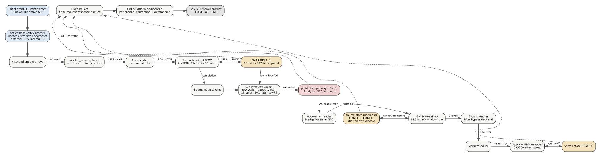

# Native GraSU + ReGraph end-to-end baseline

Date: 2026-07-25

## Claim boundary

The existing routed-HLS path is now executable end to end in the fine-grained
simulator:

```text
GraSU raw PMA update
  -> four-token completion barrier
  -> capacity-wide PMA-to-edge-array compactor
  -> native ReGraph edge-array SSSP
```

This is a `native_structural_simulation`. The simulator includes the conversion
cost and uses finite FIFO, AXI, shared-backend, and SST/DRAMSim3 HBM components.
It is **not** cycle calibrated. The exact-workload comparison below proves
functional and structural alignment, while its timing deltas identify the next
calibration work.

The no-conversion `normalized` PMA-native model remains a separate architecture
and claim. A native result must never remove the compactor or reuse normalized
timing while retaining the native label.



## HLS mapping

The pinned profile is
`configs/architectures/grasu_regraph_native_a9aef06.json`. It identifies
integration revision `a9aef064`, GraSU revision `b79ccb0`, the routed xclbin,
and routed timing report by SHA-256.

The model preserves these native details:

- four serial `bin_search_direct` CUs, fixed-round-robin dispatch, two direct
  cache HBM RMW CUs, and two DDR CUs;
- native raw 32-bit destination PMA words, 16 slots per segment, and explicit
  PMA capacity failure;
- four completion tokens, one row walk, all reserved PMA segment reads, and
  padded 8-edge edge-array writes;
- an 8-lane edge-array reader, source-state ping/pong on HBM channels 1 and 3,
  Gather/Merger/Apply FIFOs, and vertex state on channel 30;
- the fixed 65,536-vertex ReGraph partition sweep on every superstep;
- the HLS lane-0 source-window rule. A burst that crosses a 4096-source
  boundary is flagged and is correctness-ineligible rather than silently
  repaired in the native profile.

Every edge consumed by native SSSP comes from the HBM-backed compact edge-array
payload. No host adjacency list is used by the timed compute path.

## Exact FPGA workload

The committed workload
`tests/data/grasu_native_small_star_v4096_u1024.graph` is byte-identical to the
input used by the FPGA log. It contains:

| Field | Value |
| --- | ---: |
| vertices | 4,096 |
| initial edges | 4,096 |
| insert updates | 1,024 |
| final edges | 5,120 |
| source | 0 |
| fixed supersteps | 2 |

`scripts/convert_grasu_graph_to_slices.py` maps GraSU operation 0 to differential
delete `-1`, operation 1 to insert `+1`, and records input/output hashes.

The raw FPGA event log is preserved as
`docs/evidence/grasu_regraph_native_small_star_hw_20260725.log`. The generated
comparison report is
`docs/evidence/grasu_regraph_native_hw_alignment_20260725.json`.

## Functional and structural alignment

All comparable structural counters match exactly:

| Counter | FPGA | SST native | Result |
| --- | ---: | ---: | --- |
| vertices | 4,096 | 4,096 | exact |
| initial/update/final edges | 4,096 / 1,024 / 5,120 | 4,096 / 1,024 / 5,120 | exact |
| reserved PMA slots | 66,560 | 66,560 | exact |
| PMA slots scanned once | 66,560 | 66,560 | exact |
| compact slots per superstep | 5,120 | 5,120 | exact |
| supersteps | 2 | 2 | exact |
| SSSP mismatches | 0 | 0 | exact |

The update ledger additionally proves that the low simulated update time did
not come from skipping HLS work:

```text
row reads       = 1024
binary probes   = 6161
cache routes    = 1024
DDR routes      = 0
PMA reads       = 1024
PMA writes      = 1024
```

The serial simulated cycle ledger closes without a hidden controller gap:

```text
update       27,245 cycles
conversion  469,242 cycles
compute     101,544 cycles
total       598,031 cycles
component sum == total
```

## Timing comparison

At the pinned 200 MHz kernel clock:

| Window | FPGA event ms | Simulation ms | Signed error |
| --- | ---: | ---: | ---: |
| GraSU update | 1.290257 | 0.136225 | -89.44% |
| barrier + compactor | 3.644835 | 2.346210 | -35.63% |
| ReGraph compute span | 0.735271 | 0.507720 | -30.95% |
| event end to end | 5.907950 | 2.990155 | -49.39% |

The hardware component windows sum to 5.670363 ms; the remaining 0.237587 ms
is event-window/controller gap. Simulation shares a closed serial controller
and currently reports zero such gap.

These values are **not timing calibration evidence**. FPGA numbers are OpenCL
event windows rather than on-kernel cycle counters, and one workload cannot
show transferability. In particular, DRAMSim3 reports roughly 23-33 ns average
read latency on the active channels. The U55C AXI/interconnect path can add
latency outside that DRAM-device model. The large update delta therefore points
to missing platform/AXI/control latency or a measurement-window difference; it
does not justify inserting a fitted constant yet.

## What this milestone establishes

1. Native and normalized paths are now distinct executable systems.
2. Native timing contains the full PMA conversion. On this workload conversion
   is 78.46% of simulated time and 61.69% of the measured event window.
3. The exact graph, PMA capacity, compact output, fixed supersteps, and SSSP
   answer agree with the existing FPGA run.
4. Native absolute time is still optimistic. The next hardware campaign must
   vary update count, source-row capacity, PMA reserved slots, compact slots,
   and supersteps independently before any calibrated timing claim.

The current native mode is limited to the existing HLS contract: unit-weight
SSSP, at most 65,536 vertices, and fixed supersteps. Weighted SSSP, Full
PageRank, and residual PageRank are available in the normalized PMA-native
architecture, not in this existing native xclbin.

## Reproduction

```bash
cd /home/chuxiao/spine-cycle-sim

make -C cpp/sst -j2

python3 scripts/convert_grasu_graph_to_slices.py \
  tests/data/grasu_native_small_star_v4096_u1024.graph \
  --initial-out results/grasu_regraph_native_hw_alignment_20260725/input/initial.slice \
  --update-out results/grasu_regraph_native_hw_alignment_20260725/input/update.slice \
  --metadata-out results/grasu_regraph_native_hw_alignment_20260725/input/metadata.json

python3 scripts/run_sst_grasu_regraph_native.py --no-build \
  --workload results/grasu_regraph_native_hw_alignment_20260725/input/initial.slice \
  --update-workload results/grasu_regraph_native_hw_alignment_20260725/input/update.slice \
  --supersteps 2 \
  --out-dir results/grasu_regraph_native_hw_alignment_20260725/sst

python3 scripts/analyze_grasu_native_hw_alignment.py \
  --sim-result results/grasu_regraph_native_hw_alignment_20260725/sst/result.json \
  --hardware-log docs/evidence/grasu_regraph_native_small_star_hw_20260725.log \
  --profile configs/architectures/grasu_regraph_native_a9aef06.json \
  --out docs/evidence/grasu_regraph_native_hw_alignment_20260725.json

python3 -m unittest \
  tests.test_convert_grasu_graph \
  tests.test_grasu_native_runner \
  tests.test_grasu_native_hw_alignment \
  tests.test_architecture_profiles
```

Regenerate the architecture figure with:

```bash
dot -Tsvg docs/figures/grasu_regraph_native_e2e.dot \
  -o docs/figures/grasu_regraph_native_e2e.svg
```
