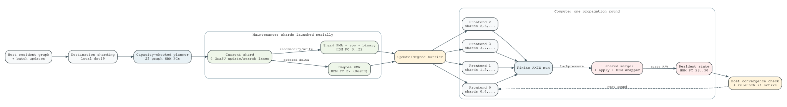

# GraSU+ReGraph sharded-K4 hardware reconciliation

## Scope

This document freezes the simulator profile that corresponds to the routed
destination-sharded GraSU+ReGraph HLS baseline. It is a hardware-native
profile, not a normalized or projected architecture. The matching HLS source
is `/home/chuxiao/grasu-regraph-integration` on
`codex/sharded-k4-fullgraph-hls`.



## Hardware contract

The frozen implementation has the following topology:

- each destination shard covers at most 65,536 vertices and stores local
  `dst19` values;
- a largest-first allocator maps PMA, update, row, and binary regions onto 23
  512 MiB U55C pseudo-channels and rejects overflow before execution;
- maintenance launches destination shards serially; within one launch, four
  GraSU update/search lanes modify the shard PMA and ordered degree state;
- compute assigns shard `p` to frontend `p mod 4`; each frontend contains PMA
  read and gather logic;
- all four frontends feed one finite-stream shared merger, apply unit, and HBM
  wrapper;
- source mirrors use HBM 23/24; weighted SSSP and CC state use HBM 30;
  residual PageRank rank, residual, and degree use HBM 25/26/27;
- the PMA-to-ReGraph handoff is direct AXIS and has no converted edge array;
- the host relaunches propagation rounds until the algorithm-specific active
  frontier is empty.

The routed evidence is hash-pinned in
`configs/evidence/grasu_regraph_sharded_k4_hls_route_v1.json`. The three
generated profiles and capability catalog are:

```text
configs/architectures/grasu_regraph_sharded_k4_weighted_hls_v8.json
configs/architectures/grasu_regraph_sharded_k4_cc_hls_v8.json
configs/architectures/grasu_regraph_sharded_k4_residual_hls_v8.json
configs/contracts/grasu_regraph_sharded_k4_hls_capabilities_v8.json
```

## Simulator changes

The v8 path now builds the same lane-aware runtime placement plan as the HLS
host. Every update, row, binary, and PMA access is issued to the selected
pseudo-channel and non-overlapping channel offset. The update engine launches
only shards with physical updates, carries the materialized post-update PMA
into compute, initializes degree state once, and accumulates every shard's AXI
and FIFO counters. Each row buffer also materializes the routed HLS `V+1`
sentinel word `(total_slots, total_slots)`; a regression reads that word back
from its runtime-selected HBM region.

The compute controller uses fixed modulo-four shard ownership and admits at
most one downstream partition at a time. Finite FIFOs and AXI ports continue
to backpressure their producers. Weighted SSSP, CC, and residual PageRank all
consume the updated PMA rather than a Python-side adjacency substitute.

Residual PageRank reports the hardware correction pass separately from repair
iterations. For the accepted smoke, 11 pipeline executions are one correction
plus ten repair iterations. The correction scans five live edges, so the
strict active-edge ledger is `43 repair + 5 correction = 48`.

## Reproduction

Build and test the C++ core:

```bash
cd /home/chuxiao/spine-cycle-sim-sharded-k4-v3
cmake -S . -B /data/tmp/chuxiao/spine-cycle-sim-sharded-k4-v3-cmake \
  -DCMAKE_BUILD_TYPE=Release
cmake --build /data/tmp/chuxiao/spine-cycle-sim-sharded-k4-v3-cmake -j8
ctest --test-dir /data/tmp/chuxiao/spine-cycle-sim-sharded-k4-v3-cmake \
  --output-on-failure
make -C cpp/sst BUILD_DIR=../../build/sst -j8
```

Check immutable profiles and their routed evidence:

```bash
python3 scripts/generate_grasu_regraph_sharded_k4_hls_profiles_v8.py --check
python3 -m unittest \
  tests.test_grasu_sharded_k4_hls_profiles_v8 \
  tests.test_profile_capabilities
```

Run the three execution-driven smokes:

```bash
python3 scripts/run_sst_grasu_regraph_hls_weighted.py \
  --profile configs/architectures/grasu_regraph_sharded_k4_weighted_hls_v8.json \
  --capability-catalog configs/contracts/grasu_regraph_sharded_k4_hls_capabilities_v8.json \
  --out-dir /data/tmp/chuxiao/sim_v8_weighted_smoke_final_20260807 --no-build

python3 scripts/run_sst_connected_components.py --architecture grasu \
  --profile configs/architectures/grasu_regraph_sharded_k4_cc_hls_v8.json \
  --capability-catalog configs/contracts/grasu_regraph_sharded_k4_hls_capabilities_v8.json \
  --out-dir /data/tmp/chuxiao/sim_v8_cc_smoke_final_20260807 \
  --hardware-full-recompute --no-build

python3 scripts/run_sst_grasu_regraph_hls_residual_pagerank.py \
  --profile configs/architectures/grasu_regraph_sharded_k4_residual_hls_v8.json \
  --capability-catalog configs/contracts/grasu_regraph_sharded_k4_hls_capabilities_v8.json \
  --out-dir /data/tmp/chuxiao/sim_v8_residual_smoke_fixed4_20260807 --no-build
```

Accepted outputs are:

| Algorithm | Cycles | Key ledger |
| --- | ---: | --- |
| weighted SSSP | 99,885 | update 121; compute 99,763; 5 logical / 8 physical updates |
| connected components | 201,893 | 5 iterations; 3 components; K=4 |
| residual PageRank | 1,487,890 | 10 repairs + 1 correction; 48 active edges; 997,048 requests |

These are compact functional and mechanism smokes, not performance results.

## FPGA evidence

The routed hardware passes three correctness-admitted repetitions on all eight
full graphs for all three algorithms. Setup-inclusive G+R/Spine medians are:

| Algorithm | Graphs | Median speedup range | Winner flips |
| --- | ---: | ---: | ---: |
| weighted SSSP | 8 | 16.21x--1,512.03x | 0 |
| connected components | 8 | 9.97x--1,037.97x | 0 |
| residual PageRank | 8 | 12.46x--595.17x | 0 |

The authoritative tables and raw-evidence hashes live in the integration
repository under `docs/evidence/sharded_k4_fullgraph_20260806`. FPGA numbers,
not compact simulator smoke cycles, support these performance statements.

## Remaining timing boundary

Functional behavior, topology, runtime placement, algorithm state, finite
queues, AXI requests, and memory-request conservation are aligned. Three
timing limitations remain explicit:

1. the simulator uses four logical merger/apply/wrapper objects but serializes
   them to represent the one routed downstream; it does not instantiate one
   literal shared object;
2. per-partition launch and drain bookkeeping has not been reconciled against
   the routed top's global round boundary;
3. workload-level simulator cycles have not yet been fitted or compared to the
   full-graph FPGA cycle decomposition.

Therefore v8 may be used for correctness, request-ledger analysis, and
architecture-mechanism studies. It must still be labeled
`pending_cycle_reconciliation` for absolute or relative performance claims.
