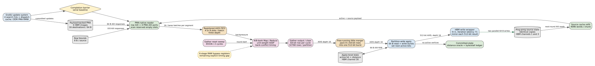

# Weighted Dynamic GraSU PMA to ReGraph SSSP

Date: 2026-07-25
Branch: `codex/fine-grained-cycle-sim`

## Result

The normalized GraSU plus PMA-native ReGraph vertical slice now carries real
edge weights through update storage, PMA reads, ReGraph Map/Reduce, and the
final SSSP result. One dynamic batch exercises all four state transitions:

- one new insertion;
- one exact weighted deletion;
- two weight decreases; and
- one weight increase.

The final payload-backed PMA is checked against an independent edge-state map.
The ReGraph result is then checked against an independent Dijkstra
implementation. The C++ component test and the online SST-HBM run both pass.



## Exact PMA Word

The normalized and projected profiles use the existing ReGraph 32-bit edge
word:

| bits | field |
| --- | --- |
| `31` | PMA empty/dummy marker |
| `30:19` | unsigned 12-bit weight |
| `18:0` | unsigned 19-bit partition-local destination |

The maximum live word is `0x7fffffff`; it cannot collide with the empty
marker. Encoding and decoding reject an oversized destination, an oversized
weight, and an empty-slot decode.

This does not describe the existing GraSU hardware ABI. Native GraSU stores a
raw 32-bit global destination and its current PMA-to-ReGraph adapter assigns
unit weight while masking the destination to 19 bits. Profiles freeze the
distinction:

| profile | PMA edge ABI | claim |
| --- | --- | --- |
| `grasu_regraph_native_a9aef06` | `raw_destination32` | existing routed hardware, including conversion |
| `grasu_regraph_normalized_spine23` | raw destination plus unit-weight compute | immutable historical normalized baseline |
| `grasu_regraph_normalized_weighted_spine23` | `regraph_weighted32_dst19_weight12` | primary weighted simulation comparison proposal |
| `grasu_regraph_weighted_pma_native_projected` | `regraph_weighted32_dst19_weight12` | explicitly optimized weighted proposal |

The historical profile files were not edited. Their SHA-256 identities remain
valid for all earlier evidence bundles; weighted behavior receives new profile
IDs instead of silently changing an existing experiment definition.

The normalized word keeps each segment at 16 slots and 64 bytes, so the
simulated PMA byte ledger does not increase. It is not a zero-cost hardware
claim: GraSU search/update logic must compare decoded destination fields while
moving the complete weighted word, and that logic still requires synthesis.

## Dynamic Update Semantics

PMA rows remain sorted by decoded destination. An update is interpreted as:

1. missing destination plus positive record: insert the encoded word;
2. existing destination plus a different weight: replace the word in place;
3. exact destination and weight plus a negative record: delete the word;
4. same destination and same positive weight: reject as no state change; and
5. deletion with a missing destination or wrong weight: reject.

Duplicate initial records use the project-wide last-write-wins rule before the
PMA image is constructed; the independent SST oracle applies the same declared
input rule without reading simulated PMA state.

The update stream remains 64 bits. Bits `62:32` carry the source, bit `63`
marks deletion, and bits `31:0` carry the weighted PMA word. Source bit 31 is
unavailable when deletion is encoded, which is consistent with the current
single-partition bound.

The SST runner materializes its correctness snapshot independently from the
simulated PMA. It applies the same declared update contract to a
`(source,destination) -> weight` map and feeds that graph to the SSSP oracle.
The oracle does not call `GraSuPmaUpdateSystem::live_edges()`.

## Validation Workload

Initial graph:

```text
0 -> 1 (8)    0 -> 2 (2)
1 -> 3 (1)    2 -> 3 (8)
3 -> 4 (1)
```

Dynamic batch:

```text
0 -> 1: 8 -> 3       decrease
0 -> 2: 2 -> 10      increase
1 -> 3 (1)           delete
2 -> 3: 8 -> 4       decrease
2 -> 4 (2)           insert
```

The final distances from source zero are `d1=3`, `d2=10`, `d3=14`, and
`d4=12`. The path to vertex four deliberately changes after both an increase
and a deletion, so a stale incremental-only result cannot pass.

The C++ Mock-HBM test records:

```text
update cycles:       84
compute cycles:    1234
inserts/deletes:    1/1
decreases/increases: 2/1
supersteps:           3
PMA oracle:        PASS
Dijkstra oracle:   PASS
```

The profile-pinned online SST-HBM run records:

```text
claim class:                 normalized_simulation
total cycles:                              132967
GraSU update cycles:                          101
ReGraph compute cycles:                    132866
correctness mismatches:                         0
supersteps:                                     3
PMA segment reads / slots:               12 / 192
live / active edge scans:                  15 / 5
source-cache requests / bytes:          6 / 98304
compute read / write bytes:       885696 / 2359296
backend requests / max outstanding:   50744 / 32
```

The old unit-weight input/update pair was rerun through the new ABI and remains
at `99379` cycles (`62` update plus `99317` compute), with zero mismatches and
the same `33838` backend requests. This is the regression guard for the ABI
upgrade, not a speed comparison between the two different workloads.

## Single-Partition Boundary

The current executable comparator has one ReGraph destination partition.
`GraSuPmaLayout::build()` therefore rejects more than `2^19` vertices. This
fail-fast bound is intentional: a raw global GraSU destination cannot simply
be packed into ReGraph's 19-bit local field for a larger graph.

Before the three-real-dataset gate, the comparator needs a declared
multi-partition design. The two defensible options are:

1. partition GraSU PMA rows by destination partition and keep the current
   weighted local word in every partition; or
2. retain global destinations in PMA and add a timed router/translator plus a
   weight source before ReGraph.

Either option changes storage, traffic, control, or resource use. It must be
implemented in the simulator, described as normalized/projected architecture,
and synthesized before publication-quality feasibility claims.

## HLS Delta Required

The minimum matching HLS proposal is:

1. encode weight and local destination when creating update/PMA payloads;
2. change GraSU binary and in-segment comparisons to use destination bits
   `18:0` while retaining the complete 32-bit word during shifts and writes;
3. let the PMA-native ReGraph reader forward the stored word directly to
   `acc_scatter.h`; and
4. implement explicit destination-partition routing for graphs beyond one
   local partition.

No matching GraSU HLS source was changed in this milestone. Consequently the
cycles are structural, execution-driven simulation evidence. They are not a
measured xclbin result and do not establish the LUT/BRAM/timing cost of the
proposal.

## Reproduction

```bash
cd /home/chuxiao/spine-cycle-sim

cmake --build build/cycle-core -j2
./build/cycle-core/cpp/grasu_cycle_tests
ctest --test-dir build/cycle-core --output-on-failure
python3 -m unittest discover -s tests -v

make -C cpp/sst -j2
python3 scripts/run_sst_grasu_regraph.py --no-build \
  --workload tests/data/grasu_regraph_weighted_dynamic_initial.slice \
  --update-workload tests/data/grasu_regraph_weighted_dynamic_update.slice \
  --out-dir results/grasu_regraph_sst_weighted_dynamic_final_20260725

python3 scripts/run_sst_grasu_regraph.py --no-build \
  --out-dir \
  results/grasu_regraph_sst_weighted_abi_unit_regression_20260725

dot -Tsvg docs/figures/grasu_regraph_pma_native_sssp.dot \
  -o docs/figures/grasu_regraph_pma_native_sssp.svg
```

## Remaining Boundary

Weighted dynamic SSSP is now complete for the one-partition normalized
vertical slice. The next comparator gaps are multi-partition graph execution,
Full PageRank, thresholded residual PageRank, real-dataset/runtime validation,
matching HLS synthesis, and PPA/energy evidence. Until those gates close, this
milestone supports mechanism and traffic studies but not a final
Spine-versus-GraSU performance claim.
