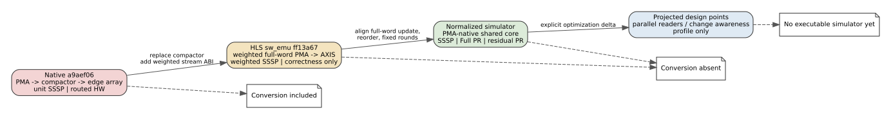
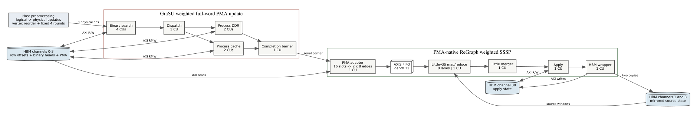

# GraSU/ReGraph Weighted PMA HLS `sw_emu` Baseline

Date: 2026-07-26

## Purpose

This milestone freezes the first compiled conversion-free weighted GraSU plus
ReGraph implementation as a fourth architecture class, `hls_sw_emu`. It is an
implementation and correctness anchor between the old routed compactor design
and the normalized simulator. It is not hardware performance evidence.



## Frozen Identity

| Item | Value |
| --- | --- |
| Integration source | `/home/chuxiao/grasu-regraph-integration` |
| Revision | `ff13a6784d376fb88f90c8b91b8ed8d1e75ed7ec` |
| Branch | `codex/weighted-pma-native-hls` |
| GraSU revision | `b79ccb0bc6aae4a2b7dededcee095bf0ad1b67dc` |
| Vitis target | `sw_emu` |
| Platform | Alveo U55C |
| Requested kernel clock | 200 MHz |
| xclbin SHA-256 | `3e819201c8846299a0b5f40ed66be7043fa6f2b1e97bdc7dbba2e2171edaa0ba` |
| Host SHA-256 | `cbe32e71ff832b4378a69b888e25b11aa8b4116a737f87ae8e95d51397b1fe53` |

The profile is
`configs/architectures/grasu_regraph_weighted_pma_hls_sw_emu_ff13a67.json`.
The parsed, hash-pinned evidence is
`docs/evidence/grasu_regraph_weighted_pma_sw_emu_20260726.json`.

## Implemented Whole System

The xclbin contains 15 compute units from ten compiled kernel objects:

```text
4 bin_search -> dispatch -> 2 process_cache + 2 process_ddr
             -> completion barrier
             -> weighted PMA adapter -> 32-deep AXIS -> 8-lane little-GS
             -> little merger -> apply -> HBM wrapper
```

PMA update and compute share HBM pseudo-channels 0 through 3. Source state is
mirrored in channels 1 and 3, and apply state is in channel 30. The adapter
reads one 512-bit, 16-slot PMA segment and emits two 512-bit, eight-edge AXIS
beats, including dummy lanes. No compact edge array is materialized.



## Exact Semantic Delta From The Normalized Simulator

The HLS implementation orders and searches complete encoded PMA words:
`{weight[11:0], destination[18:0]}`. A logical weight change is two physical
operations: delete the old word, then insert the new word. Host preprocessing
reserves every encoded word variant, builds binary heads from those variants,
and reorders vertices by physical-update density with vertex ID as a stable
tie-breaker.

The normalized comparison mode instead searches by destination, replaces a
changed weight in place, reserves destinations, reorders from logical updates,
uses four compute lanes at 150 MHz, and stops at quiescence. The separate
`grasu_regraph_hls_weighted_sssp` mode now executes the HLS semantics while the
normalized mode remains unchanged.

## Execution-Driven Simulator Result

The HLS-aligned mode uses the same FIFO, AXI master, SST memHierarchy, and
DRAMSim3 components as the normalized GraSU/ReGraph and Spine simulations. It
implements full-word PMA lookup, logical-to-physical update lowering,
physical-update-density reorder, eight edge lanes, a 32-entry adapter AXIS
FIFO, and exactly four host supersteps.

The tracked SST run passed both the synchronous architecture oracle and an
independent Dijkstra oracle:

| Metric | Result |
| --- | ---: |
| total cycles | 166,622 |
| PMA update cycles | 127 |
| ReGraph compute cycles | 166,495 |
| logical / physical updates | 5 / 8 |
| PMA reads / writes | 8 / 8 |
| backend requests | 67,664 |
| DRAM reads / writes | 18,504 / 49,160 |
| host wall time | 1.880 s |
| correctness mismatches | 0 |

The five reachable physical HBM channels are 0, 1, 2, 3, and 30. Their
DRAMSim3 transactions sum exactly to the simulator backend request count. The
active-channel DRAMSim3 energy is 367,744,158 pJ; it excludes the 27 unbound
idle channels and all on-chip/logic energy.

This tiny graph is dominated by the fixed ReGraph destination sweep: four
rounds emit 131,072 gather rows and 16,384 apply bursts although only five
edges remain live. That is a valid result for this profile and workload, not a
claim that compute always dominates on larger or denser graphs.

## Correctness Result

The tracked workload has eight vertices, five final edges, five logical
updates, and eight physical updates. Four fixed synchronous SSSP rounds from
external source 0 produced:

```text
0 0
1 3
2 10
3 14
4 12
5 2147483646
6 2147483646
7 2147483646
```

The host reported exactly one PASS line and zero mismatches against an
independent CPU oracle. The direct handoff processed 64 reserved edge slots per
superstep and explicitly reported `conversion_cost=absent`.

## Claim Boundary

The combined `sw_emu` and SST results prove that the weighted full-word PMA update, completion barrier,
direct AXIS handoff, and fixed-round ReGraph SSSP form a functioning whole
system, and that the same contract is executable against SST/DRAMSim3. It does
not prove cycle-for-cycle real-hardware latency, throughput,
energy, area, timing closure, or general workload correctness. In particular,
the roughly 1.49-second emulation event and wall times are tool execution times,
not accelerator performance measurements.

The build emitted eight inherited GraSU `ap_uint` bitsize warnings. They did
not create an oracle mismatch in this workload, but remain an explicit audit
item for `hw_emu` and synthesis.

## Reproduction

Verify the archived integration evidence:

```bash
cd /home/chuxiao/grasu-regraph-integration/evidence/weighted_pma_native_sw_emu_ff13a67
sha256sum -c evidence.sha256
```

Validate the simulator-side profile and fail-closed capability:

```bash
cd /home/chuxiao/spine-cycle-sim
python3 -m unittest \
  tests.test_architecture_profiles \
  tests.test_profile_capabilities
```

Reproduce the execution-driven SST result:

```bash
cd /home/chuxiao/spine-cycle-sim
python3 scripts/run_sst_grasu_regraph_hls_weighted.py \
  --out-dir results/grasu_regraph_hls_weighted_ff13a67_20260726
```

The tracked summary is
`docs/evidence/grasu_regraph_weighted_hls_sst_20260726.json`. The generated raw
directory is ignored by Git and its three key file hashes are pinned in that
summary.

Regenerate the profile ladder:

```bash
dot -Tsvg docs/figures/grasu_regraph_profile_ladder.dot \
  -o docs/figures/grasu_regraph_profile_ladder.svg
```

The profile capability is now `executable`. A subsequent 10-case synthetic
matrix covers update types, fixed-round convergence, stream pressure, PMA
segments, source-window boundaries, and host reorder ties; see
`docs/grasu_hls_weighted_matrix_20260726.md`. The remaining work is real-dataset
validation, hw/hw_emu timing comparison when those artifacts are available,
the two PageRank algorithms in the HLS-aligned profile, and complete
logic/on-chip-memory PPA evidence.
