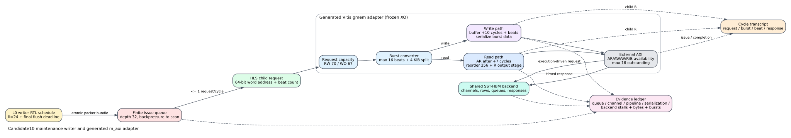

# Candidate10 m_axi adapter execution alignment

Date: 2026-07-26
Branch: `codex/fine-grained-cycle-sim`

## Result

The execution-driven Candidate10 maintenance path now includes the generated
Vitis `m_axi` adapter's deterministic transaction schedule. The implementation
is not an additive latency formula: requests advance through finite queues,
read/write-specific adapter pipelines, burst conversion, outstanding limits,
and the shared SST-HBM backend. Responses and backpressure change later issue
times causally.



The frozen RTL oracle has 29/29 passing cases. The simulator's selected
boundary schedules match that oracle exactly:

| child request | RTL/simulator external schedule |
| --- | --- |
| read, word 511, 17 beats | byte 4088 x 1 at accept+7; byte 4096 x 16 one cycle later |
| write, word 511, 17 beats | byte 4088 x 1 at accept+11; byte 4096 x 16 16 cycles later |
| write, aligned, 17 beats | 16-beat burst at accept+26; one-beat burst 17 cycles later |

Multi-parent checks also match the RTL oracle: adjacent 8-beat reads issue one
cycle apart, adjacent 8-beat writes issue nine cycles apart, and four
single-beat writes issue every two cycles without cross-parent coalescing.

## Frozen profile

The profile is derived from the frozen Candidate10 maintenance XO, not from the
older split-compute defaults:

| property | value |
| --- | ---: |
| child/external data width | 64 bit |
| maximum burst | 16 beats |
| external read/write outstanding | 16 |
| maintenance read/write request capacity | 70 |
| maintenance write-only request capacity | 67 |
| read reorder capacity | 256 beats |
| read address pipeline | 7 cycles |
| read data output pipeline | 1 additional registered cycle |
| child write store FIFO | 16 beats |
| elastic write bridge | 1 beat |
| conservative throttle FIFO | 16 beats |
| first store-to-bridge transfer | child accept + 8 cycles |
| write address eligibility | 2 cycles after a complete burst reaches throttle |
| write burst policy | complete-burst gated, ordered/serialized data stream |
| maintenance result width | 8 bytes |

The architecture profile selects this adapter with:

```json
"axi_profile": "candidate10_gmem_1e61fc0"
```

The compute ports intentionally keep the inherited split-compute request
capacities and data widths. The Candidate10 XO changed maintenance, while its
accepted build inherited the older compute XO.

## Deterministic backpressure alignment

The RTL and C++ oracles use the same two-request, 33-beat-per-request workload,
including a 4 KiB crossing, periodic channel availability, eight-cycle memory
response delay, and periodic child-output backpressure. C++ cycles are
normalized by its one-cycle registered input FIFO origin before comparison.

| event class | read | write |
| --- | ---: | ---: |
| elapsed cycles | exact, 137 | exact, 158 |
| child requests | 2/2 exact | 2/2 exact |
| burst address and length | 6/6 exact | 6/6 exact |
| burst address issue cycle | 6/6 exact | 6/6 exact |
| external data beats | 66/66 exact | 66/66 exact |
| external write responses | n/a | 6/6 exact |
| child output events | 66/66 exact | 2/2 exact |
| child write beats | n/a | 66/66 exact |
| store to elastic bridge | n/a | 66/66 exact |
| elastic bridge to throttle | n/a | 66/66 exact |
| maximum outstanding | exact, 5 | exact, 2 |

The read output comparison exposed one missing adapter register stage. It is
now explicit as `read_data_pipeline_cycles=1`; the delay sits in the causal
response path and therefore propagates through the finite read FIFO.

The write path is no longer represented by the old
`10 + cumulative_beats` address-ready proxy. The core now advances explicit
write-beat tokens through the generated adapter's 16-entry store FIFO,
one-entry elastic register, and 16-entry conservative throttle FIFO. In the
backpressure oracle, all 66 child accepts, all 132 internal transfers, all six
internal burst-last markers, all six AW events, all W/B events, and the
158-cycle elapsed time are exact. The model
also reproduces 20 child-W stall cycles and a peak occupancy of 16 entries in
both FIFOs.

The superseded `write_buffer_pipeline_cycles` knob is therefore zero in the
Candidate10 profile. It remains available only for generic/legacy profiles
that do not enable the structural ingress model.

The public `AxiRequest` API remains aggregate at the component boundary. The
adapter expands that request into execution-driven child beats internally.
Consequently this result proves the adapter schedule when its HLS child can
offer a continuous ordered W stream; producer bubbles from a future writer
microarchitecture must still be supplied explicitly rather than inferred.

RTL `VALID&&!READY` counters and C++ configured-availability counters are kept
separate: their event schedules can match while the counter definitions do
not. The JSON evidence records both ledgers without treating their totals as
equivalent.

## What changed in the core

`AxiMaster` now supports profile-selectable adapter behavior while preserving
the generic defaults used by GraSU and older Spine profiles:

1. parent acceptance cycles and external burst issue cycles are traceable;
2. read bursts wait for the generated adapter's address pipeline;
3. child writes occupy finite store, elastic, and throttle stages;
4. write addresses become eligible only after a full burst reaches throttle;
5. split writes preserve their ordered external data stream and propagate W
   backpressure to child-W acceptance;
6. parent boundaries, 16-beat limits, and 4 KiB boundaries remain explicit;
7. request capacity, outstanding burst capacity, read reorder capacity, and
   backend HBM capacity remain independent controls;
8. child-W, store/throttle occupancy, channel, reorder, response, and backend
   stalls are reported separately.

The maintenance result port changes from the old 32-bit assumption to the
frozen 64-bit RTL. Logical result traffic remains 384 bytes, while backend beat
requests fall by exactly 48 for the Amazon smoke case. This is ABI correction,
not removed work.

## Backpressure defect exposed by the alignment

The first 4,096-edge matrix run failed with:

```text
maintenance-graph0: queued=33, capacity=32
```

The finite writer queue logic covered the old `kL0Write` scan but not the
Candidate10 `kCandidateBucketWrite` scan. Slow, serialized writes therefore
allowed the Candidate queue to grow without upstream pressure. The fix makes
both writer scan kinds share the same pre-advance headroom check.

The 4,096-row regression now records:

| metric | value |
| --- | ---: |
| functional result | PASS |
| writer backpressure stalls | 188,475 cycles |
| maximum pending writer tasks on one port | 25 / 32 |
| issued/completed maintenance tasks | equal |
| maximum external outstanding bursts | <= 16 |

This is a behavioral correction. Increasing queue depth or suppressing the
exception would have hidden a missing backpressure path.

## Execution-driven smoke result

For `amazon_top1_exact.slice`:

| metric | old adapter profile | Candidate10 adapter |
| --- | ---: | ---: |
| total cycles | 4,170 | 4,932 |
| logical maintenance requests | 476 | 476 |
| logical bytes | unchanged | unchanged |
| backend beat requests | 731 | 683 |
| child write beats through adapter | n/a | 252 |

The Candidate10 run additionally reports:

| adapter counter | value |
| --- | ---: |
| parent requests accepted/completed | 476 / 476 |
| bursts accepted | 478 |
| beats issued/completed | 683 / 683 |
| address-pipeline stalls | 1,138 |
| write-serialization stalls | 11 |
| backend submit stalls | 0 |
| maximum outstanding bursts | 9 |

The small-slice delta is therefore adapter control latency, not HBM rejection.

## Hardware matrix

All five calibration and six holdout cases remain functionally passing. No
residual fit is applied in this comparison.

| role | before median absolute error | after | improvement |
| --- | ---: | ---: | ---: |
| calibration | 59.54% | 57.86% | 1.69 percentage points |
| holdout | 71.14% | 69.14% | 2.01 percentage points |

Large writer-pressure cases benefit more:

| case | edges | before error | after error | added simulated cycles |
| --- | ---: | ---: | ---: | ---: |
| dirty boundary | 4,096 | -14.89% | -10.93% | 32,779 |
| forced fallback | 4,112 | -13.44% | -9.41% | 32,884 |
| mixed fallback | 8,193 | -47.54% | -45.37% | 10,414 |

The first two large cases now fall near 10% raw error. Tiny/sparse cases still
underestimate hardware by roughly 80-92%, so adapter alignment does not support
a cycle-exact full-maintenance claim. Their remaining time is dominated by
kernel wrapper/family-range launch and drain behavior that is not yet modeled.

## Reproduction

```bash
cd /home/chuxiao/spine-cycle-sim

cmake --build build/cycle-core -j2
ctest --test-dir build/cycle-core --output-on-failure
make -C cpp/sst -j2

python3 -m unittest \
  tests.test_candidate10_m_axi_adapter_rtl_oracle \
  tests.test_candidate10_m_axi_adapter_alignment

mkdir -p docs/evidence/candidate10_m_axi_adapter_backpressure_20260726
build/cycle-core/cpp/spine_cycle_core_tests \
  candidate10_axi_periodic_backpressure \
  > docs/evidence/candidate10_m_axi_adapter_backpressure_20260726/core_trace.log

python3 scripts/run_candidate10_maintenance_matrix.py \
  --out-dir results/candidate10_m_axi_adapter_hw_matrix_stats_20260726 \
  --no-build

python3 scripts/collect_candidate10_m_axi_adapter_alignment.py \
  --out docs/evidence/candidate10_m_axi_adapter_alignment_20260726.json
```

The exact RTL oracle can be regenerated with:

```bash
python3 scripts/collect_candidate10_m_axi_adapter_rtl_oracle.py \
  --out-dir docs/evidence/candidate10_m_axi_adapter_rtl_oracle_20260726 \
  --build-dir /data/tmp/chuxiao/candidate10_m_axi_adapter_trace_20260726
```

## Claim boundary and next work

This milestone supports exact claims about frozen adapter burst shapes,
deterministic read/write issue schedules under the oracle responder, adapter
capacities, and execution-driven propagation through the current SST-HBM
backend. It also supports functional and raw timing comparisons for the 11
hardware cases.

It does not yet model the complete kernel wrapper/ap_ctrl schedule, a measured
U55C AXI crossbar arbitration policy, or a calibrated HBM controller timing
distribution. The next timing layer is shared-pseudochannel arbitration across
multiple AXI masters, followed by burst/locality/contention calibration against
SST-HBM and hardware evidence. Those terms remain visible and are not folded
back into the verified writer or adapter schedules.

The 11-case hardware matrix in the combined JSON was regenerated with this
revision. It uses the frozen accepted xclbin timings and applies no residual
fit. Large write-pressure slices are near 10% raw error, while zero/tiny/sparse
slices remain deliberately reported as large misses rather than being hidden
with a fixed offset.
