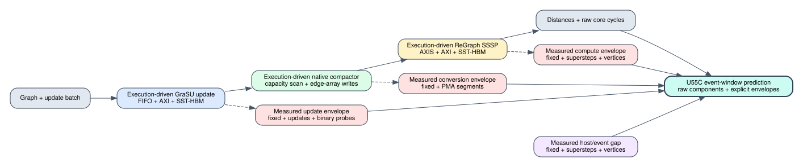

# Native GraSU/ReGraph measured timing envelope

Date: 2026-07-25

## Claim boundary

This milestone calibrates the execution-driven native GraSU/ReGraph simulator
to the event windows of one pinned U55C `hw` artifact. It does **not** replace
the FIFO/AXI/SST-HBM model and does not modify its cycles. Instead, it reports
two ledgers side by side:

1. `baseline_cycles`: cycles produced by the execution-driven architecture;
2. `measured_envelope_cycles`: platform/controller/event-window work observed
   on the FPGA but absent from the baseline;
3. `calibrated_cycles`: their explicit sum.

The resulting claim is
`hardware_event_window_calibrated_partial_repeats`, not kernel-internal
cycle accuracy. OpenCL event timestamps include controller and scheduling
effects that cannot be uniquely assigned without on-kernel cycle counters.



## What the FPGA actually measures

The pinned host uses out-of-order OpenCL command queues. Its timing fields are:

- **update**: union from earliest start to latest end over 4 `bin_search`, 1
  `dispatch`, 2 `process_cache`, and 2 `process_ddr` CUs;
- **conversion**: completion barrier duration plus the
  `pma_to_regraph_edge_array` event duration;
- **compute span**: sum of `kernelHBMWrapper` event durations over fixed
  ReGraph supersteps; `kernelApply` and little-GS run concurrently;
- **event E2E**: union over all update, barrier, compactor, and ReGraph events.

The HLS reports mark the dynamic AXIS-blocking top functions with unknown
latency. They establish II and structure, but cannot supply the missing event
envelope directly.

## Frozen fit and holdout

The 10-case matrix remains split before fitting:

| Role | Cases | Used for coefficients |
| --- | ---: | --- |
| calibration | 5 | yes |
| holdout | 5 | no |

Four tiny cases now have six real-hardware samples each: the original matrix
run plus five new same-device repetitions. The other six cases retain one
sample. Every repeat has identical input metadata, PMA/edge counts, source
mapping, superstep count, and zero SSSP mismatches. Componentwise medians are
used as hardware targets.

Measured variability confirms why one tiny run is unsafe:

| Window | CV across the four repeated cases |
| --- | ---: |
| update | 13.1-29.8% |
| conversion | 11.7-16.8% |
| compute span | 1.9-3.1% |
| event E2E | 3.0-7.6% |

All raw logs and SHA-256 identities are pinned by
`configs/experiments/grasu_native_hw_repeats_20260725.json`.

## Model

At the routed 200 MHz kernel clock, calibration-only ordinary least squares
produces the following non-negative measured envelopes:

```text
update_gap = 91027.75
           + 86.7069 * updates
           + 10.5538 * binary_probes

conversion_gap = 27506.60
               + 54.4758 * pma_segment_reads

compute_gap = 10475.59
            + 20070.49 * supersteps
            + 1.20180 * vertices

event_gap = 34872.29
          + 9777.61 * supersteps
          + 0.66140 * vertices

event_e2e_pred = update_sim + update_gap
               + conversion_sim + conversion_gap
               + compute_sim + compute_gap
               + event_gap
```

These coefficients are compact explanations of residual event time. For
example, `54.4758 * pma_segment_reads` is a measured per-segment platform gap,
not a claim that one HBM read intrinsically takes 54.4758 cycles.

## Result

Median absolute percentage errors are:

| Role | Target | Raw baseline | Calibrated | Calibrated max |
| --- | --- | ---: | ---: | ---: |
| calibration | update | 94.46% | 0.54% | 6.34% |
| calibration | conversion | 35.41% | 0.80% | 5.04% |
| calibration | compute span | 36.62% | 0.19% | 0.39% |
| calibration | event E2E | 47.99% | 0.29% | 1.42% |
| holdout | update | 99.61% | 8.18% | 36.44% |
| holdout | conversion | 82.21% | 3.99% | 21.18% |
| holdout | compute span | 36.42% | 0.64% | 5.31% |
| holdout | event E2E | 50.60% | **0.40%** | **2.38%** |

The E2E holdout gate is median `<=5%` and max `<=10%`; both pass. The
component result is deliberately more nuanced:

- compute transfers well to holdout and is now useful for U55C trend and
  event-window estimates;
- update and conversion remain inaccurate for the single-sample zero-update
  `small_chain_v64` case (36.44% and 21.18% respectively);
- the strong E2E result must not be used to claim every component is equally
  precise.

## Reproduction

The analysis itself does not rerun SST or the FPGA:

```bash
cd /home/chuxiao/spine-cycle-sim
python3 scripts/analyze_grasu_native_timing_model.py \
  --out-dir results/grasu_native_timing_model

python3 -m unittest tests.test_grasu_native_timing_model
```

To reproduce one additional hardware repetition without rebuilding the
xclbin:

```bash
cd /home/chuxiao/grasu-regraph-integration
XCL_DEVICE_INDEX=0 ./scripts/run_pure_pipeline_smoke.sh \
  --target hw \
  --manifest workloads/sssp_benchmark_pure_stage0/manifest.tsv \
  --out-dir results/pure_pipeline_hw_repeat_new \
  --timeout 600 \
  --case tiny_chain_v16,tiny_star_v16_u12,tiny_spread_v16_u8,tiny_hotdst_v64_u32
```

The command must use host SHA
`0189b94f16af5ea4e9a5803f963db6558229be76447187862737aadf5a9ad9cb`,
xclbin SHA
`5a730a2da85ddf522f577ca7d7024f7aa401bb07802f3bf9b4326dfd312e917e`,
and manifest SHA
`094dbe66fa58b6fa14d22fc74edcc564978c7c8c3e5ea9ff7407cc78077a098a`.

Generated evidence is under
`docs/evidence/grasu_native_timing_model/`; repeated raw logs are under
`docs/evidence/grasu_native_hw_repeats/`.

## Remaining validation work

1. Repeat the six small/medium cases, especially zero-update
   `small_chain_v64`, before calling component estimates publication-ready.
2. Add on-kernel cycle counters or RTL trace points to separate CU controller
   cycles from XRT event-window effects.
3. Transfer the model to a second xclbin/device run; coefficients are not an
   architecture invariant.
4. Run the 4096-superstep stress simulation and compare its extrapolation
   against the already-collected FPGA log.
