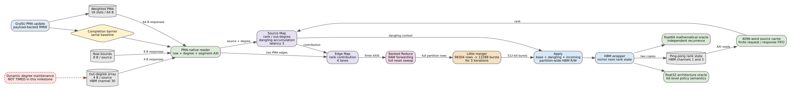

# GraSU PMA-Native ReGraph Full PageRank

Date: 2026-07-25
Branch: `codex/fine-grained-cycle-sim`

## Result

The one-partition normalized GraSU plus PMA-native ReGraph comparator now runs
fixed-iteration Full PageRank through the same execution-driven FIFO, AXI, and
online SST/DRAMSim3 HBM primitives as weighted SSSP. The final rank vector is
checked against two independent references:

- a float32 architecture oracle using the declared hardware numeric policy;
- a float64 mathematical recurrence with dangling redistribution.

Both the 16-word component run and the 65,536-word normalized partition run
pass with zero mismatches.



## Executed Data Path

Every PageRank iteration executes the following path rather than charging a
single analytical latency:

1. read one 8-byte PMA row bound and one 4-byte out-degree per real source;
2. read the current rank through the ping-pong source-cache path;
3. run the configurable source Map latency and accumulate dangling mass;
4. read all reserved PMA segments, discard empty slots, and Map live edges;
5. Reduce contributions through the four banked gather lanes and RAW bypass;
6. sweep the complete 65,536-word destination partition;
7. pack 64-bit gather rows into 512-bit apply bursts;
8. read, apply, and write every partition burst; and
9. mirror the next rank state to both source-state HBM copies.

The controller runs exactly the requested iteration count. It does not use the
SSSP empty-frontier termination condition.

## Correctness Workload

The file-backed graph is `tests/data/grasu_regraph_pagerank_initial.slice`:

```text
0 -> 1    0 -> 2
1 -> 2    2 -> 0
3 is dangling
```

It deliberately combines a two-edge source and a dangling vertex. After three
iterations at damping 0.85, the simulator returns:

```text
[0.349551, 0.221570, 0.379318, 0.049561]
```

The float32 oracle matches exactly at the reported precision. The maximum
absolute difference from the float64 oracle is `1.81955e-8`, and rank mass sums
to one within the acceptance tolerance.

## Normalized SST Evidence

Profile: `grasu_regraph_normalized_pagerank_spine23`
Profile SHA-256: `65050071426511b9be958a66aba649336ac3972214366929ba742a71bf371bec`

```text
total / compute cycles:          132886 / 132885
iterations:                                  3
architecture / math mismatches:          0 / 0
degree reads / bytes:                   12 / 48
source Map cycles:                           36
PMA segment reads / slots:              9 / 144
live / active edge work:                12 / 12
gather rows:                               98304
apply read/write bursts:             12288 / 12288
compute read/write bytes:           885456 / 2359296
backend requests:                          50721
backend max outstanding:                      33
```

The important result is structural: this tiny graph is not edge-work bound.
Three complete ReGraph partition sweeps create 98,304 gather rows and 12,288
apply bursts. The fixed partition work dominates the twelve live edge maps.
This is a defensible optimization target, but it is not yet a Spine speedup
claim.

The 16-word component run records 2,364 cycles and 1,581 backend requests. It
has identical rank values but is labeled `component_validation_simulation`,
not normalized performance evidence.

## Regression Boundary

Generalizing the controller and reader did not change either accepted SSSP
result:

| workload | total cycles | update | compute | backend requests |
| --- | ---: | ---: | ---: | ---: |
| weighted dynamic | 132,967 | 101 | 132,866 | 50,744 |
| unit-weight regression | 99,379 | 62 | 99,317 | 33,838 |

Both remain oracle-correct.

## Explicit Limitations

This milestone does not time dynamic out-degree maintenance. Degree reads are
real 4-byte HBM transactions, but insert/delete updates would also need to
modify the degree array. The result therefore exports both
`degree_update_timing_included=false` and `degree_updates_required`. The formal
run uses a static graph, so the latter is zero.

The source Map latency of three cycles is an explicit, configurable structural
parameter. It has not been extracted from a matching GraSU/ReGraph HLS
synthesis. The weighted PMA ABI and PMA-native PageRank path likewise have no
matching xclbin yet. Results are `structural_execution_driven` and
`simulation_only`, not hardware calibrated.

The comparator still supports only one 19-bit destination partition. Full
PageRank correctness here does not satisfy the multi-partition or real-dataset
gates. Thresholded residual PageRank remains the next algorithm gap.

## Reproduction

```bash
cd /home/chuxiao/spine-cycle-sim

cmake --build build/cycle-core -j2
./build/cycle-core/cpp/grasu_cycle_tests
ctest --test-dir build/cycle-core --output-on-failure
python3 -m unittest discover -s tests -v

make -C cpp/sst -j2
python3 scripts/run_sst_grasu_regraph_pagerank.py --no-build --smoke \
  --out-dir results/grasu_regraph_pagerank_dual_oracle_smoke_20260725
python3 scripts/run_sst_grasu_regraph_pagerank.py --no-build \
  --out-dir results/grasu_regraph_pagerank_dual_oracle_normalized_20260725

dot -Tsvg docs/figures/grasu_regraph_full_pagerank.dot \
  -o docs/figures/grasu_regraph_full_pagerank.svg
```
