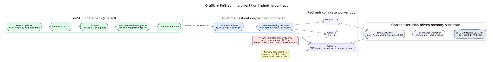

# GraSU + ReGraph multi-partition K-pipeline freeze

## Decision

The publication comparator is the conversion-free, execution-driven
GraSU + ReGraph **K=1** multi-partition architecture. The profile exposes 16
logical destination partitions; the current HLS address layout is validated
through four, and the sensitivity test below exercises two. Every non-empty
partition is dispatched through one complete ReGraph worker while preserving
finite FIFO, AXI, arbitration, and HBM backpressure. The worker is supported
by routed HLS evidence for all three algorithms.

K=2 and K=4 remain named projected scalability points. They execute the same
partition work through two or four complete simulator workers, but they are
not eligible for primary Spine comparisons until an integrated shared-port
HLS top is synthesized. Directly replicating the routed worker exceeds the
U55C HMSS budget of 33 AXI master instances at K=2 for every algorithm.

The machine-readable source of truth is
`configs/contracts/grasu_regraph_k_pipeline_freeze_v1.json`.



## Why K=1 is the primary baseline

| Algorithm | K | AXI masters | Max. projected device fraction | Evidence | Primary eligible |
| --- | ---: | ---: | ---: | --- | --- |
| Weighted SSSP | 1 | 30 | 12.83% | routed | yes |
| Weighted SSSP | 2 | 38 | 19.93% | projected | no |
| Full PageRank | 1 | 27 | 15.89% | routed | yes |
| Full PageRank | 2 | 35 | 23.20% | projected | no |
| Residual PageRank | 1 | 29 | 22.06% | routed | yes |
| Residual PageRank | 2 | 38 | 35.25% | projected | no |

The limiting resource is the number of independently exposed AXI masters,
not LUT, register, BRAM, URAM, or DSP capacity. A future K>1 implementation
must share or arbitrate worker memory ports inside the integrated top. Merely
replicating kernels is not a feasible primary architecture.

## Multi-partition sensitivity

The boundary microbenchmark has 65,537 vertices and crosses the 65,536-vertex
partition boundary. It contains two non-empty destination partitions. K=1
therefore processes them serially; K=2 processes both concurrently; K=4
cannot expose more than two-way parallelism.

| Algorithm | K=1 cycles | K=2 cycles | K=4 cycles | K=2 speedup | K=4 speedup |
| --- | ---: | ---: | ---: | ---: | ---: |
| Weighted SSSP | 1,466,848 | 734,318 | 734,318 | 1.998x | 1.998x |
| Full PageRank | 5,018,108 | 2,583,052 | 2,583,052 | 1.943x | 1.943x |
| Thresholded residual PageRank | 125,358,030 | 65,387,870 | 65,387,870 | 1.917x | 1.917x |

Every accepted point passes both correctness oracles, update/degree state
checks, request and arbitration ledgers, and cross-K work conservation. The
workload hashes, SST plugin hash, destination partition count, partition
passes, memory requests, row reads, source-cache requests, gathered rows, and
merger/apply bursts must be identical across K. A faster K point is rejected
if it silently performs less work.

This is a synthetic partition-boundary sensitivity test. It establishes that
the controller and worker-pool model can exploit independent destination
partitions. It is not a real-graph E2E performance result and is not evidence
that K=2 or K=4 is routed.

## Routed K=1 PPA

| Algorithm | LUT | REG | BRAM | URAM | DSP | WNS at 150 MHz |
| --- | ---: | ---: | ---: | ---: | ---: | ---: |
| Weighted SSSP | 96,559 | 107,380 | 233 | 64 | 0 | -0.013 ns |
| Full PageRank | 178,374 | 177,836 | 278 | 64 | 304 | -0.130 ns |
| Thresholded residual PageRank | 247,692 | 301,029 | 293 | 64 | 336 | -0.087 ns |

All three designs are routed and within 0.14 ns of the common 150 MHz target.
The HLS pipeline build is pinned to
`grasu-regraph-integration@80c50937278a0835aee09b62cb1c61bdc4903d4f`.
This is same-platform, resource-reported feasibility evidence. It is not a
strict iso-resource comparison because the two accelerators use different
amounts and types of FPGA resources.

## Reproduction

Regenerate and validate the immutable profiles and contracts:

```bash
cd /home/chuxiao/spine-cycle-sim-publication
python3 scripts/freeze_grasu_regraph_k_pipeline.py
python3 -m unittest \
  tests.test_grasu_k_pipeline_freeze \
  tests.test_grasu_k_pipeline_sensitivity
```

Run one sensitivity point by selecting the corresponding K=1, K=2, or K=4
profile. For example:

```bash
python3 scripts/run_sst_grasu_regraph_hls_weighted.py \
  --profile configs/architectures/grasu_regraph_candidate10_k2_multipart_weighted_v4.json \
  --capability-catalog configs/contracts/grasu_regraph_k1_multipart_capabilities_v4.json \
  --workload tests/data/grasu_regraph_partitioned_normalized_initial.slice \
  --update-workload tests/data/grasu_regraph_partitioned_normalized_update.slice \
  --out-dir /data/tmp/chuxiao/grasu_weighted_k2 \
  --max-cycles 10000000 --no-build
```

After all nine points complete, build the fail-closed evidence summary:

```bash
python3 scripts/summarize_grasu_k_pipeline_sensitivity.py \
  --run weighted_sssp:1:/data/tmp/chuxiao/grasu_weighted_k1 \
  --run weighted_sssp:2:/data/tmp/chuxiao/grasu_weighted_k2 \
  --run weighted_sssp:4:/data/tmp/chuxiao/grasu_weighted_k4 \
  --run full_pagerank:1:/data/tmp/chuxiao/grasu_full_k1 \
  --run full_pagerank:2:/data/tmp/chuxiao/grasu_full_k2 \
  --run full_pagerank:4:/data/tmp/chuxiao/grasu_full_k4 \
  --run thresholded_residual_pagerank:1:/data/tmp/chuxiao/grasu_residual_k1 \
  --run thresholded_residual_pagerank:2:/data/tmp/chuxiao/grasu_residual_k2 \
  --run thresholded_residual_pagerank:4:/data/tmp/chuxiao/grasu_residual_k4 \
  --out docs/evidence/grasu_regraph_k_pipeline_freeze_20260728.json
```

The residual K=1 point needs a 200-million-cycle guard on this workload. The
guard changes only the simulator timeout; it does not weaken the algorithm's
threshold, iteration limit, or correctness criteria.
