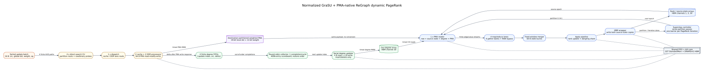

# Partitioned GraSU update and dynamic PageRank milestone

Date: 2026-07-25
Branch: `codex/fine-grained-cycle-sim`
Parent commit: `1d27becc00656c2031d974ac386d1f3db32d3b3c`

## Scope and claim boundary

This milestone closes the execution-driven path from a dynamic weighted update
batch to Full PageRank for the **normalized PMA-native GraSU + ReGraph
architecture proposal**:

```text
sorted updates -> partitioned weighted PMA update -> timed degree RMW
               -> same PMA payload -> serial partitioned ReGraph PageRank
```

There is no intermediate PMA-to-CSR or PMA-to-edge-list conversion. Update and
compute share the same payload-backed memory state, finite FIFO/AXI components,
SST `StandardMem` backend, and DRAMSim3 HBM model.

This is not an existing xclbin result. The 16-byte global-destination update
record, direct PMA handoff, and degree updater are explicit integration changes
relative to native GraSU HLS. All performance and DRAM energy results in this
document are `simulation_only`.



## Implemented behavior

### Destination-partitioned update

Every PMA partition retains global source rows and stores a 19-bit destination
relative to that partition's base. A multi-partition update record is:

| Field | Bytes |
|---|---:|
| global source | 4 |
| global destination | 4 |
| weight | 4 |
| delete flag | 4 |

The four direct-search CUs derive the destination partition, read that
partition's row and binary metadata, and route the operation through the
existing dispatch and PMA processor topology. Single-partition mode keeps its
historical 8-byte record and exact cycle behavior.

### Timed degree maintenance

The degree delta is derived from the operation that actually completed its PMA
write:

- insert of a missing edge: `+1`
- delete of a live edge: `-1`
- weight increase or decrease: `0`

Four finite sideband FIFOs carry `{batch_index, source, delta}`. PMA lanes can
complete out of order, so a finite 4,096-entry completion scoreboard restores
batch order before one serial degree updater. A round-robin collector accepts
at most one completion per cycle, allowing the scoreboard to use one write and
one read port instead of assuming a four-write ideal memory. Every nonzero
delta performs a real 4-byte HBM read, waits for the AXI response, then performs
a real 4-byte write. This serialization prevents lost updates when several
operations target one source. The runner rejects a batch larger than the
configured scoreboard; this storage is an explicit proposed-HLS cost, not free
host-side sorting.

ReGraph is launched only after all PMA and degree requests drain. Its
`initialize_degree_payload=false` setting is deliberate: compute reads the
degree array produced by the timed update phase rather than silently replacing
it with host-precomputed values.

### Serial multi-partition compute

One physical reader/gather/merger/apply/wrapper pipeline processes destination
partitions serially. All partition passes in one PageRank iteration observe the
same source-state epoch. State swap and the iteration barrier occur only after
the final partition. Dangling mass is computed once, not once per partition.

`supersteps` counts PageRank iterations; `partition_passes` counts physical
partition invocations. They must not be interchanged in reports.

## Physical HBM address map

The SST backend sends channel-local addresses to DRAMSim3. The old abstract
4-GiB partition stride was a multiple of the 512-MiB channel capacity and would
therefore alias every partition after modulo translation. The new immutable
profile uses disjoint channel-local windows:

| Payload | Base | Allocation rule |
|---|---:|---|
| update records | 0 MiB | exact batch bytes |
| binary heads | 64 MiB | 16 MiB per partition |
| row offsets | 128 MiB | 16 MiB per partition |
| PMA | 256 MiB | 16 MiB per partition |
| source-state epochs | 384 MiB | 1 MiB epoch stride |
| apply state, channel 30 | 0 MiB | 4 bytes per vertex |
| degree, channel 30 | 16 MiB | 4 bytes per vertex |

The runner rejects overlap and out-of-range windows before starting SST. This
frozen map supports at most four 65,536-vertex destination partitions; larger
workloads require a new reviewed address profile.

The runner also derives row, binary-head, and PMA segment footprints from the
actual initial and update slices. A workload is rejected before SST if any
partition exceeds its 16 MiB window, preventing a dense graph from silently
overwriting the next partition even when the partition count itself is legal.

## Validation results

The directed workload contains insert, delete, weight decrease, and weight
increase operations. It touches every destination partition and leaves the same
number of live edges as the initial snapshot. Correctness is checked against:

1. an independent weighted edge-state oracle,
2. the HBM degree array reconstructed after timed updates,
3. a float32 architecture PageRank oracle, and
4. a float64 mathematical PageRank oracle.

| Run | Vertices | Partitions | Cycles | Update | Compute | Backend requests | Result |
|---|---:|---:|---:|---:|---:|---:|---|
| C++ Mock directed | 33 | 3 | 5,631 | 170 | 5,461 | n/a | all exact |
| SST smoke | 33 | 3 | 6,377 | 152 | 6,225 | 3,412 | all exact |
| SST normalized boundary | 65,537 | 2 | 4,647,911 | 145 | 4,647,766 | 469,044 | all exact |

For the normalized run:

- `partition_passes = 4` for two partitions and two PageRank iterations.
- `compute_row_reads = 262,148 = 65,537 * 4`.
- Four topology-changing updates generate exactly four degree reads and writes;
  two weight-only updates generate none.
- The directed workload reaches three occupied completion-scoreboard entries,
  proving that the out-of-order repair path is exercised.
- `469,044` simulator backend requests equal `419,882` DRAM reads plus `49,162`
  DRAM writes.
- `cycles = update_cycles + compute_cycles`; unattributed serial cycles are zero.
- PMA mismatches, degree mismatches, and both PageRank oracle mismatches are zero.
- DRAMSim3 reports `64,373,394,072 pJ` for this synthetic run; simulator wall
  time is `240.658 s` on the evidence host.

The source-state AXI path demonstrates why parent AXI requests cannot be used as
the HBM request ledger. The normalized run expands source-state parent reads
into 10,240 64-byte HBM lines; the exact backend ledger uses those beat-level
requests.

## Reproduce

Fast component run:

```bash
cd /home/chuxiao/spine-cycle-sim
python3 scripts/run_sst_grasu_regraph_partitioned_dynamic_pagerank.py \
  --smoke \
  --out-dir results/grasu_partitioned_dynamic_smoke
```

Normalized 65,536-boundary run:

```bash
cd /home/chuxiao/spine-cycle-sim
python3 scripts/run_sst_grasu_regraph_partitioned_dynamic_pagerank.py \
  --out-dir results/grasu_partitioned_dynamic_normalized
```

Directed C++ and repository tests:

```bash
cd /home/chuxiao/spine-cycle-sim
cmake --build build/cycle-core -j2 --target grasu_cycle_tests
./build/cycle-core/cpp/grasu_cycle_tests
ctest --test-dir build/cycle-core --output-on-failure
python3 -m unittest discover -s tests
```

The immutable architecture profile is
`configs/architectures/grasu_regraph_partitioned_dynamic_pagerank_spine23.json`.
The summary evidence is
`docs/evidence/grasu_regraph_partitioned_dynamic_pagerank_20260725.json`.

## Remaining gaps

- The normalized integrated architecture has no matching HLS implementation or
  synthesized area/timing evidence yet.
- The native baseline still needs a fully execution-driven conversion layer and
  native ReGraph compute path; its conversion cost must not be removed.
- This milestone uses synthetic partition-boundary workloads, not the required
  real-dataset suite.
- Dynamic degree maintenance is closed for the Full PageRank path. The same
  shared state must still be exercised in the final residual PageRank workload
  matrix.
- One compute pipeline serializes partitions. Parallel-CU scalability requires
  explicit replicated resources and HBM contention, not a cycle-count divisor.
- Degree completion order uses a 4,096-entry scoreboard. Larger batches require
  a larger synthesized store, a different hazard policy, or a declared spill
  path; the simulator rejects them under this profile.
- DRAM energy is available, but on-chip activity-to-energy, CACTI, FPGA area,
  and timing closure remain pending.
