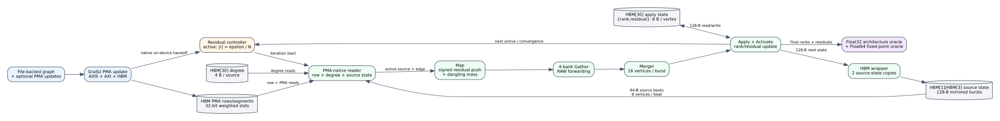

# GraSU PMA-Native ReGraph Thresholded Residual PageRank

Date: 2026-07-25
Branch: `codex/fine-grained-cycle-sim`

## Result

The one-partition normalized GraSU plus PMA-native ReGraph comparator now runs
thresholded residual PageRank through the same execution-driven FIFO, AXI, and
online SST/DRAMSim3 HBM primitives as weighted SSSP and Full PageRank. It uses
the shared `Update -> Map -> Reduce -> Apply -> Activate/Converge` algorithm
contract rather than a PageRank-specific analytical timing term.

The final rank and residual vectors are checked against an independent float32
architecture oracle. Rank convergence is also checked against a float64 Full
PageRank fixed point. Both the 16-vertex component-validation run and the
65,536-vertex normalized partition run pass with zero mismatches.



## Algorithm and State Contract

The algorithm initializes every vertex with zero rank and residual
`(1 - damping) / N`. A source is active when
`abs(residual) > epsilon / N`. An active source:

1. adds its signed residual to rank and clears that residual;
2. pushes `damping * residual / out_degree` to its outgoing neighbors; or
3. contributes the residual to the dangling accumulator when its degree is
   zero.

Apply adds incoming and redistributed dangling residual to the destination and
recomputes activation. The default profile uses damping `0.85`, epsilon
`1e-6`, float32 architecture arithmetic, and a 256-iteration safety limit.

Residual cannot reuse ReGraph's bit-31 active encoding because a signed float32
may use that bit. The modeled state is therefore an explicit packed 64-bit
record per vertex:

```text
bits 31:0   rank float32
bits 63:32  signed residual float32
```

This choice does not add an HBM channel. It changes each 512-bit source beat
from 16 to 8 vertices and each 16-vertex apply/source-state burst from 64 to
128 bytes. Those additional beats and contention are submitted to SST-HBM;
they are not charged as a fitted constant.

## Correctness Workload

The file-backed graph is `tests/data/grasu_regraph_pagerank_initial.slice`:

```text
0 -> 1    0 -> 2
1 -> 2    2 -> 0
3 is dangling
```

It converges in 79 residual iterations and performs 302 active-edge maps. The
float32 architecture oracle matches both rank and residual state exactly. The
maximum absolute rank difference from the float64 fixed point is
`1.63528e-6`; the final rank sum is `0.999996`, and residual L1 is
`6.435e-7`.

## Normalized SST Evidence

Profile: `grasu_regraph_normalized_residual_pagerank_spine23`
Profile SHA-256: `594a5ecbcf8b50a101ddd922aa6a1185bef15f0759252d0bec93bb811b52fe51`

```text
total / compute cycles:            2727372 / 2727371
iterations / active edge maps:             79 / 302
architecture / math mismatches:              0 / 0
degree reads / bytes:                    316 / 1264
source Map cycles:                              948
source-cache requests / lines:          158 / 80896
gather rows:                                2588672
apply read/write bursts:               323584 / 323584
apply read/write bytes:              41418752 / 41418752
mirrored source-state write bytes:              82837504
compute read/write bytes:           46615056 / 124256256
backend requests:                            2670437
backend max outstanding:                          33
DRAM completed reads / writes:        728933 / 1941504
DRAMSim3 total energy:                    40628812488 pJ
```

The 32 DRAMSim3 channels complete exactly 2,670,437 requests, equal to the
online backend's accepted-request count. The energy value is raw HBM-model
evidence only; it is not total accelerator energy.

The 16-vertex smoke run records 107,831 cycles and 82,397 backend requests. It
has the same algorithm result but is labeled
`component_validation_simulation`, not normalized performance evidence.

## Architectural Finding

The graph exposes a fixed-work limitation in this ReGraph organization. Only
302 edges carry active residual, but every iteration still sweeps the complete
destination partition. Across 79 iterations this produces 2,588,672 gather
rows and 323,584 apply bursts. Thresholding removes inactive edge Map work, but
it does not currently skip inactive destination tiles or the full apply sweep.

This result identifies a concrete future architecture proposal: sparse
destination-tile activation could avoid part of the gather/apply sweep. The
current evidence does not assign that proposal a speedup because no sparse
tile controller, metadata traffic, or HLS resource cost has been modeled yet.

## Regression Boundary

The residual state extension leaves the previously accepted algorithms
bit-for-bit and cycle-for-cycle unchanged:

| workload | total cycles | backend requests |
| --- | ---: | ---: |
| Full PageRank, three iterations | 132,886 | 50,721 |
| weighted dynamic SSSP | 132,967 | 50,744 |
| unit-weight SSSP | 99,379 | 33,838 |

All three retain zero correctness mismatches.

## Explicit Limitations

This milestone supports one 19-bit destination partition. It does not close the
multi-partition or three-real-dataset gates.

Degree reads are real 4-byte HBM transactions. Dynamic insert/delete updates
would also modify the degree array, but that maintenance is not timed here.
The result therefore exports `degree_update_timing_included=false` and
`degree_updates_required`; the formal run uses no updates, so the latter is
zero.

The packed rank/residual state, source Map latency, and PMA-native handoff are
simulation architecture choices without matching HLS synthesis or xclbin.
Results remain `structural_execution_driven` and `simulation_only`, not
hardware-cycle calibrated. They support mechanism, traffic, and bottleneck
claims, not a final Spine-versus-GraSU speedup claim.

The shared policy has an independent negative-residual arithmetic test, but the
formal comparator workload here is a static graph and does not generate a
negative residual. A dynamic-update case that carries negative residual through
the packed ReGraph HBM path remains a separate acceptance item.

## Reproduction

```bash
cd /home/chuxiao/spine-cycle-sim

cmake --build build/cycle-core -j4
ctest --test-dir build/cycle-core --output-on-failure
cmake --build build/cycle-core-asan -j4
ctest --test-dir build/cycle-core-asan --output-on-failure
python3 -m unittest discover -s tests -v

make -C cpp/sst -j2
python3 scripts/run_sst_grasu_regraph_residual_pagerank.py --no-build --smoke \
  --out-dir results/grasu_regraph_residual_pagerank_dual_oracle_smoke_20260725
python3 scripts/run_sst_grasu_regraph_residual_pagerank.py --no-build \
  --out-dir results/grasu_regraph_residual_pagerank_dual_oracle_normalized_20260725

dot -Tsvg docs/figures/grasu_regraph_residual_pagerank.dot \
  -o docs/figures/grasu_regraph_residual_pagerank.svg
```
