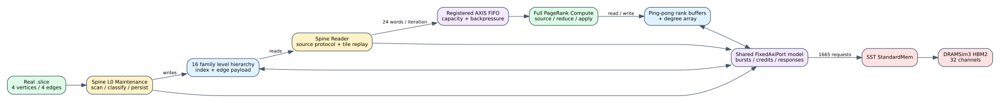

# SST-HBM Spine Full PageRank vertical slice

Date: 2026-07-25
Branch: `codex/fine-grained-cycle-sim`

## Scope

This milestone runs the connected Spine Full PageRank path against online
SST/DRAMSim3 HBM. It reuses the same `MemoryBackend`, `FixedAxiPort`, bounded
FIFO, Reader, maintenance, and algorithm-pipeline interfaces as the Mock-HBM
tests; only the memory backend changes.



The execution path is:

1. load a real `.slice` graph file;
2. run L0 maintenance and persist level metadata/edge payloads through AXI;
3. have Reader request every source value and replay level edges by tile;
4. consume registered AXIS words in the timed PageRank source/reduce/apply
   pipeline;
5. read old ranks and degrees and write new ranks through a ping-pong HBM
   layout;
6. swap physical rank-buffer bases and execute the second iteration without
   rerunning maintenance; and
7. validate ranks and close the backend-versus-DRAMSim3 request ledger.

## Evidence

The deterministic four-vertex graph runs two PageRank iterations with damping
`0.8`:

```text
total core cycles:                    12,798
iteration 1, including maintenance:    7,530
iteration 2:                           5,268
maintenance cycles:                    2,211
final ranks:             [0.17, 0.21, 0.45, 0.17]
maximum reference error:             2.98e-8
backend requests:                       1,665
DRAM reads + writes:           1,336 + 329 = 1,665
maximum outstanding requests:               7
```

The final-iteration structural ledger is also closed: four source requests and
responses, four emitted/consumed edges, 64 graph-payload bytes, 16 rank/degree
memory requests, four source-map operations, eight reductions, four applies,
24 edge-AXIS words, and five value-AXIS words.

Machine-readable evidence is
`docs/evidence/sst_spine_full_pagerank_20260725_summary.json`.

## Reproduction

```bash
cd /home/chuxiao/spine-cycle-sim
make -C cpp/sst -B -j2
python3 scripts/run_sst_spine_vertical.py \
  --scenario full_pagerank \
  --out-dir results/sst_spine_full_pagerank_repro \
  --no-build
python3 -m unittest discover -s tests
ctest --test-dir build/cycle-core --output-on-failure
git diff --check
```

The runner exposes the PageRank damping, iteration count, memory request
window, and source/edge/reduce/apply latency, II, and capacity. These parameters
are recorded in `result.json` and checked by the runner.

## Claim boundary

This is execution-driven structural evidence, not a calibrated large-graph
performance result. SST/DRAMSim3 handles every issued HBM request online and
therefore preserves request timing and contention. The PageRank arithmetic
pipeline latency/II values are still provisional, and the tile accumulator's
on-chip memory timing is folded into the reduce stage rather than represented
as a separately characterized URAM pipeline.

The four-vertex fixture proves protocol, state, iteration, request-accounting,
and numerical correctness. It is too small to support a bandwidth, scaling, or
Spine-versus-GraSU performance claim. Those claims require the real-dataset
algorithm matrix and the shared GraSU/ReGraph model.
