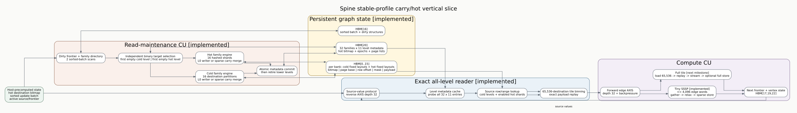

# Spine carry/hot vertical slice

Date: 2026-07-23  
Branch: `codex/fine-grained-cycle-sim`

## Scenario

Two committed file-backed slices expose independent level selection:

- `tests/data/carry_hot_preload.slice` represents an existing cold L0 edge
  `0 -> 1` with weight 7;
- `tests/data/carry_hot_batch.slice` adds cold edge `0 -> 2` with weight 3 and
  host-marked hot edge `0 -> 17` with weight 2.

Vertex 17 hashes to hot shard 5 using the same 32-bit hash as the host and HLS.
The pre-existing cold L0 makes the cold target L1. The initially empty hot
hierarchy makes the hot target L0.



## Modeled execution

The maintenance component performs two dirty-frontier scans, 16 cold family
filter scans, 16 hot family filter scans, and one hot L0 write scan. The cold
family uses carry instead of a second sorted scan: it reads one lower-level
payload, merges that edge with the new cold edge, writes two L1 payloads, and
retires cold L0 at metadata commit.

The reader caches all 32 x 11 family/level metadata entries, finds occupied
cold L1 and hot-shard-5 L0, performs source-dependent row lookups, and bins all
three payloads into one destination tile. The same forward/reverse depth-32
AXIS and fixed HBM port mapping are used with MockMemory and SST-HBM.

## Reproduction

```bash
cd /home/chuxiao/spine-cycle-sim
python3 scripts/run_sst_spine_vertical.py \
  --scenario carry_hot \
  --out-dir results/sst_spine_carry_hot_20260723
```

The accepted SST/DRAMSim3 run produced:

| evidence | value |
| --- | ---: |
| data cycles | 4,805 |
| cold / hot target | L1 / L0 |
| sorted scans / edge visits | 35 / 70 |
| carry old payloads / merge inputs / outputs | 1 / 2 / 2 |
| reader cold / hot edges | 2 / 1 |
| reader graph / metadata bytes | 176 / 3,024 |
| backend requests | 598 |
| DRAM reads / writes | 513 / 85 |
| DRAM ACT / PRE | 49 / 44 |
| total row hits | 498 |
| memory-only energy | 69,320,244 pJ |

The backend request count equals completed DRAM reads plus writes. Weighted
SSSP produces distances `{1: 7, 2: 3, 17: 2}` and the exact next-frontier set
has three vertices. The aggregate evidence is committed as
`docs/evidence/sst_spine_carry_hot_20260723_summary.json`.

## Claims boundary

This is structural and execution-driven memory evidence for one L1 carry and
one hot L0 write. The C++ reader currently serializes high-level metadata tasks
instead of issuing the pipelined/outstanding pattern generated by HLS. The
reported 4,805 cycles therefore cannot yet be presented as calibrated hardware
latency. Full-tile compute, repeated convergence, exact compiler burst
formation, and overlap remain explicit follow-up work.
