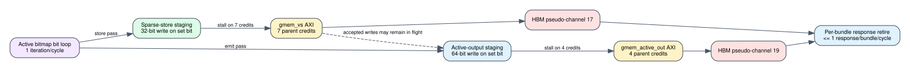

# Spine compute loop-coupled AXI writes

Date: 2026-07-24
Branch: `codex/fine-grained-cycle-sim`
Baseline commit: `bac8fbe`

## Closed gap

The previous compute model reproduced the HLS bitmap word/bit loop lengths and
bounded AXI outstanding requests, but generated tiny sparse-store and active
output traffic only after each complete scan. The target HLS generates those
writes inside the pipelined bit loops:

- `partitioned_store_vs_tile_active` writes one 32-bit vertex-state value on an
  active bit iteration;
- `partitioned_emit_tile_active` writes one 64-bit `(id, value)` record on an
  active bit iteration; and
- the two pointers use independent `gmem_vs` and `gmem_active_out` bundles.

The simulator now generates the corresponding parent write on the active bit
cycle. A one-entry loop staging slot holds the request until its AXI port has
credit. Inactive bit iterations continue without waiting for unrelated memory
responses. Once a sparse-store request is accepted, later active-output control
can overlap its response because the two bundles are independent.



## AXI rules

The source-shaped interface profile now distinguishes:

| compute port class | parent-request window | evidence |
| --- | ---: | --- |
| read/write (`gmem_vs`, active bitmap) | 7 | accepted split synthesis `USER_MAXREQS` |
| write-only (`gmem_active_out`, result) | 4 | accepted split synthesis `USER_MAXREQS` |

Both remain configurable with `--compute-memory-request-window` and
`--compute-writeonly-request-window`. The compute response collector can retire
one response per independent AXI bundle in the same core cycle. It records
maximum active ports, cross-port overlap, maximum responses per cycle, and
multi-port response cycles.

The latest source reference remains:

    repository: /home/chuxiao/spine-dynamic-graph-reduce-levels
    revision:   afb8199a2ca8d3fd208b985324bf4d8719e2b839
    file:       src/spine_partitioned.hpp

The request-window values come from the older accepted synthesis revision
`9c08763148644df262c0d374e782bc834f4c0f4f`, not a newly built latest-source
xclbin.

## Targeted microbenchmarks

The 256-edge gather A/B uses identical payloads and mock memory:

| read/write window | cycles | max vertex requests | correctness |
| ---: | ---: | ---: | --- |
| 1 | 8,211 | 1 | exact |
| 7 | 4,716 | 7 | exact |

The window-seven run records 321 credit-stall cycles. It is 1.74x faster, but
still bounded.

A second 256-edge workload places half its destinations at the beginning and
half at the end of one tile. This intentionally prevents all sparse writes from
draining before active emission begins. It records:

- 256 sparse vertex writes and 256 active-output writes;
- maximum seven vertex-state and four active-output requests in flight;
- two simultaneously active memory ports;
- ten cross-port overlap cycles; and
- exact distances and active frontier.

The fixed-latency mock does not happen to return both ports on the same cycle,
so its maximum response count is one. The model supports same-cycle independent
returns, but current SST workloads also did not produce coincident completions;
that counter remains evidence-driven rather than forced.

## Tiny/full boundary

| edges | path | baseline cycles (`bac8fbe`) | loop-coupled cycles | sparse writes | active writes |
| ---: | --- | ---: | ---: | ---: | ---: |
| 4,095 | tiny | 30,552 | 28,780 | 4,095 | 4,095 |
| 4,096 | tiny | 30,560 | 28,785 | 4,096 | 4,096 |
| 4,097 | full | 23,165 | 26,675 | 0 | 4,097 |
| 4,098 | full | 23,166 | 26,676 | 0 | 4,098 |

Tiny improves because sparse-store requests overlap the remaining controller
schedule. Full becomes slower because the old aggregate active-output parent is
replaced by HLS-shaped per-record writes subject to the four-parent write-only
window. Backend data beats are unchanged; this exposes AXI control pressure
that the aggregate request hid.

## SST-HBM evidence

All scenarios retain exact value and frontier results.

| scenario | cycles | backend requests | controller/memory overlap | controller stalls | correctness |
| --- | ---: | ---: | ---: | ---: | --- |
| Amazon L0 | 23,325 | 1,400 | 104 | 0 | 0 mismatches |
| carry + hot | 10,595 | 2,016 | recorded | 0 | 0 mismatches |
| weighted SSSP | 38,452 | 4,197 | 86 over working rounds | 0 | 0 mismatches |
| protocol window | 10,930 | 1,746 | recorded | 0 | 0 mismatches |
| fallback capacity | 23,801 | 2,442 | recorded | 0 | 0 mismatches |
| fallback payload | 23,772 | 2,436 | recorded | 0 | 0 mismatches |
| Amazon full compute, RW window 1 | 953,231 | 175,315 | 122,419 | 17,430 | 0 mismatches |
| Amazon full compute, RW window 7 | 820,097 | 175,315 | 122,419 | 3,737 | 0 mismatches |

For full compute, loop coupling improves the window-seven result from 847,903
to 820,097 cycles (3.4%) and the window-one result from 1,042,471 to 953,231
cycles (9.4%). Window seven is now 1.16x faster than window one. Both current
runs generate 44,150 compute parents and exactly 175,315 backend data requests.
The higher parent count than `bac8fbe` is expected: active-output writes are no
longer collapsed into one synthetic parent.

## Reproduction

```bash
cd /home/chuxiao/spine-cycle-sim
cmake --build build/cycle-core -j2
./build/cycle-core/cpp/spine_cycle_core_tests \
  spine_compute_store_bundle_overlap
./build/cycle-core/cpp/spine_cycle_core_tests spine_full_tile_boundaries
ctest --test-dir build/cycle-core --output-on-failure
python3 -m unittest discover -s tests
make -C cpp/sst -j2

python3 scripts/run_sst_spine_vertical.py \
  --scenario amazon_full_compute --compute-memory-request-window 1 --no-build \
  --out-dir results/sst_spine_loop_axi_full_w1_20260724
python3 scripts/run_sst_spine_vertical.py \
  --scenario amazon_full_compute --compute-memory-request-window 7 --no-build \
  --out-dir results/sst_spine_loop_axi_full_w7_20260724
python3 scripts/run_sst_spine_vertical.py \
  --scenario weighted_sssp --no-build \
  --out-dir results/sst_spine_loop_axi_weighted_sssp_20260724
```

## Remaining boundary

1. Whether Vitis coalesces the conditional, contiguous active-output writes
   into longer AW bursts is not proven by the available report. Parent-level
   address overhead is therefore source-shaped, not hardware-calibrated.
2. Full-tile load/store is still represented as a complete parent transaction;
   its internal beat stream cannot yet overlap following controller work at the
   exact W/B handshake boundary.
3. Input waits for prior writes to drain before consuming the next tile, while
   a real adapter may carry accepted responses across outer-loop iterations.
4. `vs_tile`, `tile_active_bits`, and `tiny_edge_buffer` still need physical
   BRAM/URAM ports, latency, arbitration, and the four-entry RAW bypass.
5. Latest-source hw/hw_emu timing calibration remains unavailable.

The next fidelity milestone is physical on-chip memory and bypass timing. It
must retain this loop-coupled AXI schedule rather than replacing it with a
closed-form delay.
