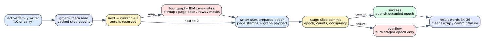

# Spine slice-epoch lifecycle and full-clear fallback

Date: 2026-07-24
Branch: codex/fine-grained-cycle-sim

## Closed gap

The previous model incremented a C++ slice-epoch array when a writer started.
It did not read the packed epoch from metadata HBM, did not execute the
full-index clear required by a 32-bit wrap, and did not retire an epoch when a
staged writer later overflowed.

The maintenance core now follows the accepted HLS transaction:

1. each active L0 or carry family reads its packed 64-bit slice-epoch word from
   gmem_meta;
2. the response updates both 32-bit lanes, so a later read-modify-write cannot
   overwrite the neighboring slice;
3. the active lane is incremented; zero is reserved;
4. on 0xffffffff to zero wrap, four graph-HBM index regions are cleared with
   actual zero payloads before writer traffic starts;
5. page epochs and graph contents use the prepared nonzero epoch;
6. successful occupied writers publish the epoch during metadata commit; and
7. an overflow burns every staged epoch without publishing occupancy or page
   lists, preventing failed page stamps from matching a later transaction.

## HLS mapping

    repository: /home/chuxiao/spine-dynamic-graph-reduce-levels
    revision:   origin/reduce-levels-for-routing
    commit:     afb8199a2ca8d3fd208b985324bf4d8719e2b839
    file:       src/spine_partitioned.hpp
    sha256:     d5c4a2f2c2f384e33808eee4250c0c88208027b3792d46425e1de2ae1d8a06ba

Relevant HLS helpers are partitioned_slice_epoch_read_family,
partitioned_write_l0_family, partitioned_write_carry_target_family,
partitioned_clear_l0_reachable_index_area_with_base,
partitioned_clear_fixed_target_index_area, and
partitioned_retire_staged_target_epochs.

For P source pages and R coalesced L0 rows, a wrap clears:

    bitmap words   = 4 * P
    page-base words = (P + 2) >> 1
    row words       = (R + 2) >> 1
    mask words      = (R + 3) >> 2

Carry uses the same bitmap/page-base sizes and its fixed target-level row/mask
capacities. Each 64-bit word becomes an AXI beat through the shared FixedAxiPort
and HBM backend. The simulator groups each contiguous HLS loop as one AXI
parent request; burst splitting, beat transfer, finite queues, responses, and
HBM contention remain explicit.

At the default MAX_N of 16,777,216, P is 65,536. A one-row L0 wrap clears
294,915 words (2,359,320 bytes). A maximum-row L0 wrap clears 393,218 words
(3,145,744 bytes). This is a real but extraordinarily rare fallback: once per
2^32 successful occupied writes to one family/level slice.

## Anti-bypass validation

Three focused cases force states that normal experiments cannot reach:

| case | injected HBM state | observed behavior |
| --- | --- | --- |
| L0 wrap | logical epoch 0, HBM epoch 0xffffffff | 12 clear words, 96 bytes, four parent writes, 36 wait cycles |
| carry wrap | target L1 HBM epoch 0xffffffff | 13 fixed-layout clear words, 104 bytes, four parent writes, 36 wait cycles |
| writer overflow | L1 capacity 2, 17 merged inputs | one packed epoch-retire write and response; result commit-failures = 1 |

The L0 test writes a nonzero sentinel into an otherwise unreachable graph-HBM
bitmap word before execution and verifies that the stored bytes are all zero
afterward. Thus the wrap decision comes from the HBM payload and the clear is a
real memory mutation, not a counter-only shortcut.

The failed-writer case verifies packed lane preservation: level 0 remains epoch
1 and the failed level 1 transaction burns epoch 1 in the high lane. Logical
level state remains uncommitted. Result words 34, 35, and 36 now report full
clear fallbacks, wrap events, and epoch commit failures exactly.

## Normal-path SST-HBM impact

The before column is the exact maintenance-result milestone (6bcf7d1).

| scenario | cycles before / after | maintenance before / after | epoch reads | requests before / after | ACT before / after |
| --- | ---: | ---: | ---: | ---: | ---: |
| Amazon L0 | 7,303 / 7,305 | 2,435 / 2,446 | 1 | 1,399 / 1,400 | 84 / 86 |
| carry + hot | 9,678 / 9,714 | 4,724 / 4,766 | 2 | 2,014 / 2,016 | 124 / 130 |
| weighted SSSP | 34,087 / 34,087 | 2,495 / 2,506 | 1 | 4,196 / 4,197 | 242 / 249 |

All scenarios pass their graph/frontier correctness checks. Backend request
growth is exactly one per active writer family. No baseline wraps, clears,
retires, or validation failures. The carry case exposes 36 E2E cycles because
its two serial family writers contend on metadata; compute hides the added
maintenance time in the weighted multiround case.

Machine-readable evidence is in
docs/evidence/spine_epoch_lifecycle_20260724.json. Complete SST summaries are
stored beside it.

## Reproduction

    cd /home/chuxiao/spine-cycle-sim
    cmake --build build/cycle-core -j2
    ./build/cycle-core/cpp/spine_cycle_core_tests spine_l0_epoch_wrap
    ./build/cycle-core/cpp/spine_cycle_core_tests spine_carry_epoch_wrap
    ./build/cycle-core/cpp/spine_cycle_core_tests spine_epoch_retire
    ctest --test-dir build/cycle-core --output-on-failure
    python3 -m unittest discover -s tests
    make -C cpp/sst -j2

    python3 scripts/run_sst_spine_vertical.py \
      --scenario amazon_l0 --no-build \
      --out-dir results/sst_spine_epoch_lifecycle_amazon_l0_20260724
    python3 scripts/run_sst_spine_vertical.py \
      --scenario carry_hot --no-build \
      --out-dir results/sst_spine_epoch_lifecycle_carry_hot_20260724
    python3 scripts/run_sst_spine_vertical.py \
      --scenario weighted_sssp --no-build \
      --out-dir results/sst_spine_epoch_lifecycle_weighted_sssp_20260724

## Remaining boundary

This closes HBM payload causality, normal epoch-read traffic, wrap clear
traffic, successful publication, failed-transaction retirement, and result ABI
telemetry. It does not claim that four source loops have RTL-identical
same-cycle address-generation timing; their AXI beats and HBM effects are
explicit, while loop-to-parent scheduling is structural. The next Spine gaps
are same-cycle metadata arbitration, explicit on-chip BRAM/URAM/controller
timing, and host/CDC launch accounting.
