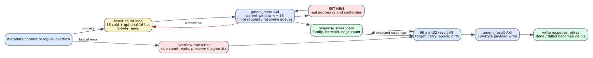

# Spine exact maintenance-result protocol

Date: 2026-07-24
Branch: codex/fine-grained-cycle-sim

## Closed gap

The maintenance model previously ended with two placeholders:

1. one contiguous metadata read covering 16 or 32 edge-count words; and
2. one 384-byte result write with an all-zero payload.

Logical maintenance failures could also set done before a result transaction
was issued. That was not the HLS contract: the host observes a fixed 96-word
transcript on both success and overflow.

The cycle core now implements that contract as an execution-driven protocol:

1. after metadata commit, issue one 8-byte target edge-count read per cold
   partition and, when enabled, per hot shard;
2. limit those parent reads by a dedicated, configurable 16-request window;
3. consume and validate every HBM response;
4. construct the exact 96 signed 32-bit words, including target/path,
   partition counts, epoch counters, hot/cold counts, nine cold and nine hot
   64-bit carry counters, layout versions, and dirty-frontier diagnostics;
5. write the actual 384-byte payload to gmem_result; and
6. declare completion only after its AXI write response retires.

## HLS mapping

Reference source:

    repository: /home/chuxiao/spine-dynamic-graph-reduce-levels
    revision:   origin/reduce-levels-for-routing
    commit:     afb8199a2ca8d3fd208b985324bf4d8719e2b839
    file:       src/spine_partitioned.hpp
    sha256:     d5c4a2f2c2f384e33808eee4250c0c88208027b3792d46425e1de2ae1d8a06ba
    ABI file:   src/common_types.hpp

The simulator indexes match MAINT_RESULT_* exactly:

| words | content |
| --- | --- |
| 0-10 | input, overflow, profile, target, persisted edges, path |
| 16-31 | 16 cold partition edge counts |
| 32-38 | epoch and hot/cold counters |
| 39-56 | nine cold carry counters, each low/high |
| 57-74 | nine hot carry counters, each low/high |
| 75-76 | result layout 3 and metadata format 2 |
| 80-95 | dirty-frontier status and diagnostics |

Words not assigned by the HLS ABI remain zero. Encoding preserves the raw
two's-complement bits of signed fields such as target_level = -1.

## Payload and error-path validation

The following anti-bypass tests inspect the bytes stored by the mock HBM, not
the simulator's logical state:

- a normal L0 commit returns 16 payload-backed edge counts and the complete
  dirty/epoch transcript;
- a cold L1 carry returns all nine carry counters from work actually performed;
- an invalid persistent dirty count returns status INVALID_STATE, target -1,
  path OVERFLOW, and a complete 384-byte write before termination; and
- an entirely full 11-level hierarchy returns overflow while preserving the
  successful dirty generation/count and leaving every old level unchanged.

The normal test reaches eight concurrent result reads. The SST runs below reach
10 cold-only or 14 cold-plus-hot requests in flight. Every result write has one
retired response and all validation-failure counters are zero.

## SST-HBM impact

The before column is the preceding HBM hot-bitmap milestone (7b7e8be).

| scenario | cycles before / after | maintenance before / after | result reads | result bytes | ACT before / after |
| --- | ---: | ---: | ---: | ---: | ---: |
| Amazon L0 | 7,303 / 7,303 | 2,407 / 2,435 | 16 | 128 read + 384 write | 78 / 84 |
| carry + hot | 9,578 / 9,678 | 4,676 / 4,724 | 32 | 256 read + 384 write | 114 / 124 |
| weighted SSSP | 34,087 / 34,087 | 2,467 / 2,495 | 16 | 128 read + 384 write | 240 / 242 |

Backend request counts remain 1,399, 2,014, and 4,196. The old contiguous
placeholder had the same byte volume and was split into the same number of AXI
beats. The timing and DRAM-activity changes come from issuing HLS-visible
per-family parent requests to their real addresses with a finite parent window.
Only the metadata-contended carry case exposes the extra 100 E2E cycles.

Machine-readable evidence is in
docs/evidence/spine_exact_maintenance_result_20260724.json; the complete SST
summaries are stored alongside it.

## Reproduction

    cd /home/chuxiao/spine-cycle-sim
    cmake --build build/cycle-core -j2
    ./build/cycle-core/cpp/spine_cycle_core_tests spine_target_hbm_metadata_payload
    ./build/cycle-core/cpp/spine_cycle_core_tests spine_carry_hbm_level_payload
    ./build/cycle-core/cpp/spine_cycle_core_tests spine_overflow_result_payload
    ./build/cycle-core/cpp/spine_cycle_core_tests spine_full_hierarchy_result_payload
    ctest --test-dir build/cycle-core --output-on-failure
    python3 -m unittest discover -s tests
    make -C cpp/sst -j2

    python3 scripts/run_sst_spine_vertical.py \
      --scenario amazon_l0 --no-build \
      --out-dir results/sst_spine_exact_result_amazon_l0_20260724
    python3 scripts/run_sst_spine_vertical.py \
      --scenario carry_hot --no-build \
      --out-dir results/sst_spine_exact_result_carry_hot_20260724
    python3 scripts/run_sst_spine_vertical.py \
      --scenario weighted_sssp --no-build \
      --out-dir results/sst_spine_exact_result_weighted_sssp_20260724

## Remaining boundary

This milestone closes the normal and known logical-overflow result protocol.
It does not claim bit-for-bit scheduling for corrupted metadata whose stored
edge count exceeds signed 32-bit range; such corruption remains a diagnostic
failure rather than a calibrated workload. The next fidelity gaps are epoch
wrap/full-clear behavior, same-cycle metadata arbitration, explicit on-chip
memory/controller timing, and host/CDC launch accounting. Algorithms and the
GraSU comparison stack remain separate platform milestones.
