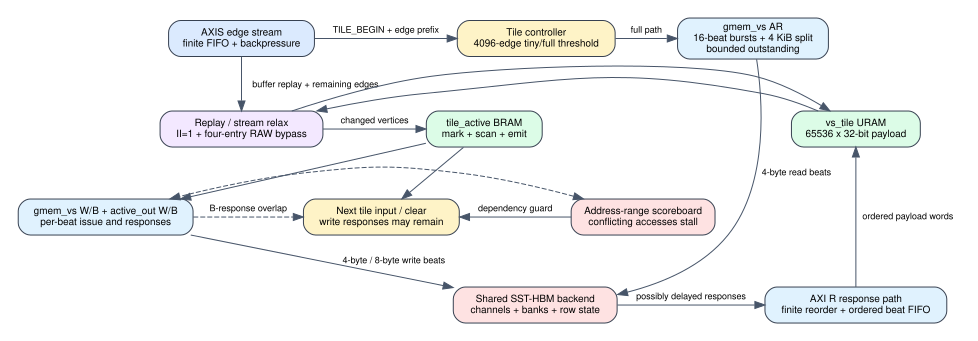

# Spine full-tile AXI streaming

Date: 2026-07-25
Branch: `codex/fine-grained-cycle-sim`
Baseline commit: `168af83`

## Closed gap

The dense compute path previously submitted one aggregate vertex-state read,
waited for its aggregate completion, and then copied the complete payload into
`vs_tile`. That preserved total byte traffic but did not expose the HLS loop's
ordered AXI beats, response buffering, or the dependency between returned HBM
words and the on-chip tile.

The compute model now:

1. submits the full-tile parent read through the shared `AxiMaster`;
2. splits it into 16-beat bursts and at 4 KiB boundaries;
3. issues one 32-bit vertex-state beat per eligible cycle;
4. accepts finite, potentially backpressured backend responses;
5. reorders returned beats and publishes them in increasing parent offset;
6. writes each returned payload word into the payload-backed `vs_tile`; and
7. permits replay only after all expected words and the parent response retire.

The full-tile store already travels through the same per-beat AXI W/B path.
Tile control remains serial, matching the HLS source, while a completed tile's
write response may overlap the next tile's input/clear work. Address-range
hazards still block a conflicting read or write.



## HLS and RTL mapping

Target source:

    repository: /home/chuxiao/spine-dynamic-graph-reduce-levels
    revision:   afb8199a2ca8d3fd208b985324bf4d8719e2b839
    file:       src/spine_partitioned.hpp

The mapped source objects and loops are `vs_tile` (`ram_t2p`, URAM),
`partitioned_load_vs_tile`, `PARTCONV_DENSE_BUFFER_REPLAY_LOOP`,
`PARTCONV_DENSE_STREAM_RELAX_LOOP`, `partitioned_store_vs_tile`, and
`partitioned_emit_tile_active`. The source executes those tile-level stages in
that order; it does not run multiple tile compute controllers in parallel.

The available accepted synthesis is older than the target source and is used
only for interface evidence:

    source revision: 9c08763148644df262c0d374e782bc834f4c0f4f
    report: /data/feiyang/spine-dynamic-graph/target/split_e2e_hw_200/
      reports/spine_partconv_compute_kernel.hw/hls_reports/
      spine_partconv_compute_kernel_csynth.rpt

That report exposes 32-bit `gmem_vs_RDATA` and `gmem_vs_WDATA`. Therefore a
65,536-vertex tile contains exactly 65,536 4-byte beats at the HLS master
boundary. This is not claimed as latest-source timing calibration.

## Validation

### Threshold boundary

| tile edges | selected path | cycles | full read beats | full read words | stream errors |
| ---: | --- | ---: | ---: | ---: | ---: |
| 4,095 | tiny | 32,845 | 0 | 0 | 0 |
| 4,096 | tiny | 32,850 | 0 | 0 | 0 |
| 4,097 | full | 151,570 | 65,536 | 65,536 | 0 |
| 4,098 | full | 151,571 | 65,536 | 65,536 | 0 |

All four cases preserve exact distances and exact read/write byte ledgers. The
4,096-to-4,097 discontinuity is now caused by executed full-tile HBM and URAM
work rather than an aggregate delay term.

### Payload anti-bypass oracle

A forced-dense four-vertex test gives software state value 10 but preloads HBM
value 7. The final value remains 7, no vertex is activated, and the ledger
records four beats, four words, 16 payload bytes, and zero stream errors. This
proves dense relaxation consumes the returned HBM payload rather than a Python
or C++ adjacency/state shortcut.

### Cross-tile response carry

A two-tile test with 4,096-cycle backend response latency records 971 overlap
cycles and one prior-tile write in flight while the next tile proceeds. The
same test preserves both expected updates. This validates removal of the
previous unconditional inter-tile drain without introducing a data hazard.

### SST-HBM workloads

| scenario | cycles | backend requests | full beats / words | wait cycles | cross-tile overlap | correctness |
| --- | ---: | ---: | ---: | ---: | ---: | --- |
| Amazon L0 | 43,830 | 1,400 | 0 / 0 | 0 | 0 | exact |
| weighted SSSP | 38,479 | 4,197 | 0 / 0 | 0 | 0 | exact, six rounds |
| Amazon full compute | 863,889 | 175,315 | 65,536 / 65,536 | 1,495 | 6 | exact |

The prior Amazon full result was 863,973 cycles with the same 175,315 backend
requests. The small 84-cycle change is expected: the old model already charged
the transfer duration. This milestone closes payload arrival and dependency
semantics rather than adding duplicate latency.

## Reproduction

```bash
cd /home/chuxiao/spine-cycle-sim
cmake --build build/cycle-core -j2
./build/cycle-core/cpp/spine_cycle_core_tests spine_full_tile_boundaries
./build/cycle-core/cpp/spine_cycle_core_tests spine_full_tile_stream_payload
./build/cycle-core/cpp/spine_cycle_core_tests spine_cross_tile_write_overlap
./build/cycle-core/cpp/spine_cycle_core_tests
python3 -m unittest discover -s tests
make -C cpp/sst -j2

python3 scripts/run_sst_spine_vertical.py \
  --scenario amazon_l0 --no-build \
  --out-dir results/sst_spine_full_tile_stream_amazon_l0_20260725
python3 scripts/run_sst_spine_vertical.py \
  --scenario weighted_sssp --no-build \
  --out-dir results/sst_spine_full_tile_stream_weighted_20260725
python3 scripts/run_sst_spine_vertical.py \
  --scenario amazon_full_compute --no-build \
  --out-dir results/sst_spine_full_tile_stream_full_20260725
```

## Remaining boundary

1. The HLS 32-bit master to platform HBM-width converter, register slices, and
   platform routing are not separately modeled or calibrated.
2. Full-store W beats and B responses are explicit, but the producer-side URAM
   read-to-W startup schedule is still represented by the enclosing controller
   rather than a dedicated store pipeline.
3. Same-cycle AXI handshake details and default BRAM/URAM latencies need a
   latest-source csynth/RTL trace or hardware microbenchmark.
4. Current correctness covers weighted insertion SSSP. Delete/increase repair,
   full PageRank, and thresholded residual PageRank remain future milestones.

This closes the largest remaining payload dependency in the current Spine SSSP
compute model. It does not make the complete simulator hardware-calibrated.
