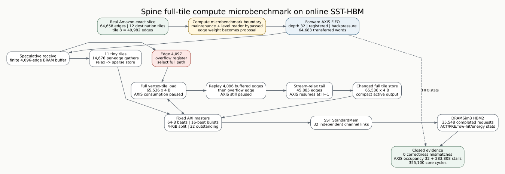

# Spine full-tile compute vertical slice

Date: 2026-07-23  
Branch: `codex/fine-grained-cycle-sim`

## Workload

The committed workload
`tests/data/amazon_densewin8192_active7893_exact.slice` is an exact slice of
the Amazon-2008 graph. It contains 64,658 real edges distributed over 12
destination tiles:

- 11 tiles contain 14,676 edges in total and remain at or below the 4,096-edge
  tiny threshold;
- tile 8 contains 49,982 edges and enters the full path when edge 4,097
  arrives.

The compute microbenchmark converts each positive edge to a proposal whose
value is the stored edge weight. This isolates the compute reduce behavior; it
does not claim to execute a complete SSSP round because source-value lookup and
reader traversal are intentionally bypassed.



## Modeled schedule

The depth-32 forward AXIS sends `TILE_BEGIN`, edge proposals, `TILE_END`, and
`DONE_ALL` words. The compute CU buffers at most 4,096 ordinary words.

For a tiny tile it gathers one persisted destination word per edge, including
duplicate destinations, relaxes at one edge per compute cycle, sparse-stores
changed words, and emits a compact active list.

For the full tile, edge 4,097 is retained as the overflow word and immediately
starts a read of the valid 65,536-word vertex tile. Compute does not consume
the forward stream during this AXI read or while replaying the 4,096 buffered
words, so the upstream FIFO can fill and backpressure the source. The overflow
word is then relaxed, followed by every remaining stream word. A changed full
tile performs a 65,536-word store before active-list emission.

All vertex and output traffic passes through the same 64-byte AXI beat model,
4 KiB burst boundaries, finite outstanding queues, SST StandardMem interfaces,
and 32 DRAMSim3 HBM channels as the end-to-end vertical slices.

## Reproduction

```bash
cd /home/chuxiao/spine-cycle-sim
python3 scripts/run_sst_spine_vertical.py \
  --scenario amazon_full_compute \
  --out-dir results/sst_spine_full_compute_20260723
```

## Accepted evidence

| evidence | value |
| --- | ---: |
| data cycles at 141 MHz | 355,100 |
| input edges / touched tiles | 64,658 / 12 |
| tiny / full tiles | 11 / 1 |
| tiny gathered words | 14,676 |
| full load + store swept words | 131,072 |
| full buffer replay / overflow / stream tail | 4,096 / 1 / 45,885 |
| next frontier / correctness mismatches | 19,207 / 0 |
| AXIS max occupancy / push-stall attempts | 32 / 283,808 |
| vertex read / write bytes | 320,848 / 303,192 |
| backend requests / maximum outstanding | 35,548 / 32 |
| DRAM reads / writes | 18,773 / 16,775 |
| DRAM ACT / PRE | 11,265 / 11,246 |
| total row hits | 24,311 |
| memory-only energy | 5,199,454,314 pJ |

The full-tile edge ledger closes exactly:
`4,096 + 1 + 45,885 = 49,982`. Backend requests also close against completed
DRAM commands: `18,773 + 16,775 = 35,548`. The accepted aggregate is committed
as `docs/evidence/sst_spine_full_compute_20260723_summary.json`.

## Boundary validation

The C++ core additionally tests 4,095, 4,096, 4,097, and 4,098 distinct-edge
tiles. The first two use tiny gather/sparse store; the last two use one full
load and one full store while preserving every output value. An 8,192-edge
case proves that load/replay fills the depth-32 AXIS and stalls its producer. A
duplicate-destination tiny case proves that gather memory traffic remains one
word per edge rather than being deduplicated by the simulator.

## Claims boundary

This is execution-driven evidence for the compute tile schedule and its online
AXIS/AXI/HBM interactions. It is not a full Spine E2E result because it bypasses
maintenance, level traversal, source requests, and host-controlled repeated
convergence. DRAMSim3 energy is memory-only; it excludes compute logic, AXI
interconnect, BRAM/URAM, and control energy. Hardware cycle calibration and HLS
compiler overlap remain future validation work.
