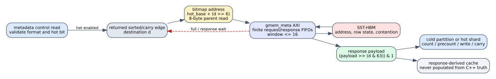

# Spine HBM-driven hot classification

Date: 2026-07-24
Branch: `codex/fine-grained-cycle-sim`

## Closed gap

The maintenance model previously counted one placeholder metadata-control read
but classified destinations by directly querying `SpineL0State::hot_vertices`.
That made the result functionally plausible while omitting the actual metadata
traffic, response dependency, and contention on `gmem_meta`.

The reference HLS does the following:

1. It reads and validates the metadata control word. The accepted schedule
   hoists the hot-enabled condition outside the pipelined edge loops.
2. When hot mode is enabled, `partitioned_hot_bitmap_test()` reads one 64-bit
   bitmap word for the current destination and tests one bit.
3. This classification is used by the initial hot/cold count, every cold and
   hot family precount pass, each active L0 write pass, and the new-batch input
   of a carry merge.

The simulator now follows the same source-visible protocol. It initializes the
bitmap in metadata HBM, issues one 8-byte read for every classification, waits
for the matching response before consuming that edge, and propagates finite
request/response backpressure. Carry keeps the returned edge pending until its
bitmap response arrives. The response-derived classification cache is not an
oracle: it is populated only by HBM payloads, while every HLS-visible scan still
issues its own memory request.



## HLS mapping

Reference source:

```text
repository: /home/chuxiao/spine-dynamic-graph-reduce-levels
revision:   origin/reduce-levels-for-routing
commit:     afb8199a2ca8d3fd208b985324bf4d8719e2b839
file:       src/spine_partitioned.hpp
sha256:     d5c4a2f2c2f384e33808eee4250c0c88208027b3792d46425e1de2ae1d8a06ba
```

Relevant functions are `partitioned_hot_enabled`,
`partitioned_hot_bitmap_test`, and `partitioned_edge_matches_family`. The
accepted 2026-07-11 synthesis reports show II=1 and iteration latency 21 for
the count/precount edge loops. L0 write and carry have additional writer/merge
constraints; this milestone changes only the hot-classification memory
dependency and preserves their separately modeled II.

## Anti-bypass microbenchmark

The test constructs the logical state with destination 17 marked hot, then
changes the HBM bitmap before execution so that only destination 18 is hot. It
feeds 16 copies of each edge under 40-cycle mock-memory latency. The result is
one coalesced cold edge for 17 and one hot-shard edge for 18. The former direct
set lookup would produce the opposite placement.

The exact request ledger is:

```text
hot/cold count:       32 edges
32 family precounts:  32 * 32 edges
2 active L0 writes:    2 * 32 edges
total:              1,120 bitmap reads = 8,960 bytes
```

All 1,120 responses retire, the scan records 4,455 response-wait cycles, and
the metadata port reaches exactly the configured 16-request outstanding limit
with zero validation failures.

## SST-HBM impact

The before column is the preceding HBM target-selector milestone (`9960129`).

| scenario | cycles before / after | maintenance before / after | bitmap reads | backend requests before / after | result |
| --- | ---: | ---: | ---: | ---: | --- |
| Amazon L0, hot disabled | 7,303 / 7,303 | 2,407 / 2,407 | 0 | 1,399 / 1,399 | PASS |
| carry + hot | 9,280 / 9,578 | 4,319 / 4,676 | 70 | 1,944 / 2,014 | PASS |
| weighted SSSP, hot disabled | 34,087 / 34,087 | 2,467 / 2,467 | 0 | 4,196 / 4,196 | PASS |

The hot scenario was previously low by 298 E2E cycles (3.21%) and 357
maintenance cycles (8.27%). The 70 new bitmap reads add exactly 70 backend
requests: 68 come from count/precount/L0 scans and two come from the carry
new-batch cursor. DRAM activates change from 110 to 114. Hot-disabled workloads
pay only the already-existing single 8-byte control read and remain bit-for-bit
unchanged in their timing ledger.

Machine-readable evidence is in
`docs/evidence/spine_hbm_hot_bitmap_20260724.json`.

## Reproduction

```bash
cd /home/chuxiao/spine-cycle-sim
cmake --build build/cycle-core -j2
./build/cycle-core/cpp/spine_cycle_core_tests \
  spine_hot_hbm_bitmap_payload
ctest --test-dir build/cycle-core --output-on-failure
python3 -m unittest discover -s tests
make -C cpp/sst -j2

python3 scripts/run_sst_spine_vertical.py \
  --scenario amazon_l0 --no-build \
  --out-dir results/sst_spine_hot_bitmap_amazon_l0_20260724
python3 scripts/run_sst_spine_vertical.py \
  --scenario carry_hot --no-build \
  --out-dir results/sst_spine_hot_bitmap_carry_hot_20260724
python3 scripts/run_sst_spine_vertical.py \
  --scenario weighted_sssp --no-build \
  --out-dir results/sst_spine_hot_bitmap_weighted_sssp_20260724
```

## Remaining boundary

This closes payload causality, traffic volume, finite outstanding requests, and
memory-contention timing for maintenance hot classification. It does not claim
that every same-cycle RTL issue/retire decision on `gmem_meta` is reproduced.
The next Spine maintenance gaps are exact overflow/result transcripts,
generation wrap and full-clear behavior, and finer same-cycle arbitration among
metadata users. BRAM/URAM controller timing and host/CDC accounting remain
separate later milestones.
