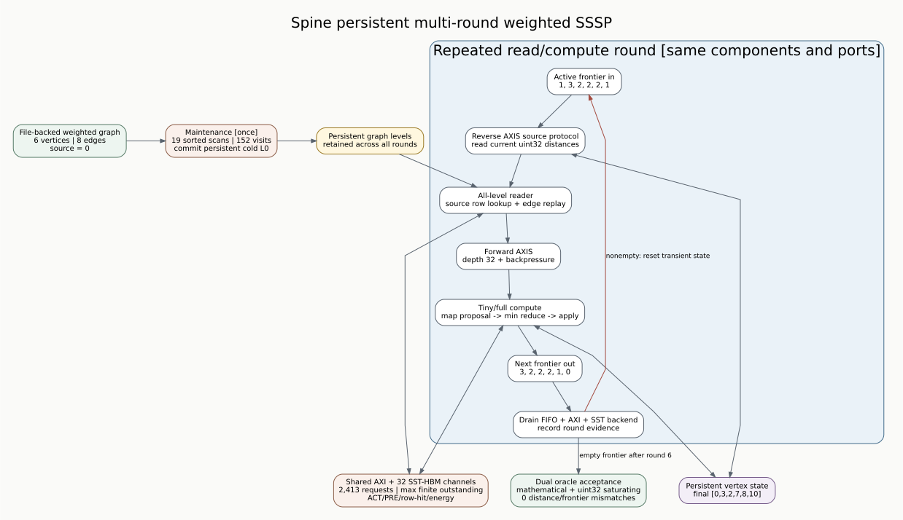

# Spine multi-round weighted SSSP

Date: 2026-07-23  
Branch: `codex/fine-grained-cycle-sim`

## Workload and oracle

`tests/data/weighted_chain_shortcut.slice` is a committed six-vertex,
eight-edge weighted graph. Its direct and shortcut paths force several
vertices to improve more than once, so a one-round fanout implementation cannot
pass accidentally.

The independent Python Map/Reduce engine runs two oracles on the same file:

- a mathematical integer SSSP oracle with 63-bit infinity;
- an architecture oracle with the compute CU's uint32 infinity and saturating
  addition.

They match exactly for this workload and produce final distances
`[0, 3, 2, 7, 8, 10]`. A separate overflow test proves that the architecture
oracle saturates while the mathematical oracle continues beyond uint32.



## Persistent execution

Maintenance runs once and commits the eight edges to persistent levels. Round
1 starts with source vertex 0. At the end of each round, the simulator waits
until reader, compute, both finite AXIS FIFOs, every AXI master, and the online
SST backend are drained. It then:

1. records the input/output frontier and all per-round counters;
2. replaces the active-source list with the output frontier;
3. clears reader/compute transient state and FIFO statistics;
4. retains graph levels, vertex distances, ports, and the memory backend;
5. starts the next reader/source-value protocol.

The run stops only when a completed round emits an empty frontier or reaches
the configured `max_rounds` limit.

## Reproduction

```bash
cd /home/chuxiao/spine-cycle-sim
python3 scripts/run_sst_spine_vertical.py \
  --scenario weighted_sssp \
  --out-dir results/sst_spine_weighted_sssp_20260723
```

## Accepted evidence

| round | active in | active out | processed edges | reader graph bytes | cycles |
| ---: | ---: | ---: | ---: | ---: | ---: |
| 1 | 1 | 3 | 3 | 112 | 4,559 |
| 2 | 3 | 2 | 3 | 176 | 3,672 |
| 3 | 2 | 2 | 2 | 160 | 3,666 |
| 4 | 2 | 2 | 2 | 160 | 3,661 |
| 5 | 2 | 1 | 1 | 80 | 3,569 |
| 6 | 1 | 0 | 0 | 0 | 3,503 |

Aggregate evidence:

| evidence | value |
| --- | ---: |
| total data cycles at 141 MHz | 22,630 |
| maintenance scans / visits | 19 / 152 |
| final distances | `[0, 3, 2, 7, 8, 10]` |
| distance / frontier mismatches | 0 / 0 |
| backend requests | 2,413 |
| DRAM reads / writes | 2,310 / 103 |
| DRAM ACT / PRE | 151 / 150 |
| total row hits | 2,119 |
| memory-only energy | 331,653,336 pJ |

The backend ledger closes exactly: `2,310 + 103 = 2,413`. The aggregate is
committed as `docs/evidence/sst_spine_weighted_sssp_20260723_summary.json`.
Each round reports forward-AXIS maximum occupancy 1 and zero push stalls, as
expected for this sparse correctness workload; full-FIFO backpressure is
covered by the separate 8,192-edge/full-Amazon tests. Reader metadata traffic
per round is `[2952, 2960, 2960, 2960, 2952, 2944]` bytes and remains in the
execution-driven HBM request stream.

## Claims boundary

This validates execution-driven, frontier-synchronous weighted SSSP over
multiple device rounds with persistent graph and vertex state. The total does
not include real Vitis launch latency, host polling, PCIe transfer, or an
inter-round delay; the simulator currently restarts at the first core cycle
after a full drain. The small graph exercises correctness and control flow, not
large-graph performance. HLS compiler overlap and hardware cycle calibration
remain separate work.
