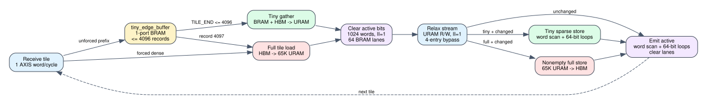

# Spine on-chip controller timing

Date: 2026-07-24
Branch: `codex/fine-grained-cycle-sim`

## Closed gap

The split compute model already reproduced the tiny/full decision, HBM
gather/sweep traffic, finite edge buffer, replay order, and AXIS backpressure.
It previously completed several on-chip controller loops instantly. The target
HLS executes those loops explicitly around every tile:

1. `tiny_edge_buffer` stores at most 4,096 ordinary edge words in a one-port
   BRAM and is read once for gather and once for tiny relax, or once for dense
   replay;
2. `vs_tile` is a 65,536-entry true-dual-port URAM used by gather/load,
   edge relax, sparse/full store, and active emission;
3. `tile_active_bits[64][1024]` is partitioned across 64 bit lanes and mapped
   to dual-port BRAM;
4. every tile clears all 1,024 active words at II=1;
5. tiny nonempty tiles scan every valid active word for sparse store, then run
   a 64-cycle bit loop for each nonzero word;
6. every tile repeats the word/bit scan to emit active records and clear the
   bit lanes; and
7. a full tile writes `vs_tile` back only when relaxation changed at least one
   destination.

The C++ state machine now has explicit clear, sparse-word, sparse-bit,
emit-word, and emit-bit phases. Every phase advances only on a core clock edge
and records both controller cycles and physical lane-access work.



## HLS mapping

    repository: /home/chuxiao/spine-dynamic-graph-reduce-levels
    revision:   origin/reduce-levels-for-routing
    commit:     afb8199a2ca8d3fd208b985324bf4d8719e2b839
    file:       src/spine_partitioned.hpp
    sha256:     d5c4a2f2c2f384e33808eee4250c0c88208027b3792d46425e1de2ae1d8a06ba

Mapped functions and loops are `partitioned_run_convergence_compute`,
`PARTCONV_SPECULATIVE_RECEIVE_LOOP`, `PARTITIONED_CLEAR_TILE_ACTIVE`,
`PARTCONV_TINY_GATHER_LOOP`, `PARTCONV_TINY_BUFFER_RELAX_LOOP`,
`PARTCONV_DENSE_BUFFER_REPLAY_LOOP`, `PARTCONV_DENSE_STREAM_RELAX_LOOP`,
`partitioned_store_vs_tile_active`, and `partitioned_emit_tile_active`.

The available July 12 split-compute synthesis report targets 200 MHz and
reports 16 URAMs for the convergence compute instance and 9 BRAM18Ks at the
kernel level. It is useful implementation evidence, but it predates the pinned
source revision and is not treated as an exact latest-source resource report:

    /data/feiyang/spine-dynamic-graph/target/split_e2e_hw_200/reports/
      spine_partconv_compute_kernel.hw/hls_reports/
      spine_partconv_compute_kernel_csynth.rpt
    sha256: 3d5ef550d4c70d981547f819b4f16cd26b3327051103beddc09847df9317116d

## Boundary microbenchmarks

The threshold test drives one complete 65,536-vertex tile with distinct
destinations:

| edges | path | cycles | tiny reads | clear words | sparse words / bit cycles | emit words / bit cycles | controller cycles |
| ---: | --- | ---: | ---: | ---: | ---: | ---: | ---: |
| 4,095 | tiny | 101,917 | 8,190 | 1,024 | 1,024 / 4,096 | 1,024 / 4,096 | 11,264 |
| 4,096 | tiny | 101,939 | 8,192 | 1,024 | 1,024 / 4,096 | 1,024 / 4,096 | 11,264 |
| 4,097 | full | 23,173 | 4,096 | 1,024 | 0 / 0 | 1,024 / 4,160 | 6,208 |
| 4,098 | full | 23,174 | 4,096 | 1,024 | 0 / 0 | 1,024 / 4,160 | 6,208 |

All four cases preserve every distance and edge. The 4,097 transition is
visible both in the tiny-buffer ledger and in the disappearance of the sparse
store scan. A duplicate-destination tiny case proves two buffer writes, four
buffer reads, one active destination, and exact 64-bit HLS active-output bytes:
value 3 in bits 31:0 and vertex ID 1 in bits 63:32.

The forced-dense host fallback also corrected an old simulator assumption. Its
second pass sees five already-converged edges, so all six full tiles are empty:
327,681 vertex words are loaded, no full tile is written back, all 6,144 clear
words execute, and the final one-vertex tile emits one valid active word scan.

## SST-HBM impact

The before column is commit `089f28a`; all comparisons use
`hls_split_9c08763` and the same SST-HBM profile.

| scenario | cycles before / after | explicit controller cycles | requests before / after | correctness |
| --- | ---: | ---: | ---: | ---: |
| Amazon L0, 5 tiny tiles | 7,305 / 23,501 | 16,256 | 1,400 / 1,400 | 0 mismatches |
| carry + hot, 1 tiny partial tile | 9,702 / 10,646 | 1,156 | 2,016 / 2,016 | 0 mismatches |
| weighted SSSP, 5 working rounds | 34,087 / 38,710 | 5 x 1,154 | 4,197 / 4,197 | 0 mismatches |
| Amazon full compute, 11 tiny + 1 full | 496,386 / 1,073,313 | 577,028 | 175,315 / 175,315 | 0 mismatches |

For full compute, the 576,927-cycle E2E increase differs from the explicit
577,028-cycle controller ledger by only 101 cycles because a small amount is
hidden by existing stream/memory overlap. Request counts remain identical.
DRAM ACT counts can still change because controller stalls alter the
execution-driven request arrival order; no trace is replayed independently of
the simulated pipeline.

Complete summaries and selected evidence are in
`docs/evidence/sst_spine_onchip_controller_*_20260724_summary.json` and
`docs/evidence/spine_onchip_controller_timing_20260724.json`.

## Reproduction

```bash
cd /home/chuxiao/spine-cycle-sim
cmake --build build/cycle-core -j2
./build/cycle-core/cpp/spine_cycle_core_tests spine_full_tile_boundaries
./build/cycle-core/cpp/spine_cycle_core_tests spine_tiny_duplicate_gather
./build/cycle-core/cpp/spine_cycle_core_tests spine_host_active_gate_fallback
ctest --test-dir build/cycle-core --output-on-failure
python3 -m unittest discover -s tests
make -C cpp/sst -j2

python3 scripts/run_sst_spine_vertical.py \
  --scenario amazon_l0 --no-build \
  --out-dir results/sst_spine_onchip_controller_amazon_l0_20260724
python3 scripts/run_sst_spine_vertical.py \
  --scenario carry_hot --no-build \
  --out-dir results/sst_spine_onchip_controller_carry_hot_20260724
python3 scripts/run_sst_spine_vertical.py \
  --scenario weighted_sssp --no-build \
  --out-dir results/sst_spine_onchip_controller_weighted_sssp_20260724
python3 scripts/run_sst_spine_vertical.py \
  --scenario amazon_full_compute --no-build \
  --out-dir results/sst_spine_onchip_controller_amazon_full_compute_20260724
```

## Remaining boundary

This closes deterministic controller-loop work and exact access ledgers. The
arrays are not yet connected to the reusable `BankedMemory` request/response
components, so URAM read latency, physical port grants, RAW bypass depth, and
response backpressure are still modeled logically. The compute vertex-state
AXI path also waits for one parent response at a time; the HLS gather and sparse
write loops can maintain outstanding transactions. Those are the next two
Spine timing gaps and can materially reduce the current tiny-path latency.
