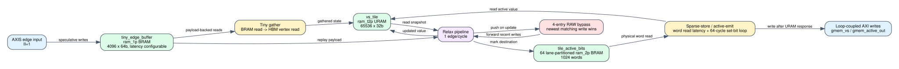

# Spine physical on-chip memory pipeline

Date: 2026-07-24
Branch: `codex/fine-grained-cycle-sim`
Baseline commit: `6a647b3`

## Closed gap

The previous model counted on-chip accesses but read `tiny_edge_buffer`,
`vs_tile`, and `tile_active_bits` as immediately available C++ containers. The
compute schedule now uses payload-backed, finite-latency pipelines matching the
target HLS storage directives:

- `tiny_edge_buffer`: one-port BRAM, one 64-bit access per loop iteration;
- `vs_tile`: true-dual-port URAM with an II=1 read pipeline and an independent
  update path;
- `tile_active_bits[64][1024]`: 64 fully partitioned lanes, represented as one
  physical 64-bit word per lane-parallel access; and
- `bp_addr/bp_val/bp_valid`: newest-first four-entry forwarding for stale URAM
  read snapshots.



Tiny gather and relax consume the buffered edge payload only when the BRAM read
completes. Relax captures the URAM value at read issue, then checks the bypass
when the response becomes ready. Sparse-store and active-emission AXI writes
are generated only after the corresponding URAM read completes. Active-word
branches consume the physical bitmap read result after its configured latency.

The default profile is source-shaped rather than newly calibrated:

| parameter | default | source constraint |
| --- | ---: | --- |
| tiny BRAM read latency | 2 | `ram_1p impl=bram` |
| vertex URAM read latency | 2 | `ram_t2p impl=uram` |
| active BRAM read latency | 2 | `ram_2p impl=bram` |
| read pipeline capacity | 4 | enough for the modeled II=1 memory latency |
| vertex RAW bypass depth | 4 | `PARTITIONED_VS_BYPASS_DEPTH` |

All five values are configurable in the C++ profile and SST command line. The
latencies are explicit assumptions because the available old top-level csynth
report gives resource counts but not sub-loop memory latency.

## HLS mapping

    repository: /home/chuxiao/spine-dynamic-graph-reduce-levels
    revision:   afb8199a2ca8d3fd208b985324bf4d8719e2b839
    file:       src/spine_partitioned.hpp

Mapped declarations and loops are `tiny_edge_buffer`, `vs_tile`,
`tile_active_bits`, `PARTCONV_SPECULATIVE_RECEIVE_LOOP`,
`PARTCONV_TINY_GATHER_LOOP`, `PARTCONV_TINY_BUFFER_RELAX_LOOP`,
`PARTCONV_DENSE_BUFFER_REPLAY_LOOP`, `PARTCONV_DENSE_STREAM_RELAX_LOOP`,
`partitioned_relax_partconv_word`, `partitioned_store_vs_tile_active`, and
`partitioned_emit_tile_active`.

The accepted older synthesis report records 16 URAM and 9 BRAM18K for the
compute kernel, but is not claimed as latest-source calibration:

    /data/feiyang/spine-dynamic-graph/target/split_e2e_hw_200/reports/
      spine_partconv_compute_kernel.hw/hls_reports/
      spine_partconv_compute_kernel_csynth.rpt

## Validation

The 64-edge access-ledger microbenchmark closes exactly:

| physical operation | requests |
| --- | ---: |
| tiny BRAM writes / reads | 64 / 128 |
| vertex URAM reads / writes | 192 / 128 |
| active BRAM reads / writes | 2,048 / 2,112 |

The counts correspond to one buffer write, gather and relax buffer reads,
relax/sparse/emit vertex reads, gather/update vertex writes, two 1,024-word
active scans, the full clear, 64 marks, and the emit clear. Distances and active
records are exact.

Changing only active-BRAM read latency from one to four cycles increases the
same workload from 5,566 to 11,709 cycles. This proves the profile controls the
execution schedule rather than only annotating statistics. The duplicate-
destination test observes one bypass miss followed by one hit and preserves the
minimum value and exact active-output bytes.

The 4,095/4,096/4,097/4,098 threshold cycles are 32,755, 32,760, 28,599, and
28,600. All retain exact distances and exact HLS parent-request counts.

## SST-HBM results

| scenario | cycles before / after | backend requests | relevant physical work | correctness |
| --- | ---: | ---: | --- | --- |
| Amazon L0 | 23,325 / 43,830 | 1,400 | 10,240 active-word reads | exact |
| weighted SSSP | 38,452 / 38,479 | 4,197 | only small partial-tile scans | exact |
| Amazon full compute | 820,097 / 863,973 | 175,315 | 159,663 URAM reads, 8,104 bypass hits | exact |

The contrast is expected: full-size touched tiles pay two physical bitmap scans,
whereas small weighted rounds scan only their valid words. Backend request
counts remain unchanged, so the increase is attributable to on-chip timing and
its changed request arrival schedule, not extra graph traffic.

## Reproduction

```bash
cd /home/chuxiao/spine-cycle-sim
cmake --build build/cycle-core -j2
./build/cycle-core/cpp/spine_cycle_core_tests spine_onchip_memory_profile
./build/cycle-core/cpp/spine_cycle_core_tests spine_tiny_duplicate_gather
./build/cycle-core/cpp/spine_cycle_core_tests spine_full_tile_boundaries
ctest --test-dir build/cycle-core --output-on-failure
python3 -m unittest discover -s tests
make -C cpp/sst -j2

python3 scripts/run_sst_spine_vertical.py \
  --scenario amazon_l0 --no-build \
  --out-dir results/sst_spine_onchip_ports_amazon_l0_20260724
python3 scripts/run_sst_spine_vertical.py \
  --scenario weighted_sssp --no-build \
  --out-dir results/sst_spine_onchip_ports_weighted_sssp_20260724
python3 scripts/run_sst_spine_vertical.py \
  --scenario amazon_full_compute --no-build \
  --out-dir results/sst_spine_onchip_ports_full_20260724
```

## Remaining boundary

1. Full-tile HBM load/store is still one aggregate parent transaction. Its
   per-word HLS loop and AXI R/W/B beat overlap are not yet represented.
2. The next tile waits for accepted prior writes to drain; cross-tile response
   carry remains conservative.
3. Default BRAM/URAM latency needs latest-source csynth or hardware calibration.
4. The local arrays have source-determined ports, so there is no unmodeled
   crossbar contention inside this kernel. Future alternative bank counts must
   use the generic `BankedMemory` primitive rather than this fixed profile.

This closes the current HLS design's on-chip payload, latency, II=1 pipeline,
and four-entry RAW-forwarding behavior. It does not close full-tile AXI beat
timing or latest-hardware calibration.
