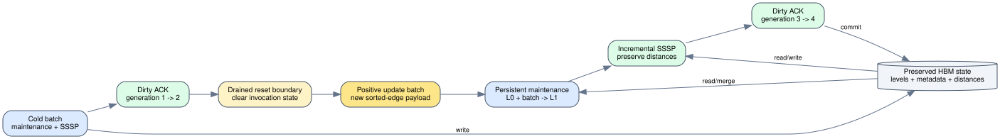

# Persistent Spine incremental update

Date: 2026-07-25
Branch: `codex/fine-grained-cycle-sim`
Claim tier: `structural_execution_driven`
Memory backend: `MockMemoryBackend`

## Scope

This milestone lets one registered `SpineVerticalSliceSystem` execute a second
positive-differential update batch without reconstructing the scheduler, AXI
ports, HBM backend, graph hierarchy, or SSSP vertex-state array.



The reset boundary preserves architectural state and clears only per-invocation
state:

- preserved: graph levels, graph/index payloads, slice/page epochs, dirty
  generation stored in metadata, SSSP distances, AXI masters, and backend;
- reset: maintenance scans and queues, Reader round state, compute round state,
  dirty-ACK state, FIFO statistics, and convergence-run guard;
- overwritten: only the sorted-edge input payload for the new batch.

`SpineL0Maintenance::reset_batch()` rejects a failed or non-drained system,
an empty/unsorted/out-of-range batch, a changed vertex count, or non-idle
ports. `SpineDirtyAck::reset()` similarly requires a completed successful ACK.
The system-level `restart_incremental_update()` accepts positive differential
records only; this is the insert/decrease path of the current timed contract.

## Acceptance workload

Initial graph:

```text
0 -> 1 (5)
0 -> 2 (20)
1 -> 2 (5)
2 -> 3 (1)
```

Cold SSSP from source 0 converges to `[0, 5, 10, 11]`. The second batch adds
the lower-weight record `0 -> 2 (2, diff=+1)`. The same system then converges
to `[0, 5, 2, 3]`.

Observed structural evidence:

| metric | cold invocation | incremental invocation |
| --- | ---: | ---: |
| total cycles | 24,672 | 19,085 |
| SSSP rounds | 4 | 3 |
| maintenance target | L0 | L1 |
| dirty generation after ACK | 2 | 4 |
| final distances | `[0,5,10,11]` | `[0,5,2,3]` |

The second maintenance invocation selects L1 because L0 is occupied. It merges
the persisted L0 payload with the new sorted-edge payload, retires L0, and
publishes L1 metadata. The first update round obtains source 0 from the new
generation-3 dirty list; it does not use a host-supplied Python frontier.

Machine-readable evidence is
`docs/evidence/spine_persistent_incremental_update_20260725.json`.

## Reproduction

```bash
cd /home/chuxiao/spine-cycle-sim
cmake -S . -B build/cycle-core -G Ninja -DCMAKE_BUILD_TYPE=RelWithDebInfo
cmake --build build/cycle-core -j2
./build/cycle-core/cpp/spine_cycle_core_tests spine_incremental_update
ctest --test-dir build/cycle-core --output-on-failure
python3 -m unittest discover -s tests
git diff --check
```

Expected focused output:

```text
EVIDENCE spine_incremental_update cold_cycles=24672 update_cycles=19085 update_rounds=3 target_level=1 generation=4
PASS spine_incremental_update
```

## Claim boundary

This result proves persistent positive-differential maintenance plus incremental
weighted-SSSP repair on the Mock HBM timing backend. It does not yet prove:

1. SST/DRAMSim3 timing for the second batch;
2. deletion or weight-increase handling;
3. timed full-recompute graph/state initialization;
4. dynamic Full PageRank warm start;
5. signed-residual PageRank update initialization; or
6. hardware-cycle calibration.

The next direct step is to expose the same two-batch scenario through the SST
runner. Delete/increase must use an explicit timed full-rebuild path because a
minimum-weight differential hierarchy cannot recover a superseded larger
weight from the compacted level alone.
