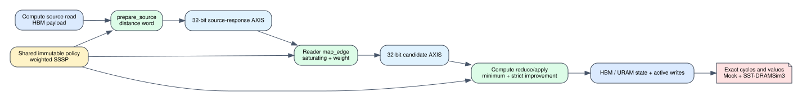

# Spine weighted SSSP policy integration

Date: 2026-07-25
Branch: `codex/fine-grained-cycle-sim`
Baseline commit: `909b370`

## Closed gap

The timed Spine Reader and Compute previously embedded weighted SSSP in three
separate code paths: source-state forwarding, saturating edge-weight addition,
and destination minimum/update. This milestone routes all three operations
through one shared immutable `GraphAlgorithmPolicy` while preserving the
existing 32-bit AXIS protocols and every scheduler-visible action.



The resulting timed path is:

1. Compute reads the source distance from the payload-backed vertex-state AXI
   port and invokes `prepare_source`.
2. Reader receives the same 32-bit source payload and invokes `map_edge` for
   exact and fallback replay.
3. Compute invokes `reduce` and `apply` after the modeled BRAM/URAM read and
   writes the policy result through the existing state and active pipelines.

Reader and Compute are tested with the same policy instance. The timed compute
still rejects non-SSSP policies. That rejection is intentional: accepting a
PageRank policy before degree/residual ports and floating-point timing exist
would silently undercount work.

## Zero-cycle regression gate

| backend / workload | metric | before | after |
| --- | --- | ---: | ---: |
| Mock / Amazon top1 exact | end-to-end cycles | 43,407 | 43,407 |
| Mock / Amazon top1 exact | maintenance cycles | 2,370 | 2,370 |
| Mock / Amazon top1 exact | Reader cycles | 4,478 | 4,478 |
| Mock / Amazon top1 exact | Compute cycles | 40,968 | 40,968 |
| SST-DRAMSim3 / Amazon L0 | end-to-end cycles | 43,830 | 43,830 |
| SST-DRAMSim3 / Amazon L0 | backend requests | 1,400 | 1,400 |
| SST-DRAMSim3 / weighted SSSP | end-to-end cycles | 38,479 | 38,479 |
| SST-DRAMSim3 / weighted SSSP | backend requests | 4,197 | 4,197 |

The weighted SSSP SST case still converges in six rounds to
`[0, 3, 2, 7, 8, 10]`, with zero value and frontier mismatches. The 4,095 to
4,098 tiny/full boundary remains `32,845 / 32,850 / 151,570 / 151,571` cycles.

The SST Makefile now links `algorithm.cpp` explicitly. A dynamic-symbol check
confirms the shared object contains the policy definitions and has no unresolved
`GraphAlgorithmPolicy` references.

Machine-readable evidence is
`docs/evidence/spine_sssp_policy_integration_20260725.json`.

## Reproduction

```bash
cd /home/chuxiao/spine-cycle-sim
cmake --build build/cycle-core -j2
./build/cycle-core/cpp/spine_cycle_core_tests spine_l0_real_slice
./build/cycle-core/cpp/spine_cycle_core_tests spine_full_tile_boundaries
./build/cycle-core/cpp/spine_cycle_core_tests spine_multiround_weighted_sssp
./build/cycle-core/cpp/spine_cycle_core_tests
python3 -m unittest discover -s tests

make -C cpp/sst -B -j2
nm -D build/sst/libspine_cycle.so | \
  grep ' U .*GraphAlgorithmPolicy' && exit 1 || true
python3 scripts/run_sst_spine_vertical.py \
  --scenario amazon_l0 --no-build \
  --out-dir results/sst_spine_policy_amazon_l0_20260725
python3 scripts/run_sst_spine_vertical.py \
  --scenario weighted_sssp --no-build \
  --out-dir results/sst_spine_policy_weighted_sssp_20260725
```

## Remaining boundary

1. Full PageRank needs timed degree reads, ping-pong rank state, dangling
   accumulation, float pipelines, all-vertex activation, and convergence.
2. Residual PageRank additionally needs timed residual reads/writes and signed
   threshold activation.
3. SSSP insert/decrease and delete/increase fallback are correct in the Python
   dynamic oracle but are not yet driven end-to-end by a file-backed C++ batch
   runner.
4. GraSU and PMA-native ReGraph do not yet execute on this shared timing core.

This milestone removes the hard-coded SSSP operation barrier without changing
the accepted hardware-shaped timing baseline. It does not make PageRank timed.
