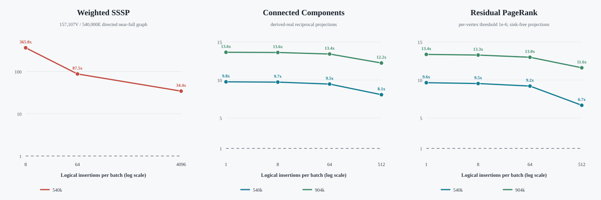

# Large-Real-Graph Evaluation: Weighted SSSP, CC, and Residual PageRank

## Result boundary

All three sparse-update algorithms now have correctness-gated comparisons at
or above 540,000 edge records.  The comparison is Spine versus the frozen K=1
GraSU+ReGraph baseline.  The graph contracts differ where the algorithms
require it:

| Algorithm | Input scope | Vertices | Initial edge records | Destination partitions | Batches |
|---|---|---:|---:|---:|---|
| Weighted SSSP | directed near-full AskUbuntu simple graph | 157,107 | 540,000 | 3 | 8, 64, 4,096 |
| Connected Components | AskUbuntu-derived reciprocal gate | 94,931 | 540,000 | 2 | 1, 8, 64, 512 |
| Connected Components | full reciprocal projection of the frozen source | 156,289 | 903,774 | 3 | 1, 8, 64, 512 |
| Residual PageRank | sink-free AskUbuntu-derived reciprocal gate | 94,931 | 540,000 | 2 | 1, 8, 64, 512 |
| Residual PageRank | full sink-free reciprocal projection of the frozen source | 156,289 | 903,774 | 3 | 1, 8, 64, 512 |

The directed SSSP graph contains 540,000 of the 544,621 unique non-self edges
available after preprocessing.  The reciprocal gate selects the first 270,000
unique undirected pairs and emits both directions.  The full reciprocal
projection scans all 540,000 frozen source records, retains all 451,887 unique
undirected pairs, and emits 903,774 directed records.  "Full" therefore means
the full reciprocal projection of this frozen source, not an unsliced raw
temporal dataset.

CC and residual updates are nested, deterministic cross-component bridge
insertions.  They retain real graph topology but are not original timestamped
AskUbuntu events.  This choice gives CC a known component-count oracle and
keeps the residual graph reciprocal and sink-free.

## Correctness admission

No row enters a performance table unless its algorithm-specific checks pass:

- Weighted SSSP: Spine and GraSU+ReGraph final distances match.
- CC: both architecture oracles and the independent CPU minimum-label CC
  oracle match; both systems execute the same iterations and active edges.
- Residual PageRank: both architecture oracles and the independent numerical
  oracle pass; rank, residual, and frontier sequences match across systems.
- Every residual row terminates with `Linf(residual) <= 1e-6`.  This is the
  frozen per-vertex Delta.hls threshold, not GAP's global-L1 rule.
- Request, response, byte, FIFO-drain, and active-work ledgers close before a
  row is admitted.

All 19 architecture pairs in this large-real package pass their gates.

## Performance results

### Weighted SSSP on the 540K directed graph

| Logical insertions | Spine time (ms) | GraSU+ReGraph time (ms) | Spine speedup |
|---:|---:|---:|---:|
| 8 | 1.567 | 572.066 | 364.96x |
| 64 | 6.534 | 572.031 | 87.54x |
| 4,096 | 16.691 | 573.326 | 34.35x |

This is resident-state update timing.  Spine excludes cold bootstrap, while
GraSU+ReGraph includes PMA update plus the frozen four-round routed compute
path.  The large speedup is therefore evidence for this small-update timing
contract and the K=1 baseline, not a universal whole-program ratio.

### Connected Components

| Logical insertions | 540K Spine cycles | 540K G+R cycles | 540K speedup | 903,774E Spine cycles | 903,774E G+R cycles | 903,774E speedup |
|---:|---:|---:|---:|---:|---:|---:|
| 1 | 1,617,036 | 15,781,604 | 9.76x | 3,965,472 | 54,122,677 | 13.65x |
| 8 | 2,027,626 | 19,711,487 | 9.72x | 3,973,933 | 54,123,007 | 13.62x |
| 64 | 2,082,804 | 19,712,032 | 9.46x | 4,033,790 | 54,128,744 | 13.42x |
| 512 | 2,446,066 | 19,730,207 | 8.07x | 4,426,116 | 54,148,843 | 12.23x |

### Per-vertex-threshold Residual PageRank

| Logical insertions | 540K Spine cycles | 540K G+R cycles | 540K speedup | 903,774E Spine cycles | 903,774E G+R cycles | 903,774E speedup |
|---:|---:|---:|---:|---:|---:|---:|
| 1 | 413,177 | 3,985,774 | 9.65x | 670,030 | 8,955,983 | 13.37x |
| 8 | 826,751 | 7,881,915 | 9.53x | 674,314 | 8,956,370 | 13.28x |
| 64 | 1,280,480 | 11,782,647 | 9.20x | 1,368,327 | 17,778,287 | 12.99x |
| 512 | 2,933,022 | 19,579,227 | 6.68x | 2,293,695 | 26,625,416 | 11.61x |



The main trend is consistent across CC and residual PageRank: Spine retains a
large sparse-update advantage, while the advantage decreases as the update
activates more work.  The full projection does not reverse the architecture
ordering.  This is stronger evidence than the earlier 8,192-edge screening,
but remains conditional on K=1 GraSU+ReGraph and the declared update streams.

## Simulator wall time

The weighted SSSP six-execution matrix completed in 782.2 seconds (13.0
minutes).  For CC, the slowest individual host runs were 60.3 seconds at 540K
and 165.0 seconds on the full projection.  For residual PageRank, the slowest
individual host runs were 193.5 seconds at 540K and 260.5 seconds on the full
projection.  Thus every tested architecture/workload run remains below five
minutes; the requested half-hour budget was not approached.

Host wall time measures simulator cost, not accelerator latency.

## Reproduction

```bash
cd /home/chuxiao/spine-cycle-sim-publication
make -C cpp/sst -j2

# Verify or regenerate the directed 540K source.
python3 scripts/prepare_candidate10_askubuntu_paper_scale.py --verify-only

# Generate the reciprocal gate and full projection.
python3 scripts/prepare_askubuntu_reciprocal_large.py
python3 scripts/prepare_askubuntu_reciprocal_large.py \
  --out-dir tests/data/askubuntu_reciprocal_full \
  --manifest configs/experiments/askubuntu_reciprocal_full_v1.json \
  --target-records 903774 \
  --matrix-id askubuntu_reciprocal_full_v1

# Weighted SSSP, K=1.
python3 scripts/run_hls_weighted_real_comparison.py \
  --profile-set candidate10_hls_v3 \
  --input-manifest configs/experiments/candidate10_grasu_askubuntu_paper_scale_v1_20260728.json \
  --out-dir /data/tmp/chuxiao/opt_v2_k1_askubuntu540k_weighted_formal_v2_20260728 \
  --jobs 2 --no-build

# CC, K=1, gate and full projection.
python3 scripts/run_connected_components_matrix.py \
  --manifest configs/experiments/askubuntu_reciprocal_large_v1.json \
  --out-dir evidence/askubuntu_reciprocal_large_cc_k1_matrix_v1 \
  --compute-pipelines 1 --downstream-sharing direct \
  --max-concurrent 2 --no-build
python3 scripts/run_connected_components_matrix.py \
  --manifest configs/experiments/askubuntu_reciprocal_full_v1.json \
  --out-dir evidence/askubuntu_reciprocal_full_cc_k1_matrix_v1 \
  --compute-pipelines 1 --downstream-sharing direct \
  --max-concurrent 2 --no-build

# Delta.hls residual PageRank, K=1, per-vertex threshold 1e-6.
python3 scripts/run_delta_hls_residual_matrix.py \
  --manifest configs/experiments/askubuntu_reciprocal_large_v1.json \
  --out-dir evidence/askubuntu_reciprocal_large_residual_k1_matrix_v1 \
  --epsilon 1e-6 --jobs 2 --no-build
python3 scripts/run_delta_hls_residual_matrix.py \
  --manifest configs/experiments/askubuntu_reciprocal_full_v1.json \
  --out-dir evidence/askubuntu_reciprocal_full_residual_k1_matrix_v1 \
  --epsilon 1e-6 --jobs 2 --no-build

# Audit and render the compact publication evidence.
python3 scripts/analyze_large_real_algorithm_results.py \
  --out-dir evidence/large_real_three_algorithm_v1
python3 scripts/render_large_real_algorithm_figure.py \
  --summary evidence/large_real_three_algorithm_v1/summary.json
```

The compact, reviewable result is committed under
`docs/evidence/large_real_three_algorithm_v1/summary.json`.  Raw SST/DRAMSim3
outputs remain untracked under `evidence/`; the weighted raw matrix remains
under `/data/tmp/chuxiao`.

## Remaining boundary

- These large-real rows compare K=1 GraSU+ReGraph.  Existing direct/shared K=4
  evidence isolates partition scaling on smaller or replicated fixtures; a
  large-real K4 rerun is still a separate follow-up.
- The comparisons use normalized, execution-driven simulator profiles.  They
  are not cycle-for-cycle FPGA calibration claims.
- Deletion-aware CC repair is not implemented; the CC claim is incremental
  insertion only.
