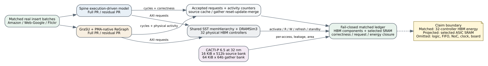

# Matched PageRank partial-energy evidence

Date: 2026-07-26
Branch: `codex/fine-grained-cycle-sim`

## Scope and result

This milestone runs Spine and conversion-free GraSU + PMA-native ReGraph on
the same Amazon-2008, Web-Google, and Flickr compact real-graph insert batches.
It covers Full PageRank and thresholded residual PageRank: 12 system runs and
6 architecture pairs. Every run passed its architecture oracle, mathematical
oracle, update-state checks, cross-system comparison, memory-request closure,
and DRAMSim3 energy closure.



The matched cross-system energy claim is deliberately narrow:

- **matched:** all 32 simulated HBM controller instances, including command,
  refresh, and standby energy;
- **projected:** current GraSU/ReGraph source-cache and gather SRAMs using
  CACTI-P at 32 nm; and
- **omitted:** logic, FIFOs, interconnect, clock tree, host, PCIe, shell, board
  power, and uncharacterized Spine PageRank pipeline storage.

Therefore, the HBM energy ratios below are valid within the shared DRAMSim3
model. The HBM-plus-selected-SRAM sum is still a partial ledger and is not a
total accelerator-energy comparison.

## Matched execution

The matrix uses one eight-edge insert batch from each dataset. Full PageRank
runs three iterations. Residual PageRank uses damping 0.85 and threshold
`1e-6`, converging in 76--100 iterations for these slices.

| algorithm | dataset | Spine ms | GraSU+ReGraph ms | correctness |
| --- | --- | ---: | ---: | --- |
| Full PR | Amazon | 0.974 | 0.968 | exact / cross-system pass |
| Full PR | Web-Google | 2.904 | 2.011 | exact / cross-system pass |
| Full PR | Flickr | 2.609 | 1.797 | exact / cross-system pass |
| residual PR | Amazon | 21.878 | 27.263 | exact / cross-system pass |
| residual PR | Web-Google | 66.862 | 47.139 | exact / cross-system pass |
| residual PR | Flickr | 60.606 | 51.011 | exact / cross-system pass |

Instantiating all 32 controllers preserves the same cycle and backend-request
counts as the earlier sparse-controller runs for all 12 rows. It changes only
host simulation cost and inclusion of physically idle-controller energy.

## HBM energy

`total` includes command dynamic, refresh, and active/precharge standby.
`command ratio` is GraSU divided by Spine for activate/read/write energy only.
This split matters because 94--99% of total HBM energy in these small workloads
is refresh and standby energy.

| algorithm | dataset | Spine total mJ | GraSU total mJ | GraSU/Spine total | GraSU/Spine command |
| --- | --- | ---: | ---: | ---: | ---: |
| Full PR | Amazon | 2.021 | 2.062 | 1.020x | 2.740x |
| Full PR | Web-Google | 6.027 | 4.232 | 0.702x | 1.039x |
| Full PR | Flickr | 5.416 | 3.786 | 0.699x | 1.089x |
| residual PR | Amazon | 45.573 | 60.284 | 1.323x | 6.098x |
| residual PR | Web-Google | 139.383 | 100.772 | 0.723x | 1.458x |
| residual PR | Flickr | 126.418 | 109.440 | 0.866x | 1.861x |

Across the three datasets, the geometric-mean GraSU/Spine HBM total-energy
ratio is `0.794x` for Full PR and `0.939x` for residual PR. The corresponding
command-dynamic ratios are `1.458x` and `2.548x`.

The interpretation is not contradictory. GraSU/ReGraph has regular PMA and
partition sweeps and often finishes earlier, reducing always-on HBM background
energy. It still performs more command-level memory work, especially for
residual PageRank. This agrees with the independent accepted-request traffic
result: regularity and transferred volume are different axes.

## Selected SRAM projection

The current proposed GraSU/ReGraph profile has 8 map lanes, 8 gather banks,
and one 65,536-vertex destination partition. The execution model now exports
gather reset and merge cycles directly; `gather_merge_cycles` equals
`gather_rows_emitted` for every accepted run.

| array | physical instances | CACTI geometry | R/W nJ | leakage mW/bank | projected area |
| --- | ---: | --- | ---: | ---: | ---: |
| source-property ping-pong | 16 | 16 KiB x 512b | 0.12638 / 0.16409 | 33.020 | 4.592 mm2 |
| gather temporary properties | 8 | 64 KiB x 64b | 0.03394 / 0.03545 | 43.225 | 2.918 mm2 |
| selected total | 24 | - | - | - | 7.509 mm2 |

Source-cache reads equal physical PMA slots presented to the 8 map lanes;
writes use the direct lane-write counter. Gather activity uses direct
reset/update/merge counters:

```text
gather reads  = bank_updates + merge_cycles * 8
gather writes = reset_cycles * 8 + bank_updates + merge_cycles * 8
```

The selected GraSU SRAM energy ranges from 0.91--1.83 mJ for Full PR and
25.83--46.49 mJ for residual PR. No corresponding Spine PageRank local-memory
set is yet characterized, so these values must not be divided by a zero Spine
selected-array value or presented as total-energy ratios.

## Runtime

With `--jobs 2`, the three-pair Full PR matrix took 44.0 seconds. The residual
matrix took 1066.2 seconds (17.8 minutes). This meets the present tens-of-
minutes gate for compact real slices but does not prove full large-graph
throughput. Full-controller simulation is 4--5x slower than sparse reachable-
controller execution because every idle SST controller ticks each cycle.

A safe optimization is to keep every reachable controller execution-driven,
simulate one independent idle-controller representative for the common timing
window, and multiply its byte-identical refresh/standby trace by the number of
physically idle controllers. It must be accepted only after cycle, active-
controller, and energy equality against this 32-controller baseline.

## Reproduction

```bash
cd /home/chuxiao/spine-cycle-sim
make -C cpp/sst -j2

python3 scripts/characterize_current_grasu_arrays.py \
  --out-dir docs/evidence/matched_partial_energy_20260726/raw/cacti \
  --cacti-source-dir /data/feiyang/mcpat/cacti --jobs 2

python3 scripts/run_hls_pagerank_real_comparison.py \
  --out-dir docs/evidence/matched_partial_energy_20260726/raw/full_pagerank \
  --run-id real_amazon_2008_insert_u8 \
  --run-id real_web_google_insert_u8 \
  --run-id real_soc_flickr_und_insert_u8 \
  --jobs 2 --timeout-seconds 900 --max-cycles 100000000 --no-build \
  --instantiate-all-hbm-channels

python3 scripts/run_hls_residual_pagerank_real_comparison.py \
  --out-dir docs/evidence/matched_partial_energy_20260726/raw/residual_pagerank \
  --run-id real_amazon_2008_insert_u8 \
  --run-id real_web_google_insert_u8 \
  --run-id real_soc_flickr_und_insert_u8 \
  --jobs 2 --timeout-seconds 1800 --max-cycles 100000000 --no-build \
  --instantiate-all-hbm-channels

python3 scripts/analyze_matched_pagerank_energy.py \
  --out-dir docs/evidence/matched_partial_energy_20260726

python3 -m unittest tests.test_matched_energy \
  tests.test_hls_pagerank_real_comparison tests.test_energy_evidence
```

Primary outputs are `matched_energy.json`, `system_energy.csv`,
`component_energy.csv`, and `pair_energy.csv`. The JSON ledger pins matrix,
activity, CACTI, and every final DRAMSim3 file by SHA-256.

## Remaining acceptance work

1. Synthesize and route HLS matching the proposed conversion-free PageRank
   policies before assigning measured FPGA area/timing labels.
2. Characterize Spine PageRank local storage plus logic/FIFO/interconnect/clock
   energy for a symmetric total-energy comparison.
3. Extend the matched energy matrix to weighted SSSP after adding an exact
   Spine maintenance/compute energy boundary.
4. Validate the idle-controller runtime optimization, then run full large-
   graph, dense-batch, ablation, and scalability matrices.
