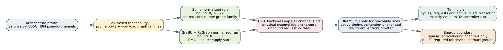

# Normalized sparse SST HBM binding

Date: 2026-07-25

## Purpose and claim boundary

The complete normalized comparison matrix was blocked by simulator host runtime:
SST advanced all 32 DRAMSim3 controllers on every HBM clock, including physical
pseudo-channels that a run could never address. GDB samples from the timed-out
`syn_source_window_e4095__residual_pagerank` run consistently landed in
`DRAMSim3Memory::clock`, `Controller::ClockTick`, and
`CommandQueue::GetCommandToIssue`.

The default runners now instantiate only profile- and workload-reachable
physical HBM channel numbers. This is a simulator host-runtime optimization,
not an accelerator architecture optimization:

- the architecture profile still exposes 32 U55C pseudo-channels;
- the C++ backend retains a 32-entry physical channel namespace;
- active channel numbers, timing, request order and contention are unchanged;
- a request to an unbound channel is fatal rather than remapped;
- no architecture cycle, refresh on an active channel, or memory transaction is
  fast-forwarded.



## Reachability

For GraSU + ReGraph normalized profiles, PMA channels `0..3`, source-state
channels `1` and `3`, and apply/degree channel `30` produce the fixed reachable
set `{0,1,2,3,30}`.

For Spine, fixed control/data ports use `16..22`. Graph channels are derived
from every destination in the graph, update and preload slices, using the same
cold partition and hot-destination hash as the C++ model. All frozen shared
comparison workloads fit destination partition 0 and have no explicit hot set,
so their reachable set is `{0,16,17,18,19,20,21,22}`. A wider or hot workload
automatically adds its reachable graph banks.

Use `--instantiate-all-hbm-channels` on any child runner to restore all 32 SST
controllers for equivalence checks or full-channel DRAM energy runs.

## Exact equivalence evidence

The machine-readable report is
`docs/evidence/normalized_sparse_hbm_equivalence_20260725.json`.

| System | Algorithm | Cycles | Requests | Bound channels | Host speedup | Result and active DRAM identity |
| --- | --- | ---: | ---: | --- | ---: | --- |
| Spine | Full PageRank | 32,136 | 4,699 | 8 | 3.20x | byte-identical |
| Spine | Weighted SSSP | 39,106 | 4,240 | 8 | 3.22x | byte-identical |
| Spine | Residual PageRank | 457,960 | 42,126 | 8 | 3.58x | byte-identical |
| GraSU + ReGraph | Full PageRank | 135,771 | 50,976 | 5 | 3.99x | byte-identical |
| GraSU + ReGraph | Weighted SSSP | 233,633 | 101,466 | 5 | 4.33x | byte-identical |
| GraSU + ReGraph | Residual PageRank | 107,831 | 82,397 | 5 | 3.90x | byte-identical |

Each row compares a full 32-controller run with a sparse run. `result.json` is
byte-identical, and both `dramsim3.json` and `dramsim3.txt` are byte-identical
for every bound channel. Host speedups are single-run engineering measurements;
they must not be reported as accelerator speedups.

## Energy boundary

Sparse DRAMSim3 energy includes only instantiated active/bound channels. It
omits idle/background energy from unbound physical channels and is labeled
`bound_channel_dramsim3_only_excludes_unbound_idle_background`. It is suitable
for timing and transaction experiments, but not for a full-device HBM energy
claim. Use the all-channel flag for such a claim, or add a separately validated
idle/background model.

## Reproduction

Build and test:

```bash
cd /home/chuxiao/spine-cycle-sim
make -C cpp/sst -j2
python3 -m unittest discover -s tests
```

Representative full/sparse Spine pair:

```bash
python3 scripts/run_sst_spine_vertical.py \
  --scenario weighted_sssp --validation-mode generic \
  --profile configs/architectures/spine_latest_afb8199.json \
  --workload tests/data/shared_comparison/syn_weighted_diamond_v8.slice \
  --source 0 --max-cycles 100000000 --max-rounds 256 \
  --instantiate-all-hbm-channels --no-build \
  --out-dir results/sparse_hbm_equivalence_20260725/spine_weighted_sssp_full

python3 scripts/run_sst_spine_vertical.py \
  --scenario weighted_sssp --validation-mode generic \
  --profile configs/architectures/spine_latest_afb8199.json \
  --workload tests/data/shared_comparison/syn_weighted_diamond_v8.slice \
  --source 0 --max-cycles 100000000 --max-rounds 256 \
  --no-build \
  --out-dir results/sparse_hbm_equivalence_20260725/spine_weighted_sssp_sparse
```

Representative full/sparse GraSU + ReGraph pair:

```bash
python3 scripts/run_sst_grasu_regraph.py \
  --profile configs/architectures/grasu_regraph_normalized_weighted_spine23.json \
  --workload tests/data/shared_comparison/syn_weighted_diamond_v8.slice \
  --update-workload tests/data/shared_comparison/syn_weighted_diamond_v8.empty.slice \
  --source 0 --max-cycles 100000000 --max-rounds 256 \
  --instantiate-all-hbm-channels --no-build \
  --out-dir results/sparse_hbm_equivalence_20260725/grasu_weighted_sssp_full

python3 scripts/run_sst_grasu_regraph.py \
  --profile configs/architectures/grasu_regraph_normalized_weighted_spine23.json \
  --workload tests/data/shared_comparison/syn_weighted_diamond_v8.slice \
  --update-workload tests/data/shared_comparison/syn_weighted_diamond_v8.empty.slice \
  --source 0 --max-cycles 100000000 --max-rounds 256 \
  --no-build \
  --out-dir results/sparse_hbm_equivalence_20260725/grasu_weighted_sssp_sparse
```

The analyzer accepts repeated
`--case NAME=FULL_DIR,SPARSE_DIR` arguments and verifies result bytes, directory
sets, physical namespace metadata, and every active DRAMSim3 output before
writing the evidence JSON:

```bash
python3 scripts/analyze_sparse_hbm_equivalence.py \
  --case spine_weighted_sssp=results/sparse_hbm_equivalence_20260725/spine_weighted_sssp_full,results/sparse_hbm_equivalence_20260725/spine_weighted_sssp_sparse \
  --case grasu_weighted_sssp=results/sparse_hbm_equivalence_20260725/grasu_weighted_sssp_full,results/sparse_hbm_equivalence_20260725/grasu_weighted_sssp_sparse \
  --output results/sparse_hbm_equivalence_20260725/verification.json
```

The full six-case command is the same form with the four PageRank pairs added.
