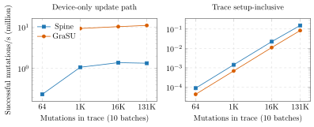

# Persistent update-only comparison

## Question and boundary

This experiment answers two distinct questions for the same update traces:

1. **Device-only update throughput.** No graph algorithm is launched. Spine
   executes structure maintenance; GraSU executes PMA search and update.
2. **Trace setup-inclusive throughput.** Add the measured CPU preprocessing
   required before the trace can execute. Spine preloads the initial graph once
   and sorts each arriving batch independently. GraSU follows its official
   trace-aware contract: reorder the initial graph and complete update trace,
   reserve PMA slots, and build the PMA once.

Disk parsing, logging, and correctness-oracle time are outside both windows.
The modeled host-inclusive column additionally uses the same 12 GB/s H2D and
10 us launch-plus-sync cost per batch for both systems. These runtime constants
are assumptions, not measured XRT latency; raw byte counts are retained so they
can be replaced.

The graph is the full directed AskUbuntu materialization: 515,281 vertices and
390,847 initial edges. Each point contains ten persistent chronological batches
and uses 64, 1,024, 16,384, or 131,072 insertion records. Resident graph state
survives between batches. Every batch and final graph state passed correctness.

## Result

| Trace mutations | Spine device Mupd/s | GraSU device Mupd/s | Device Spine speedup | Setup-inclusive Spine speedup |
|---:|---:|---:|---:|---:|
| 64 | 0.238 | 5.327 | 0.045x | 2.076x |
| 1,024 | 1.074 | 9.267 | 0.116x | 2.078x |
| 16,384 | 1.385 | 10.278 | 0.135x | 2.017x |
| 131,072 | 1.342 | 10.982 | 0.122x | 1.830x |



The device-only conclusion is unambiguous: the trace-aware GraSU PMA path is
7.4--22.4x faster than Spine maintenance on this insertion workload. The
setup-inclusive result reverses because GraSU spends about 1.47--1.54 s in
trace-aware reorder and PMA construction, while Spine spends about 0.71--0.75 s
preloading the graph and sorting ten batches. At 131,072 mutations, device time
is 97.67 ms for Spine and 11.93 ms for GraSU, but modeled totals are 0.852 s and
1.559 s, respectively.

This is not evidence that Spine has better PMA update throughput. It shows that
the ranking depends on whether a deployment can amortize GraSU's offline,
future-aware PMA construction over a sufficiently long trace. An online
future-unknown GraSU rebalance mechanism is a separate baseline and is not
silently approximated here.

## Implementation

- `GraSuPmaUpdateSystem` now returns its resident partitioned PMA layout, so a
  later launch consumes the state produced by the preceding batch.
- `grasu_update_trace` and `spine_update_trace` execute multiple batches in one
  SST process and skip graph compute.
- GraSU update-trace mode applies the same update-density vertex reorder as the
  official host implementation before PMA construction.
- The large-graph default is 65,536 vertices per ReGraph partition. The prior
  value of 16 was a tiny-test default and caused tens of thousands of partitions
  and excessive initialization memory if a caller omitted the environment
  override.
- The host benchmark splits the trace first, then sorts each Spine batch; it
  does not incorrectly sort the complete trace as one large batch.

## Reproduction

Build and test:

```bash
cd /home/chuxiao/spine-cycle-sim-update-only
cmake -S . -B build -DBUILD_TESTING=ON
cmake --build build -j8
ctest --test-dir build --output-on-failure
python3 -m unittest tests.test_persistent_update_only
make -C cpp/sst -B -j2
```

Run host preprocessing for one point:

```bash
build/cpp/persistent_update_host_benchmark \
  /data/tmp/chuxiao/large_graph_campaign_v1/formal_v8_au_update_scaling/workloads/sx_askubuntu/graphs/directed_weighted.slice \
  /data/tmp/chuxiao/large_graph_campaign_v1/formal_v8_au_update_scaling/workloads/sx_askubuntu/updates/directed/insert_u131072.slice \
  10 65536 3 > host.json
```

After producing `spine.json` and `grasu.json` with `spine_update_trace` and
`grasu_update_trace`, combine the evidence:

```bash
python3 scripts/analyze_persistent_update_only.py \
  --dataset sx_askubuntu --scenario insert \
  --host host.json --spine spine.json --grasu grasu.json \
  --h2d-gbps 12 --launch-sync-us 10 --output comparison.json
python3 scripts/render_persistent_update_only.py
```

Tracked raw evidence is under
`docs/evidence/persistent_update_only_20260731/`. The derived table is
`docs/paper/data/persistent_update_only_20260731.csv`.
