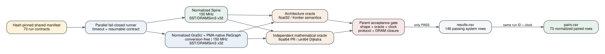

# Shared normalized comparison runner

## Claim boundary

This milestone implements the fail-closed runner for the frozen 73-case shared
workload corpus. It compares source-following Spine against the normalized,
conversion-free GraSU plus PMA-native ReGraph proposal. Both run at 150 MHz and
use the same 32-physical-channel SST/DRAMSim3 backend. By default, SST only
instantiates controllers reachable by the profile and workload; physical
channel IDs and active-channel contention are unchanged.

This is **normalized structural execution-driven simulation**. It is not a
native FPGA measurement, a calibrated absolute-cycle claim, or evidence that a
matching conversion-free GraSU/ReGraph HLS design has been synthesized. The
existing native GraSU/ReGraph path retains its conversion stage and separate
hardware-alignment evidence.

The complete matrix has not yet run. One filtered Full PageRank smoke pair is
recorded below to prove the orchestration and validation path. It is not a
headline speedup result.



## Execution and correctness contract

`scripts/run_shared_comparison_matrix.py` validates the hash-pinned source
manifest before launching any child. Every child receives the same graph or
graph/update bytes and algorithm parameters. The parent independently reloads
the child result and rejects it unless all of the following hold:

- architecture and mathematical mismatch counts are both zero;
- the named oracles match the algorithm contract;
- vertex, edge, and update counts match the frozen manifest;
- both systems report 150 MHz for normalized pairing;
- the binding reports exactly 32 physical channels, preserves channel numbers,
  and uses a fatal policy for requests to unbound channels;
- DRAM reports exactly the explicitly instantiated channel set;
- DRAM reads plus writes equal the component backend-request ledger.

| Algorithm | Architecture oracle | Mathematical oracle |
|---|---|---|
| Weighted static/dynamic SSSP | synchronous frontier, saturating `uint32` | independent `uint64` Dijkstra |
| Full PageRank | iterative float32 Map-Reduce policy | independent iterative float64 |
| Thresholded residual PageRank | residual-push float32 policy | float64 Full PageRank, 200 iterations |

The runner writes `results.csv` for individual architecture runs and
`pairs.csv` only when both systems pass for the same run ID. A paired speedup is
therefore cycle-based at an identical clock and is labeled
`normalized_structural_execution_driven`.

Child processes start in separate process groups. A timeout first terminates
and then kills the complete process group so that SST or DRAMSim3 children are
not orphaned. `--resume` reuses a passing result only when both the complete
command, serialized run contract hash, and implementation fingerprint still
match. The simulation fingerprint covers the compiled component library, SST
executable, memory config, architecture profiles, SST topology scripts, and
child runners. A separate orchestration fingerprint covers command generation,
parent validation, and scheduling, so reporting-only changes do not invalidate
cycle evidence.
The matrix manifest reports executed and reused row counts separately; cached
rows retain the original simulation wall time and are marked in `results.csv`.
On the first failed child, the runner cancels pending work, terminates every
active child process group, writes a partial `FAIL` manifest, and exits nonzero.

## Current smoke evidence

The filtered `syn_weighted_diamond_v8__full_pagerank` pair passed both oracles
and all parent gates:

| System | Cycles | Simulated time | Backend requests | Runner wall time |
|---|---:|---:|---:|---:|
| Spine | 20,072 | 0.133813 ms | 2,393 | 1.15 s |
| GraSU/PMA-native ReGraph | 133,053 | 0.887020 ms | 50,757 | 7.41 s |

For this one tiny case, the cycle ratio is 6.6288x in Spine's favor. It cannot
be generalized across algorithms, graph shapes, dynamic updates, or full
datasets. The output manifest correctly labels this run as a filtered subset
and sets `complete_matrix` to false.

Separate direct smoke runs also pass weighted SSSP, Full PageRank, thresholded
residual PageRank, and mixed dynamic SSSP on both normalized systems. These are
component bring-up checks, not a substitute for the complete frozen matrix.

## First full-matrix runtime gate

The first 4-worker complete attempt produced 55 child `PASS` caches with zero
reported oracle or memory-ledger mismatch. It then hit the 1,800-second child
timeout on the Spine side of
`syn_source_window_e4095__residual_pagerank`. That graph spreads 4,095 edges
across 4,095 sources and is deliberately hostile to source-oriented metadata
and reader control.

This is a **simulator runtime failure**, not a simulated-hardware correctness
failure. No aggregate speedup is reported from the partial matrix. Increasing
the timeout would hide the acceptance failure: the next implementation task is
to improve scheduler/runtime efficiency while preserving cycle, contention,
FIFO, and memory-event semantics.

That attempt also exposed an orchestration issue in the first runner revision:
`ThreadPoolExecutor` could continue queued work after one child failed. The
runner now uses a shared stop latch and process registry. A deliberate
0.01-second timeout test starts only the two active worker slots, terminates
both process groups, leaves no SST child, emits a partial `FAIL` manifest, and
returns nonzero in 0.12 seconds.

The runtime diagnosis led to fail-closed sparse controller binding. Six
full-vs-sparse cases spanning all three algorithms and both architectures have
byte-identical result files and active-channel DRAMSim3 transcripts, while
reducing host wall time by 3.20x to 4.33x. This does not change simulated
cycles or requests. Sparse-run DRAM energy excludes idle/background energy for
unbound channels; see `docs/normalized_sparse_hbm_binding_20260725.md`.

The next complete attempt exposed a validator boundary at 4,096 source-buffer
vertices. ReGraph's ping-pong source-cache reader keeps one window prefetched,
so each algorithm iteration issues
`ceil(vertices / source_buffer_vertices) + 1` source-cache requests. The old
residual PageRank child gate assumed exactly two requests per iteration and
incorrectly rejected the 4,097-vertex case even though both oracles, residual
bound, and memory ledger passed. The corrected formula is locked at 4,095,
4,096, 4,097, 8,192, and 8,193 vertices. Re-execution passed with 10,157,843
cycles and 3,163,796 backend requests; simulator behavior was unchanged.

## Reproduction

```bash
cd /home/chuxiao/spine-cycle-sim
make -C cpp/sst -j2
python3 scripts/prepare_shared_comparison_workloads.py --verify-only

python3 scripts/run_shared_comparison_matrix.py \
  --run-id syn_weighted_diamond_v8__full_pagerank \
  --out-dir results/shared_driver_smoke \
  --jobs 2 \
  --no-build

python3 scripts/run_shared_comparison_matrix.py \
  --out-dir results/shared_comparison_full_20260725 \
  --jobs 4 \
  --resume \
  --no-build
```

The complete command schedules 146 system runs: 73 run IDs times two systems.
It is complete only when `comparison_manifest.json` says
`complete_matrix: true`, all 146 rows exist, and all 73 paired rows exist.

## Remaining evidence

- Execute and summarize the complete frozen matrix.
- Add full real-dataset performance runs; committed compact slices validate
  shapes and correctness only.
- Add dynamic PageRank batches rather than static PageRank alone.
- Add dense-batch, multi-partition scalability, and ablation matrices.
- Attach native and projected paths without relabeling normalized results.
- Extend selected-array activity evidence to every architecture/run class.
