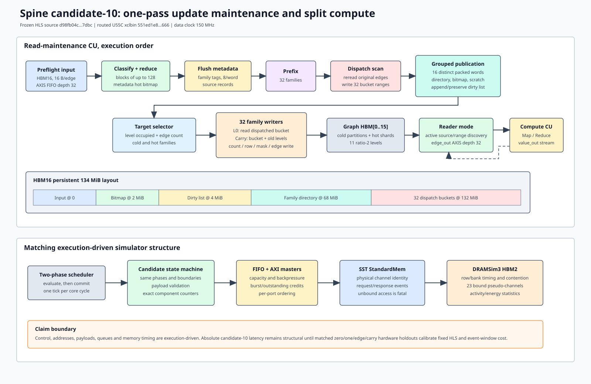

# Spine candidate-10 one-pass maintenance model

## Scope

This milestone adds a selectable execution-driven maintenance path for the
hardware candidate frozen on 2026-07-25. It does not replace the historical
shared-engine model. Every run records either `shared_engine_serial` or
`candidate10_one_pass`, and the architecture profile supplies the default.

The authoritative hardware identity is:

- profile: `configs/architectures/spine_candidate10_one_pass_1e61fc0.json`
- Git provenance: `1e61fc0822608f8776399cc10a851f6fe5806f92`
- frozen dirty HLS source SHA-256: `d98fb04cb59c3b00b894ba4d615d7dd1a6250f46fe1d998a951bb0a0843c7dbc`
- routed xclbin SHA-256: `551ed1e89755a8b97725efa4003e28007eabd66abb73f480c6ee087a627b9666`
- achieved data clock: 150 MHz

The frozen source hash is authoritative because the routed build used a dirty
source snapshot. The Git revision alone is insufficient to reproduce its HLS
behavior.

## Modeled maintenance pipeline



The candidate path in `cpp/src/spine_l0.cpp` models these operations:

1. Preflight reads sorted 16-byte edge records from HBM16 through the AXI
   payload path and the depth-32 input stream.
2. Classification runs in blocks of at most 128 edges. Hot/cold decisions use
   returned metadata bitmap payload. Each block is then reduced.
3. Family tags and source records are flushed to metadata. Tags pack eight
   edges per metadata word.
4. A fixed 32-iteration prefix pass computes the family bucket ranges.
5. Dispatch rereads the original HBM16 input, consumes one tag per edge, and
   writes the exact edge payload into one of 32 bucket ranges in HBM16.
6. Dirty-frontier publication groups source records by up to 16 distinct
   packed directory or bitmap words. It performs payload-backed directory,
   bitmap, scratch, and list reads/writes, including the empty-frontier bitmap
   fast path and partial list-word preservation.
7. Target selection reads level metadata. L0 and carry writers consume the
   dispatched family bucket ranges rather than rescanning and reclassifying the
   original batch.

The simulator uses the production HBM16 layout: input at 0, bitmap at 2 MiB,
list at 4 MiB, family directory at 68 MiB, bucket payload at 132 MiB, and a
134 MiB total allocation. Candidate metadata/result ABIs are version 5/6;
the historical path remains version 2/3.

## What is exact and what is not

| Property | Current claim |
|---|---|
| Classify, reduce, tag, dispatch and publication control order | HLS-source mapped |
| HBM/metadata addresses and read/write payloads | Execution-driven and checked |
| Family/tag/hash/directory/bitmap/list counters | Exact logical counters |
| FIFO capacity, AXI credits and DRAM response timing | Cycle-driven through the common core and SST/DRAMSim3 |
| 128-edge block and 16-distinct-word boundaries | Boundary tested |
| Local HLS scheduling inside every helper | Structural, not yet calibrated |
| XRT launch and host orchestration overhead | Not included in device cycles |
| Absolute candidate-10 maintenance latency | Not yet hardware calibrated |

The 16-entry publication rule applies to distinct packed words, not simply to
16 source IDs. The simulator first derives the next logical packed-word window,
then obtains and validates every source record through AXI payload responses.
The candidate AXI request window bounds outstanding source-record traffic to 16.

## Validation evidence

The C++ core has four focused candidate tests:

- one-pass payload test: cold/hot families, exact tags, buckets, directory,
  bitmap and list payloads
- persistent repeated-frontier test: bitmap read-modify-write, duplicate
  suppression, scratch/list preservation and carry
- 130-source boundary test: two classify blocks, 17 tag words, 33 directory
  words, two bitmap words and 33 list words
- zero-edge protocol test: zero classify/dispatch/publication traffic with a
  successful version-6 result and completed publication state

The SST weighted-SSSP smoke test used a real `.slice`, passed both the
architecture and mathematical oracles, and closed the SST/DRAM request ledger:

```text
cycles=38034
maintenance_cycles=1785
backend_requests=4088
dram_requests=4088
candidate_classify_blocks=1
dispatch_input_reads=8
dispatch_bucket_writes=8
dispatch_cursor_mismatches=0
publication_complete=true
```

The measured-hardware importer verified all 213 files in the frozen
`SHA256SUMS`, 29 correctness cases, six focused benchmark groups, and two RMAT24
trial rows. All explicit PASS/error gates succeeded. Compact normalized evidence
is checked in under `docs/evidence/spine_candidate10_hw_20260725/`.

Hardware timing is not yet aligned. For example, the measured one-edge
maintenance event is 0.258457 ms, approximately 38,769 cycles at 150 MHz. That
large fixed cost is not reproduced by the current structural candidate path.
It may include HLS control/protocol work and event-window overhead that must be
separated using matched zero/one/edge-sweep holdouts. Until then, candidate
latency claims must be labeled `structural_execution_driven`.

## Reproduction

Build and run the complete C++ core tests:

```bash
cmake --build build/cycle-core -j4
ctest --test-dir build/cycle-core --output-on-failure
```

Build the SST plugin and run the profile-selected candidate path:

```bash
make -C cpp/sst -j4
python3 scripts/run_sst_spine_vertical.py \
  --out-dir /tmp/spine_candidate10_sst_smoke \
  --profile configs/architectures/spine_candidate10_one_pass_1e61fc0.json \
  --scenario weighted_sssp \
  --validation-mode generic \
  --no-build
```

Verify and normalize the frozen direct-hardware evidence:

```bash
python3 scripts/import_spine_candidate10_hw_evidence.py \
  --out-dir docs/evidence/spine_candidate10_hw_20260725
```

Run the focused Python tests:

```bash
python3 -m unittest \
  tests.test_candidate10_evidence \
  tests.test_architecture_profiles
```

## Next calibration step

Run or reconstruct identical zero-edge, one-edge, 128-edge, 4096-source,
4097-source, repeated-frontier and L1/L2/L3 carry workloads in SST. Fit only
calibration cases, then report component and E2E errors on disjoint holdouts.
The first target is to separate fixed event/control cost from edge-dependent
classify/dispatch/publication cost. Do not absorb a fixed mismatch into a
per-edge coefficient.
