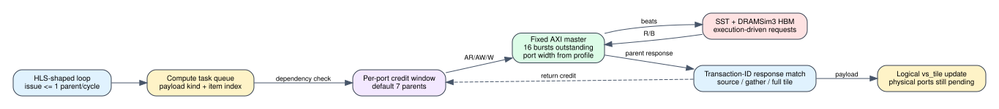

# Spine compute AXI outstanding requests

Date: 2026-07-24
Branch: `codex/fine-grained-cycle-sim`
Baseline commit: `eb6b48f3bf266bfffac572c069f31d4ce20f0766`

## Closed gap

The split compute model previously issued one logical memory request and waited
for its complete response before issuing the next. That behavior serialized the
`PARTCONV_TINY_GATHER_LOOP`, even though the HLS loop has II=1 and its AXI
adapter supports multiple pending transactions.

`SpineSplitSsspCompute` now:

1. issues at most one parent request per core cycle;
2. keeps a configurable number of requests in flight per AXI port;
3. tags source reads, tiny gathers, and full-tile loads independently;
4. matches returned transaction IDs to their original task, so completion order
   cannot attach a payload to the wrong destination;
5. permits one issue and one completion in the same cycle;
6. preserves read/write dependencies for overlapping address ranges; and
7. records issued/completed requests, request-window stalls, dependency stalls,
   FIFO stalls, and maximum in-flight occupancy.

The source-shaped default is seven parent requests. The latest HLS source proves
the II=1 gather structure. The value seven comes from the accepted older split
compute synthesis interface (`USER_MAXREQS=7`), not from a new synthesis of the
latest revision, and remains configurable through
`--compute-memory-request-window`.



## Source and implementation evidence

    HLS repository: /home/chuxiao/spine-dynamic-graph-reduce-levels
    HLS revision:   afb8199a2ca8d3fd208b985324bf4d8719e2b839
    HLS branch:     reduce-levels-for-routing
    HLS loop:       PARTCONV_TINY_GATHER_LOOP, PIPELINE II=1

    synthesis report:
      /data/feiyang/spine-dynamic-graph/target/split_e2e_hw_200/reports/
        spine_partconv_compute_kernel.hw/hls_reports/
        spine_partconv_compute_kernel_csynth.rpt
    report sha256:
      3d5ef550d4c70d981547f819b4f16cd26b3327051103beddc09847df9317116d
    synthesis source revision: 9c08763148644df262c0d374e782bc834f4c0f4f

The report also establishes a 32-bit `gmem_vs` AXI data path, 16 outstanding
transactions, and seven adapter parent-request slots. The simulator retains the
existing 32-bit vertex-state profile and bounds producer-visible parents at
seven; the AXI master separately enforces its burst limit.

## Deterministic microbenchmarks

A 256-edge tiny tile was run against the same three-cycle mock memory while
changing only the compute parent-request window:

| window | cycles | max vertex requests in flight | correctness |
| ---: | ---: | ---: | --- |
| 1 | 8,780 | 1 | exact |
| 7 | 4,844 | 7 | exact |

This is a 1.81x speedup. The window-seven run records 144 credit-stall cycles,
so it does not assume unlimited memory-level parallelism.

At the tiny/full threshold, the 4,096-edge tiny case falls from 101,939 cycles
at baseline `eb6b48f` to 30,560 cycles, while the 4,097-edge full case remains
nearly unchanged (23,173 to 23,165 cycles). Every distance and frontier entry
matches. This isolates the correction to the random tiny-gather schedule.

## SST-HBM evidence

All runs use execution-driven requests, `hls_split_9c08763`, 32 mapped pseudo
channels, and the same DRAMSim3 HBM configuration.

| scenario | window | cycles | backend requests | max vertex in flight | window stalls | correctness |
| --- | ---: | ---: | ---: | ---: | ---: | --- |
| Amazon L0 | 7 | 23,406 | 1,400 | 4 | 0 | 0 mismatches |
| carry + hot | 7 | 10,607 | 2,016 | 3 | 0 | 0 mismatches |
| weighted SSSP | 7 | 38,525 | 4,197 | 7 | 4 | 0 mismatches |
| protocol window | 7 | 10,947 | 1,746 | 7 | 6 | 0 mismatches |
| fallback capacity | 7 | 23,838 | 2,442 | 1 | 0 | 0 mismatches |
| fallback payload | 7 | 23,802 | 2,436 | 1 | 0 | 0 mismatches |
| Amazon full compute | 1 | 1,042,471 | 175,315 | 1 | 204,732 | 0 mismatches |
| Amazon full compute | 7 | 847,903 | 175,315 | 7 | 10,174 | 0 mismatches |

The full-compute window-seven run is 1.23x faster than the window-one control.
Both issue and complete 24,955 compute parent requests and generate exactly
175,315 backend requests. The performance difference therefore comes from
request timing and HBM overlap, not omitted traffic. DRAM ACT commands also
change (7,473 to 6,517), which is expected because request arrival order changes
row-buffer behavior in an execution-driven model.

Compared with the pre-fix `eb6b48f` result of 1,073,313 cycles, the corrected
source-shaped result is 1.27x faster. Window one is not identical to the old
implementation because the new transaction engine can retire and issue in the
same cycle and can overlap independent AXI bundles.

## Reproduction

```bash
cd /home/chuxiao/spine-cycle-sim
cmake --build build/cycle-core -j2
./build/cycle-core/cpp/spine_cycle_core_tests \
  spine_compute_gather_outstanding
./build/cycle-core/cpp/spine_cycle_core_tests spine_full_tile_boundaries
ctest --test-dir build/cycle-core --output-on-failure
python3 -m unittest discover -s tests
make -C cpp/sst -j2

python3 scripts/run_sst_spine_vertical.py \
  --scenario amazon_full_compute --compute-memory-request-window 1 --no-build \
  --out-dir results/sst_spine_compute_axi_full_w1_20260724
python3 scripts/run_sst_spine_vertical.py \
  --scenario amazon_full_compute --compute-memory-request-window 7 --no-build \
  --out-dir results/sst_spine_compute_axi_full_w7_20260724
python3 scripts/run_sst_spine_vertical.py \
  --scenario weighted_sssp --compute-memory-request-window 7 --no-build \
  --out-dir results/sst_spine_compute_axi_weighted_w7_20260724
```

## Remaining boundary

This closes bounded compute parent-request concurrency for existing memory
phases. It does not yet make every HLS loop/AXI interaction exact:

1. tiny sparse-store writes are queued after the complete bitmap scan instead
   of being issued on their active bit-loop cycles;
2. active-output records are emitted as one aggregate request after the scan,
   rather than as writes generated inside the active bit loop;
3. compute accepts at most one parent response per cycle globally, although
   independent AXI bundles can respond together;
4. the URAM/BRAM arrays still use logical access ledgers rather than physical
   `BankedMemory` ports, latency, arbitration, and the four-entry RAW bypass;
5. no accepted latest-source xclbin cycle calibration exists yet.

The current model can support structural bottleneck and what-if comparisons,
but these remaining items must be closed before claiming cycle-exact compute
timing.
