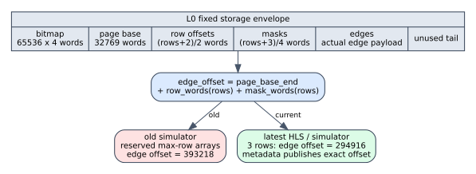

# Spine dynamic L0 layout

Date: 2026-07-24  
Branch: `codex/fine-grained-cycle-sim`

## Closed gap

The latest `reduce-levels-for-routing` HLS uses two layout rules:

- L0 compacts its row-offset and row-mask arrays to the pre-counted number of
  output rows, so `mask_offset` and `edge_offset` change with each batch.
- Carry targets L1-L10 retain fixed-capacity row, mask, and edge regions.

The simulator previously used the fixed-capacity rule for every level. Its own
writer and reader agreed with each other, so functional tests passed, but L0
addresses did not match the HLS ABI. This could change HBM bank/row mapping and
made payload-level comparison against hardware misleading.

`spine_slice_layout(config, hot, level, row_count)` now implements the staged
HLS metadata rule. Initialization, graph payload placement, L0 writes, and
metadata publication all use it. `spine_level_layout` remains the fixed storage
envelope and the correct rule for carry levels.



For the production default, the row-offset base is word 294,913. A three-row
L0 uses two row words and one mask word, placing edges at word 294,916. The old
fixed-capacity model placed the same edges at word 393,218. Both remain inside
the L0 envelope ending at word 524,290.

## Validation

The C++ anti-bypass test checks that:

1. L0 metadata contains the dynamic edge offset.
2. The edge payload exists at that address.
3. The old fixed offset remains zero.
4. The reader consumes the dynamic HBM payload and returns the dual-oracle
   result.
5. Row counts 0 through 4 obey the exact HLS packing boundaries and stay inside
   the fixed L0 envelope.

Online SST-HBM preserves all request counts and reports zero value/frontier
mismatches. Address movement changes DRAM behavior, as it should:

| scenario | cycles before | cycles after | activates before | activates after |
| --- | ---: | ---: | ---: | ---: |
| Amazon L0 | 7,157 | 7,153 | 72 | 69 |
| carry hot | 8,884 | 8,872 | 99 | 93 |
| weighted SSSP | 33,788 | 33,788 | 242 | 230 |

Machine-readable evidence is in
`docs/evidence/spine_dynamic_l0_layout_20260724.json`.

## Reproduction

```bash
cd /home/chuxiao/spine-cycle-sim
cmake --build build/cycle-core -j2
ctest --test-dir build/cycle-core --output-on-failure
python3 -m unittest discover -s tests
make -C cpp/sst -j2

python3 scripts/run_sst_spine_vertical.py \
  --scenario amazon_l0 --no-build \
  --out-dir results/sst_spine_dynamic_l0_amazon_20260724
python3 scripts/run_sst_spine_vertical.py \
  --scenario carry_hot --no-build \
  --out-dir results/sst_spine_dynamic_l0_carry_hot_20260724
python3 scripts/run_sst_spine_vertical.py \
  --scenario weighted_sssp --no-build \
  --out-dir results/sst_spine_dynamic_l0_weighted_20260724
```

## Remaining boundary

The L0 scan still builds a logical output vector and enqueues bulk index/edge
writes after the scan. The next milestone will reuse the finite packers from
the carry writer to emit row, mask, page, epoch, and edge writes while streamed
sorted-edge beats are being consumed.
